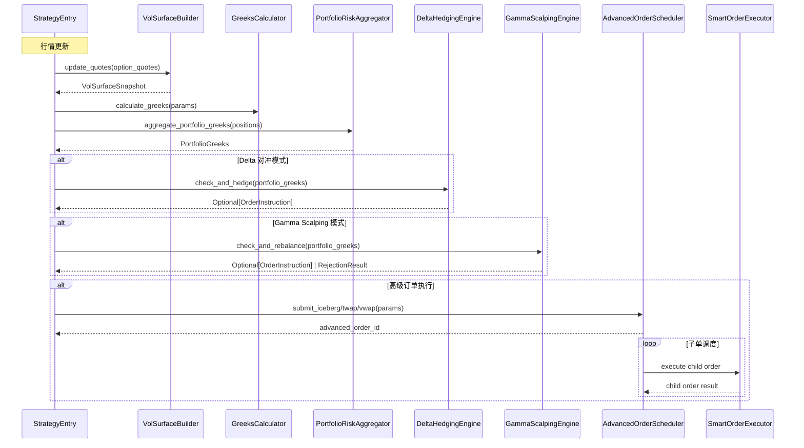

# Design Document: 高级订单类型、动态对冲引擎、波动率曲面

## Overview

本设计在现有 DDD 架构基础上新增三个核心能力模块：

1. **高级订单类型** — 冰山单、TWAP、VWAP 执行引擎，通过 Advanced_Order_Scheduler 统一调度子单生命周期，底层复用已有的 SmartOrderExecutor
2. **动态对冲引擎** — Delta 中性对冲和 Gamma Scalping，基于已有的 PortfolioRiskAggregator 提供的组合 Greeks 数据自动生成对冲指令
3. **波动率曲面** — 从市场期权报价构建波动率曲面，支持双线性插值查询、波动率微笑提取和期限结构提取

设计遵循现有项目的 Pragmatic DDD 风格：领域逻辑封装在 domain 层，基础设施逻辑封装在 infrastructure 层，StrategyEntry 充当应用层编排。新模块与已有的 GreeksCalculator、PortfolioRiskAggregator、SmartOrderExecutor 紧密协作。

## Architecture

### 分层架构扩展

```
┌──────────────────────────────────────────────────────────────────────┐
│                     StrategyEntry (应用层)                            │
│  on_bar → Greeks → 风控 → 对冲检查 → 高级下单 → 超时管理 → 曲面更新    │
└───────┬──────────┬──────────┬──────────┬──────────┬──────────────────┘
        │          │          │          │          │
  ┌─────▼────┐ ┌───▼────┐ ┌──▼───────┐ ┌▼────────┐ ┌▼──────────────┐
  │ Greeks   │ │PortRisk│ │ Advanced │ │ Hedging │ │ Vol Surface   │
  │ Calc     │ │ Agg    │ │ Order    │ │ Engine  │ │ Builder       │
  │ (已有)   │ │ (已有) │ │ Scheduler│ │ (新增)  │ │ (新增)        │
  └──────────┘ └────────┘ └────┬─────┘ └─────────┘ └───────────────┘
                               │
                         ┌─────▼──────┐
                         │ Smart Order│
                         │ Executor   │
                         │ (已有)     │
                         └────────────┘
```

### 数据流



## Components and Interfaces

### 1. AdvancedOrderScheduler (领域服务)

**位置**: `src/strategy/domain/domain_service/advanced_order_scheduler.py`

**职责**: 统一管理冰山单、TWAP、VWAP 的拆单逻辑和子单生命周期。不直接调用网关，生成 ChildOrder 列表交由 SmartOrderExecutor 执行。

```python
class AdvancedOrderType(Enum):
    ICEBERG = "iceberg"
    TWAP = "twap"
    VWAP = "vwap"

class AdvancedOrderStatus(Enum):
    PENDING = "pending"
    EXECUTING = "executing"
    COMPLETED = "completed"
    CANCELLED = "cancelled"

@dataclass
class AdvancedOrderRequest:
    """高级订单请求"""
    order_type: AdvancedOrderType
    instruction: OrderInstruction      # 原始交易指令 (含总量)
    # 冰山单参数
    batch_size: int = 0                # 每批数量
    # TWAP/VWAP 参数
    time_window_seconds: int = 0       # 时间窗口 (秒)
    num_slices: int = 0                # 分片数
    volume_profile: List[float] = field(default_factory=list)  # VWAP 成交量分布

@dataclass
class AdvancedOrder:
    """高级订单状态"""
    order_id: str
    request: AdvancedOrderRequest
    status: AdvancedOrderStatus = AdvancedOrderStatus.PENDING
    filled_volume: int = 0
    child_orders: List[ChildOrder] = field(default_factory=list)
    created_time: datetime = field(default_factory=datetime.now)
    slice_schedule: List[SliceEntry] = field(default_factory=list)

@dataclass
class ChildOrder:
    """子单"""
    child_id: str
    parent_id: str
    volume: int
    scheduled_time: Optional[datetime] = None
    is_submitted: bool = False
    is_filled: bool = False

@dataclass(frozen=True)
class SliceEntry:
    """时间片条目"""
    scheduled_time: datetime
    volume: int

class AdvancedOrderScheduler:
    def submit_iceberg(self, instruction: OrderInstruction, batch_size: int) -> AdvancedOrder:
        """提交冰山单，拆分为子单"""
        ...

    def submit_twap(self, instruction: OrderInstruction, time_window_seconds: int,
                    num_slices: int, start_time: datetime) -> AdvancedOrder:
        """提交 TWAP 单，均匀分配到时间片"""
        ...

    def submit_vwap(self, instruction: OrderInstruction, time_window_seconds: int,
                    volume_profile: List[float], start_time: datetime) -> AdvancedOrder:
        """提交 VWAP 单，按成交量分布分配"""
        ...

    def get_pending_children(self, current_time: datetime) -> List[ChildOrder]:
        """获取当前时刻应提交的子单"""
        ...

    def on_child_filled(self, child_id: str) -> List[DomainEvent]:
        """子单成交回报处理"""
        ...

    def cancel_order(self, order_id: str) -> Tuple[List[str], List[DomainEvent]]:
        """取消高级订单，返回需撤销的子单ID列表"""
        ...
```

### 2. DeltaHedgingEngine (领域服务)

**位置**: `src/strategy/domain/domain_service/delta_hedging_engine.py`

**职责**: 监控组合 Delta 敞口，当偏离目标超过 Hedging Band 时计算对冲手数并生成对冲指令。纯计算服务。

```python
@dataclass(frozen=True)
class HedgingConfig:
    """对冲配置"""
    target_delta: float = 0.0          # 目标 Delta
    hedging_band: float = 0.5          # 对冲触发带
    hedge_instrument_vt_symbol: str = ""  # 对冲工具合约代码
    hedge_instrument_delta: float = 1.0   # 对冲工具 Delta (期货=1.0)
    hedge_instrument_multiplier: float = 10.0  # 对冲工具合约乘数

@dataclass(frozen=True)
class HedgeResult:
    """对冲计算结果"""
    should_hedge: bool
    hedge_volume: int = 0
    hedge_direction: Optional[Direction] = None
    instruction: Optional[OrderInstruction] = None
    reason: str = ""

class DeltaHedgingEngine:
    def __init__(self, config: HedgingConfig): ...

    @classmethod
    def from_yaml_config(cls, config_dict: dict) -> "DeltaHedgingEngine":
        """从 YAML 配置字典创建实例，缺失字段使用 HedgingConfig 默认值"""
        ...

    def check_and_hedge(self, portfolio_greeks: PortfolioGreeks,
                        current_price: float) -> Tuple[HedgeResult, List[DomainEvent]]:
        """检查是否需要对冲，返回对冲结果和事件"""
        ...
```

### 3. GammaScalpingEngine (领域服务)

**位置**: `src/strategy/domain/domain_service/gamma_scalping_engine.py`

**职责**: 在持有正 Gamma 敞口时，当 Delta 偏离零超过阈值时生成再平衡指令。

```python
@dataclass(frozen=True)
class GammaScalpConfig:
    """Gamma Scalping 配置"""
    rebalance_threshold: float = 0.3   # Delta 再平衡阈值
    hedge_instrument_vt_symbol: str = ""
    hedge_instrument_delta: float = 1.0
    hedge_instrument_multiplier: float = 10.0

@dataclass(frozen=True)
class ScalpResult:
    """Gamma Scalping 结果"""
    should_rebalance: bool
    rebalance_volume: int = 0
    rebalance_direction: Optional[Direction] = None
    instruction: Optional[OrderInstruction] = None
    rejected: bool = False
    reject_reason: str = ""

class GammaScalpingEngine:
    def __init__(self, config: GammaScalpConfig): ...

    @classmethod
    def from_yaml_config(cls, config_dict: dict) -> "GammaScalpingEngine":
        """从 YAML 配置字典创建实例，缺失字段使用 GammaScalpConfig 默认值"""
        ...

    def check_and_rebalance(self, portfolio_greeks: PortfolioGreeks,
                            current_price: float) -> Tuple[ScalpResult, List[DomainEvent]]:
        """检查是否需要 Gamma Scalping 再平衡"""
        ...
```

### 4. VolSurfaceBuilder (领域服务)

**位置**: `src/strategy/domain/domain_service/vol_surface_builder.py`

**职责**: 从市场期权报价构建波动率曲面，支持双线性插值查询、微笑提取和期限结构提取。纯计算服务。

```python
@dataclass(frozen=True)
class VolQuote:
    """单个期权的波动率报价"""
    strike: float
    time_to_expiry: float
    implied_vol: float

@dataclass(frozen=True)
class VolQueryResult:
    """波动率查询结果"""
    implied_vol: float = 0.0
    success: bool = True
    error_message: str = ""

@dataclass
class VolSmile:
    """波动率微笑"""
    time_to_expiry: float
    strikes: List[float]
    vols: List[float]

@dataclass
class TermStructure:
    """期限结构"""
    strike: float
    expiries: List[float]
    vols: List[float]

@dataclass
class VolSurfaceSnapshot:
    """波动率曲面快照"""
    strikes: List[float]
    expiries: List[float]
    vol_matrix: List[List[float]]  # [expiry_idx][strike_idx]
    timestamp: datetime

class VolSurfaceBuilder:
    def build_surface(self, quotes: List[VolQuote]) -> VolSurfaceSnapshot:
        """从报价列表构建波动率曲面"""
        ...

    def query_vol(self, snapshot: VolSurfaceSnapshot,
                  strike: float, time_to_expiry: float) -> VolQueryResult:
        """双线性插值查询隐含波动率"""
        ...

    def extract_smile(self, snapshot: VolSurfaceSnapshot,
                      time_to_expiry: float) -> VolSmile:
        """提取指定到期时间的波动率微笑"""
        ...

    def extract_term_structure(self, snapshot: VolSurfaceSnapshot,
                               strike: float) -> TermStructure:
        """提取指定行权价的期限结构"""
        ...
```

### 5. 新增领域事件

**位置**: 扩展 `src/strategy/domain/event/event_types.py`

```python
@dataclass
class IcebergCompleteEvent(DomainEvent):
    """冰山单完成事件"""
    order_id: str = ""
    vt_symbol: str = ""
    total_volume: int = 0
    filled_volume: int = 0

@dataclass
class IcebergCancelledEvent(DomainEvent):
    """冰山单取消事件"""
    order_id: str = ""
    vt_symbol: str = ""
    filled_volume: int = 0
    remaining_volume: int = 0

@dataclass
class TWAPCompleteEvent(DomainEvent):
    """TWAP 完成事件"""
    order_id: str = ""
    vt_symbol: str = ""
    total_volume: int = 0

@dataclass
class VWAPCompleteEvent(DomainEvent):
    """VWAP 完成事件"""
    order_id: str = ""
    vt_symbol: str = ""
    total_volume: int = 0

@dataclass
class HedgeExecutedEvent(DomainEvent):
    """对冲执行事件"""
    hedge_volume: int = 0
    hedge_direction: str = ""
    portfolio_delta_before: float = 0.0
    portfolio_delta_after: float = 0.0
    hedge_instrument: str = ""

@dataclass
class GammaScalpEvent(DomainEvent):
    """Gamma Scalping 再平衡事件"""
    rebalance_volume: int = 0
    rebalance_direction: str = ""
    portfolio_delta_before: float = 0.0
    portfolio_gamma: float = 0.0
    hedge_instrument: str = ""
```

### 6. 配置扩展

**位置**: `config/strategy_config.yaml` 新增节

```yaml
# ========== 动态对冲配置 ==========
hedging:
  delta_hedging:
    target_delta: 0.0
    hedging_band: 0.5
    hedge_instrument_vt_symbol: ""    # 运行时由策略设置
    hedge_instrument_delta: 1.0
    hedge_instrument_multiplier: 10.0
  gamma_scalping:
    rebalance_threshold: 0.3
    hedge_instrument_vt_symbol: ""
    hedge_instrument_delta: 1.0
    hedge_instrument_multiplier: 10.0

# ========== 高级订单配置 ==========
advanced_orders:
  default_iceberg_batch_size: 5
  default_twap_slices: 10
  default_time_window_seconds: 300
```

## Data Models

### AdvancedOrderRequest (值对象)

| 字段 | 类型 | 说明 |
|------|------|------|
| order_type | AdvancedOrderType | 订单类型 (iceberg/twap/vwap) |
| instruction | OrderInstruction | 原始交易指令 |
| batch_size | int | 冰山单每批数量 |
| time_window_seconds | int | TWAP/VWAP 时间窗口 |
| num_slices | int | TWAP 分片数 |
| volume_profile | List[float] | VWAP 成交量分布 |

### AdvancedOrder (实体)

| 字段 | 类型 | 说明 |
|------|------|------|
| order_id | str | 高级订单 ID |
| request | AdvancedOrderRequest | 原始请求 |
| status | AdvancedOrderStatus | 订单状态 |
| filled_volume | int | 已成交量 |
| child_orders | List[ChildOrder] | 子单列表 |
| created_time | datetime | 创建时间 |
| slice_schedule | List[SliceEntry] | 时间片调度表 |

### ChildOrder (实体)

| 字段 | 类型 | 说明 |
|------|------|------|
| child_id | str | 子单 ID |
| parent_id | str | 父订单 ID |
| volume | int | 子单数量 |
| scheduled_time | Optional[datetime] | 计划提交时间 |
| is_submitted | bool | 是否已提交 |
| is_filled | bool | 是否已成交 |

### HedgingConfig (值对象)

| 字段 | 类型 | 说明 |
|------|------|------|
| target_delta | float | 目标 Delta |
| hedging_band | float | 对冲触发带 |
| hedge_instrument_vt_symbol | str | 对冲工具合约代码 |
| hedge_instrument_delta | float | 对冲工具 Delta |
| hedge_instrument_multiplier | float | 对冲工具合约乘数 |

### GammaScalpConfig (值对象)

| 字段 | 类型 | 说明 |
|------|------|------|
| rebalance_threshold | float | 再平衡阈值 |
| hedge_instrument_vt_symbol | str | 对冲工具合约代码 |
| hedge_instrument_delta | float | 对冲工具 Delta |
| hedge_instrument_multiplier | float | 对冲工具合约乘数 |

### VolQuote (值对象)

| 字段 | 类型 | 说明 |
|------|------|------|
| strike | float | 行权价 |
| time_to_expiry | float | 剩余到期时间 (年化) |
| implied_vol | float | 隐含波动率 |

### VolSurfaceSnapshot (值对象)

| 字段 | 类型 | 说明 |
|------|------|------|
| strikes | List[float] | 行权价列表 (升序) |
| expiries | List[float] | 到期时间列表 (升序) |
| vol_matrix | List[List[float]] | 波动率矩阵 [expiry_idx][strike_idx] |
| timestamp | datetime | 快照时间 |

### VolSmile (值对象)

| 字段 | 类型 | 说明 |
|------|------|------|
| time_to_expiry | float | 到期时间 |
| strikes | List[float] | 行权价列表 (升序) |
| vols | List[float] | 对应隐含波动率列表 |

### TermStructure (值对象)

| 字段 | 类型 | 说明 |
|------|------|------|
| strike | float | 行权价 |
| expiries | List[float] | 到期时间列表 (升序) |
| vols | List[float] | 对应隐含波动率列表 |

### HedgeResult (值对象)

| 字段 | 类型 | 说明 |
|------|------|------|
| should_hedge | bool | 是否需要对冲 |
| hedge_volume | int | 对冲手数 |
| hedge_direction | Optional[Direction] | 对冲方向 |
| instruction | Optional[OrderInstruction] | 对冲指令 |
| reason | str | 说明 |

### ScalpResult (值对象)

| 字段 | 类型 | 说明 |
|------|------|------|
| should_rebalance | bool | 是否需要再平衡 |
| rebalance_volume | int | 再平衡手数 |
| rebalance_direction | Optional[Direction] | 再平衡方向 |
| instruction | Optional[OrderInstruction] | 再平衡指令 |
| rejected | bool | 是否被拒绝 |
| reject_reason | str | 拒绝原因 |


## Correctness Properties

*A property is a characteristic or behavior that should hold true across all valid executions of a system — essentially, a formal statement about what the system should do. Properties serve as the bridge between human-readable specifications and machine-verifiable correctness guarantees.*

### Property 1: 冰山单拆分正确性

*For any* total volume > 0 and batch_size > 0, when an iceberg order is created:
- Each child order volume <= batch_size
- The sum of all child order volumes == total volume
- The number of child orders == ceil(total_volume / batch_size)

**Validates: Requirements 1.1, 1.5**

### Property 2: 冰山单生命周期

*For any* iceberg order with N child orders:
- After filling child i (i < N-1), the next pending child (i+1) becomes available for submission
- After filling all N children, exactly one IcebergCompleteEvent is produced and status becomes COMPLETED
- After cancellation, IcebergCancelledEvent is produced with correct filled/remaining volumes

**Validates: Requirements 1.2, 1.3, 1.4**

### Property 3: TWAP 调度正确性

*For any* total volume > 0, time_window_seconds > 0, and num_slices > 0:
- Each slice volume is approximately total_volume / num_slices (difference <= 1 due to integer rounding)
- The sum of all slice volumes == total_volume
- The time interval between consecutive slices == time_window_seconds / num_slices (within 1 second tolerance)
- After all slices are filled, TWAPCompleteEvent is produced

**Validates: Requirements 2.1, 2.3, 2.4**

### Property 4: VWAP 分配正确性

*For any* total volume > 0 and volume_profile (list of positive floats):
- Each slice volume is proportional to its profile weight: slice_volume ≈ total_volume * (weight / sum(weights))
- The sum of all slice volumes == total_volume
- After all slices are filled, VWAPCompleteEvent is produced

**Validates: Requirements 3.1, 3.2, 3.3, 3.4**

### Property 5: 高级订单成交量追踪

*For any* advanced order and sequence of child fills, the advanced order's filled_volume equals the sum of all filled child volumes.

**Validates: Requirements 4.2, 4.3**

### Property 6: 高级订单序列化 Round-Trip

*For any* valid AdvancedOrder object (including all child orders and schedule), serializing to JSON then deserializing should produce an object with equivalent field values.

**Validates: Requirements 4.4, 4.5**

### Property 7: Delta 对冲正确性

*For any* PortfolioGreeks, HedgingConfig (with hedging_band > 0, hedge_instrument_multiplier > 0):
- should_hedge == True if and only if |portfolio_delta - target_delta| > hedging_band
- When should_hedge is True, hedge_volume == round((target_delta - portfolio_delta) / (hedge_instrument_delta * hedge_instrument_multiplier))
- When hedge_volume == 0 (due to rounding), should_hedge is False and no instruction is generated
- When hedging occurs, exactly one HedgeExecutedEvent is produced

**Validates: Requirements 5.1, 5.2, 5.3, 5.4**

### Property 8: Gamma Scalping 正确性

*For any* PortfolioGreeks with total_gamma > 0 and GammaScalpConfig:
- should_rebalance == True if and only if |portfolio_delta| > rebalance_threshold
- When rebalancing, the hedge volume is calculated to bring portfolio delta to zero: volume == round(|portfolio_delta| / (hedge_instrument_delta * hedge_instrument_multiplier))
- When rebalancing occurs, exactly one GammaScalpEvent is produced

**Validates: Requirements 6.1, 6.3, 6.4**

### Property 9: Gamma Scalping 负 Gamma 拒绝

*For any* PortfolioGreeks with total_gamma <= 0, the Gamma_Scalping_Engine should reject the operation with rejected=True and a non-empty reject_reason, regardless of the delta value.

**Validates: Requirements 6.2**

### Property 10: 波动率曲面构建正确性

*For any* list of VolQuote objects (with at least 2 distinct strikes and 2 distinct expiries), the built VolSurfaceSnapshot should have:
- strikes sorted in ascending order
- expiries sorted in ascending order
- vol_matrix dimensions == len(expiries) x len(strikes)
- At each grid point matching an input quote, the vol value equals the input implied_vol

**Validates: Requirements 8.1**

### Property 11: 波动率曲面插值有界性

*For any* VolSurfaceSnapshot and query point (strike, time_to_expiry) within the grid bounds, the interpolated implied_vol should be bounded by the minimum and maximum vol values of the four surrounding grid points.

**Validates: Requirements 8.2**

### Property 12: 波动率曲面序列化 Round-Trip

*For any* valid VolSurfaceSnapshot, serializing to JSON then deserializing should produce an object with equivalent field values (strikes, expiries, vol_matrix within floating point tolerance).

**Validates: Requirements 8.4, 8.5**

### Property 13: 波动率微笑提取正确性与排序

*For any* VolSurfaceSnapshot and target time_to_expiry within the grid bounds:
- The extracted VolSmile has strikes sorted in ascending order
- When the target expiry matches a grid point, the extracted vols match the corresponding row in vol_matrix
- When the target expiry is between grid points, each extracted vol is bounded by the corresponding vols of the two surrounding expiry rows

**Validates: Requirements 9.1, 9.2, 9.3**

### Property 14: 期限结构提取正确性与排序

*For any* VolSurfaceSnapshot and target strike within the grid bounds:
- The extracted TermStructure has expiries sorted in ascending order
- When the target strike matches a grid point, the extracted vols match the corresponding column in vol_matrix
- When the target strike is between grid points, each extracted vol is bounded by the corresponding vols of the two surrounding strike columns

**Validates: Requirements 10.1, 10.2, 10.3**

## Error Handling

### 高级订单错误

| 场景 | 处理方式 |
|------|----------|
| 总量 <= 0 | 返回错误，不创建订单 |
| 冰山单 batch_size <= 0 | 返回错误，不创建订单 |
| TWAP num_slices <= 0 | 返回错误，不创建订单 |
| VWAP volume_profile 为空或含负值 | 返回错误，不创建订单 |
| 子单执行失败 | 记录错误日志，不影响其他子单 |

### 对冲引擎错误

| 场景 | 处理方式 |
|------|----------|
| 对冲工具合约乘数 <= 0 | 返回 HedgeResult(should_hedge=False, reason="无效配置") |
| 对冲工具 Delta == 0 | 返回 HedgeResult(should_hedge=False, reason="对冲工具 Delta 为零") |
| 组合 Gamma <= 0 (Gamma Scalping) | 返回 ScalpResult(rejected=True, reject_reason="组合 Gamma 非正") |
| 当前价格 <= 0 | 返回错误结果，不生成指令 |

### 波动率曲面错误

| 场景 | 处理方式 |
|------|----------|
| 报价列表为空 | 返回空曲面 |
| 报价不足以构建曲面 (< 2 strikes 或 < 2 expiries) | 返回错误 |
| 查询坐标超出范围 | 返回 VolQueryResult(success=False, error_message="...") |
| 隐含波动率 <= 0 | 过滤无效报价，记录警告 |

## Testing Strategy

### 测试框架

- **单元测试**: pytest
- **属性测试**: hypothesis (已在 requirements.txt 中，版本 6.151.4)
- **最小迭代次数**: 每个属性测试至少 100 次

### 属性测试 (Property-Based Testing)

每个属性测试对应设计文档中的一个 Correctness Property，使用 hypothesis 库生成随机输入。

测试标注格式: `# Feature: advanced-order-hedging-volsurface, Property N: {property_text}`

**生成器策略**:
- 冰山单生成器: total_volume ∈ (1, 1000), batch_size ∈ (1, 100)
- TWAP 生成器: total_volume ∈ (1, 1000), time_window ∈ (10, 3600), num_slices ∈ (2, 50)
- VWAP 生成器: total_volume ∈ (1, 1000), volume_profile 长度 ∈ (2, 20), 每个权重 ∈ (0.01, 10.0)
- HedgingConfig 生成器: target_delta ∈ (-5, 5), hedging_band ∈ (0.01, 5.0), multiplier ∈ (1, 300)
- GammaScalpConfig 生成器: rebalance_threshold ∈ (0.01, 5.0), multiplier ∈ (1, 300)
- PortfolioGreeks 生成器: total_delta ∈ (-10, 10), total_gamma ∈ (-1, 1)
- VolQuote 生成器: strike ∈ (1000, 10000), time_to_expiry ∈ (0.01, 2.0), implied_vol ∈ (0.05, 2.0)
- VolSurface 生成器: 构建 NxM 网格 (N ∈ (2, 10) expiries, M ∈ (2, 15) strikes)

### 单元测试

单元测试覆盖以下场景:
- 冰山单具体拆分验证 (如 100 总量 / 30 每批 = 4 子单)
- TWAP 具体时间片验证 (如 300 秒 / 5 片 = 60 秒间隔)
- VWAP 具体分配验证 (如 [0.1, 0.3, 0.6] 分布)
- Delta 对冲具体数值验证 (已知 Delta 偏离的对冲手数)
- Gamma Scalping 负 Gamma 拒绝
- 波动率曲面边界查询 (超出范围)
- 配置加载 (YAML 解析、默认值回退)
- 领域事件产生验证
