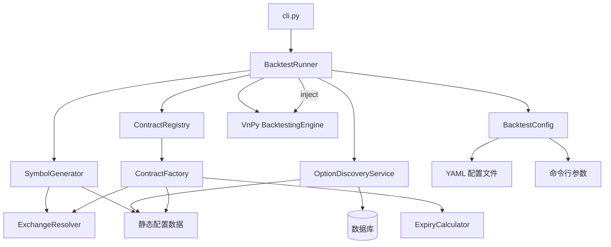

# 设计文档：回测模块重构

## 概述

将 `src/backtesting` 从两个散乱的文件重构为职责清晰的模块结构。核心思路是将当前 `vt_symbol_generator.py` 中混杂的职责拆分为独立组件（交易所解析、到期日计算、合约工厂、期权发现），将 `run_backtesting.py` 中的 monkey-patching 替换为合约注册表模式，并将回测配置从硬编码改为可配置的数据类。

重构后的模块结构：

```
src/backtesting/
├── __init__.py                  # 公共接口导出
├── config.py                    # 回测配置数据类 + 静态配置数据（交易所映射、品种规格）
├── contract/
│   ├── __init__.py
│   ├── exchange_resolver.py     # 交易所解析
│   ├── expiry_calculator.py     # 到期日计算
│   ├── contract_factory.py      # ContractData 构建
│   └── contract_registry.py     # 合约注册表（替代 monkey-patching）
├── discovery/
│   ├── __init__.py
│   ├── symbol_generator.py      # vt_symbol 生成
│   └── option_discovery.py      # 期权合约发现
├── runner.py                    # 回测执行器
└── cli.py                       # 命令行入口
```

## 架构



数据流：
1. CLI 解析命令行参数 → 构建 `BacktestConfig`
2. `BacktestRunner` 使用 `SymbolGenerator` 生成期货 vt_symbols
3. `OptionDiscoveryService` 从数据库发现关联期权
4. `ContractFactory` 为每个 vt_symbol 构建 `ContractData`
5. `ContractRegistry` 收集所有合约，注入 `BacktestingEngine`
6. 引擎执行回测

## 组件与接口

### 1. 静态配置数据 (`config.py`)

集中存放交易所映射、期货期权映射、品种规格等静态数据。

```python
# 交易所映射
EXCHANGE_MAP: Dict[str, str] = {
    "IF": "CFFEX", "IM": "CFFEX", "IO": "CFFEX", "MO": "CFFEX",
    "rb": "SHFE", "ag": "SHFE",
    "m": "DCE", "i": "DCE",
    "SA": "CZCE", "MA": "CZCE",
    # ... 完整映射
}

# 期货→期权映射
FUTURE_OPTION_MAP: Dict[str, str] = {"IF": "IO", "IM": "MO", "IH": "HO"}
OPTION_FUTURE_MAP: Dict[str, str] = {v: k for k, v in FUTURE_OPTION_MAP.items()}

# 品种规格 (size, pricetick)
PRODUCT_SPECS: Dict[str, Tuple[int, float]] = {
    "IF": (300, 0.2), "IM": (200, 0.2), "IO": (100, 0.2), "MO": (100, 0.2),
    # ... 完整规格
}
DEFAULT_PRODUCT_SPEC: Tuple[int, float] = (10, 1.0)
```

### 2. ExchangeResolver (`contract/exchange_resolver.py`)

```python
class ExchangeResolver:
    @staticmethod
    def resolve(product_code: str) -> str:
        """根据品种代码返回交易所代码。未知品种抛出 ValueError。"""

    @staticmethod
    def is_czce(product_code: str) -> bool:
        """判断品种是否属于郑商所（影响合约代码格式）。"""
```

### 3. ExpiryCalculator (`contract/expiry_calculator.py`)

```python
class ExpiryCalculator:
    @classmethod
    def calculate(cls, product_code: str, year: int, month: int) -> date:
        """根据交易所规则计算到期日。优先使用手动配置。"""

    @staticmethod
    def get_trading_days(year: int, month: int) -> List[date]:
        """获取指定月份的交易日列表（排除周末和法定节假日）。"""
```

### 4. ContractFactory (`contract/contract_factory.py`)

```python
class ContractFactory:
    @classmethod
    def create(cls, vt_symbol: str, gateway_name: str = "BACKTESTING") -> Optional[ContractData]:
        """解析 vt_symbol 并构建 ContractData。支持期货和期权格式。"""

    @staticmethod
    def parse_vt_symbol(vt_symbol: str) -> Tuple[str, str, str]:
        """解析 vt_symbol 为 (symbol, exchange_str, product_code)。"""
```

### 5. ContractRegistry (`contract/contract_registry.py`)

```python
class ContractRegistry:
    def __init__(self) -> None:
        self._contracts: Dict[str, ContractData] = {}

    def register(self, contract: ContractData) -> None:
        """注册合约。"""

    def get(self, vt_symbol: str) -> Optional[ContractData]:
        """查询合约。"""

    def get_all(self) -> List[ContractData]:
        """获取全部合约。"""

    def register_many(self, vt_symbols: List[str]) -> int:
        """批量注册：使用 ContractFactory 构建并注册。返回成功数量。"""

    def inject_into_engine(self, engine: BacktestingEngine) -> None:
        """将合约信息注入回测引擎（替代 monkey-patching）。"""
```

### 6. SymbolGenerator (`discovery/symbol_generator.py`)

```python
class SymbolGenerator:
    @classmethod
    def generate_for_range(
        cls, product_code: str,
        start_year: int, start_month: int,
        end_year: int, end_month: int
    ) -> List[str]:
        """生成指定时间范围内的所有 vt_symbol。"""

    @classmethod
    def generate_recent(cls, product_code: str, months_ahead: int = 1) -> List[str]:
        """生成近期合约代码（当前月到 N 个月后）。"""
```

### 7. OptionDiscoveryService (`discovery/option_discovery.py`)

```python
class OptionDiscoveryService:
    @classmethod
    def discover(cls, underlying_vt_symbols: List[str]) -> List[str]:
        """从数据库中查找关联期权合约。"""
```

### 8. BacktestConfig (`config.py`)

```python
@dataclass
class BacktestConfig:
    config_path: str = "config/strategy_config.yaml"
    start_date: Optional[str] = None
    end_date: Optional[str] = None
    capital: int = 1_000_000
    rate: float = 2.5e-5
    slippage: float = 0.2
    default_size: int = 10
    default_pricetick: float = 1.0
    show_chart: bool = True

    @classmethod
    def from_yaml(cls, path: str) -> "BacktestConfig":
        """从 YAML 文件加载配置。"""

    @classmethod
    def from_args(cls, args: argparse.Namespace) -> "BacktestConfig":
        """从命令行参数构建配置。"""
```

### 9. BacktestRunner (`runner.py`)

```python
class BacktestRunner:
    def __init__(self, config: BacktestConfig) -> None:
        self.config = config
        self.registry = ContractRegistry()

    def run(self) -> None:
        """执行完整回测流程。"""
```

## 数据模型

### BacktestConfig

| 字段 | 类型 | 默认值 | 说明 |
|------|------|--------|------|
| config_path | str | "config/strategy_config.yaml" | 策略配置文件路径 |
| start_date | Optional[str] | None | 回测开始日期 (YYYY-MM-DD) |
| end_date | Optional[str] | None | 回测结束日期，None 表示当天 |
| capital | int | 1_000_000 | 初始资金 |
| rate | float | 2.5e-5 | 手续费率 |
| slippage | float | 0.2 | 滑点 |
| default_size | int | 10 | 默认合约乘数 |
| default_pricetick | float | 1.0 | 默认最小价格变动 |
| show_chart | bool | True | 是否显示图表 |

### 静态配置数据

| 数据 | 类型 | 说明 |
|------|------|------|
| EXCHANGE_MAP | Dict[str, str] | 品种代码→交易所代码映射 |
| FUTURE_OPTION_MAP | Dict[str, str] | 期货品种→期权品种映射 |
| OPTION_FUTURE_MAP | Dict[str, str] | 期权品种→期货品种反向映射 |
| PRODUCT_SPECS | Dict[str, Tuple[int, float]] | 品种→(乘数, 最小价格变动) |
| MANUAL_EXPIRY_CONFIG | Dict[str, date] | 手动到期日配置 |


## 正确性属性

*正确性属性是一种在系统所有有效执行中都应成立的特征或行为——本质上是关于系统应该做什么的形式化陈述。属性是人类可读规范与机器可验证正确性保证之间的桥梁。*

### Property 1: 合约代码生成格式正确性

*For any* 品种代码和有效的时间范围（start_year/start_month 到 end_year/end_month），SymbolGenerator 生成的 vt_symbol 列表应满足：
- 列表长度等于时间范围内的月份数
- 郑商所品种使用 1 位年份 + 2 位月份格式（如 AP601）
- 其他交易所品种使用 2 位年份 + 2 位月份格式（如 rb2601）
- 每个 symbol 以 ".交易所代码" 结尾

**Validates: Requirements 2.1, 2.2, 2.3**

### Property 2: 交易所解析一致性

*For any* EXCHANGE_MAP 中的品种代码，ExchangeResolver.resolve() 返回的交易所代码应与 EXCHANGE_MAP 中存储的值一致。

**Validates: Requirements 3.1**

### Property 3: 品种规格查找正确性

*For any* PRODUCT_SPECS 中的品种代码，查找返回的 (size, pricetick) 应与 PRODUCT_SPECS 中存储的值一致；对于不在 PRODUCT_SPECS 中的品种代码，应返回默认值 (10, 1.0)。

**Validates: Requirements 3.3, 3.4**

### Property 4: 到期日计算交易所规则正确性

*For any* 品种代码和有效的年/月组合，ExpiryCalculator.calculate() 返回的到期日应满足：
- 中金所品种：到期日是合约月份的第三个周五（weekday == 4）
- 大商所品种：到期日在交割月前一个月内
- 郑商所品种：到期日在交割月前一个月内
- 上期所/能源中心品种：到期日在交割月前一个月内

**Validates: Requirements 4.1, 4.2, 4.3, 4.4**

### Property 5: 期货合约构建正确性

*For any* 有效的期货格式 vt_symbol（如 "XX2501.EXCHANGE"），ContractFactory.create() 返回的 ContractData 应满足：
- product 为 Product.FUTURES
- symbol 和 exchange 与输入一致
- size 和 pricetick 与 PRODUCT_SPECS 中该品种的值一致（或使用默认值）

**Validates: Requirements 5.1, 5.4**

### Property 6: 期权合约构建正确性

*For any* 有效的期权格式 vt_symbol（如 "MO2601-C-6300.CFFEX"），ContractFactory.create() 返回的 ContractData 应满足：
- product 为 Product.OPTION
- option_type 与 symbol 中的 C/P 标识一致
- option_strike 与 symbol 中的行权价一致
- 若品种存在反向映射（如 MO→IM），option_underlying 使用映射后的期货品种代码

**Validates: Requirements 5.2, 5.3, 5.4**

### Property 7: 合约注册表 round-trip

*For any* 一组 ContractData 对象，注册到 ContractRegistry 后：
- get_all() 返回的合约数量等于注册的去重数量
- 对每个已注册的 vt_symbol，get() 返回对应的 ContractData
- 对未注册的 vt_symbol，get() 返回 None

**Validates: Requirements 7.1, 7.2, 7.3**

### Property 8: 配置 CLI 覆盖优先级

*For any* BacktestConfig 默认值和命令行参数覆盖值，当 CLI 参数非 None 时，最终配置中该字段的值应等于 CLI 参数值；当 CLI 参数为 None 时，应保留默认值。

**Validates: Requirements 8.4**

## 错误处理

| 场景 | 处理方式 |
|------|----------|
| 未知品种代码传入 ExchangeResolver | 抛出 ValueError，包含品种代码信息 |
| 无法解析的 vt_symbol 传入 ContractFactory | 返回 None，记录 warning 日志 |
| 数据库查询失败（OptionDiscoveryService） | 记录 error 日志，返回空列表 |
| 生成的 vt_symbols 为空（BacktestRunner） | 终止执行，输出错误信息 |
| 配置文件不存在 | 抛出 FileNotFoundError |
| 到期日计算异常 | 回退到月份第 15 日 |

## 测试策略

### 测试框架

- 单元测试：pytest
- 属性测试：hypothesis
- 每个属性测试至少运行 100 次迭代

### 属性测试

每个正确性属性对应一个属性测试，使用 hypothesis 生成随机输入：

- **Property 1**: 生成随机品种代码（从 EXCHANGE_MAP 中选取）和随机时间范围，验证 SymbolGenerator 输出格式
- **Property 2**: 从 EXCHANGE_MAP 中随机选取品种代码，验证 ExchangeResolver 返回值
- **Property 3**: 生成随机品种代码（包含已知和未知），验证规格查找结果
- **Property 4**: 生成随机品种代码和年/月，验证到期日符合交易所规则
- **Property 5**: 生成随机期货 vt_symbol，验证 ContractFactory 输出
- **Property 6**: 生成随机期权 vt_symbol，验证 ContractFactory 输出
- **Property 7**: 生成随机 ContractData 集合，验证注册表 round-trip
- **Property 8**: 生成随机配置值和 CLI 覆盖值，验证优先级

每个测试需标注：**Feature: backtesting-restructure, Property {number}: {property_text}**

### 单元测试

- ExchangeResolver：未知品种抛出 ValueError
- ContractFactory：无法解析的 vt_symbol 返回 None
- ExpiryCalculator：手动配置优先级、节假日处理
- BacktestConfig：默认结束日期为当天
- OptionDiscoveryService：数据库失败返回空列表
- BacktestRunner：空 vt_symbols 终止执行
