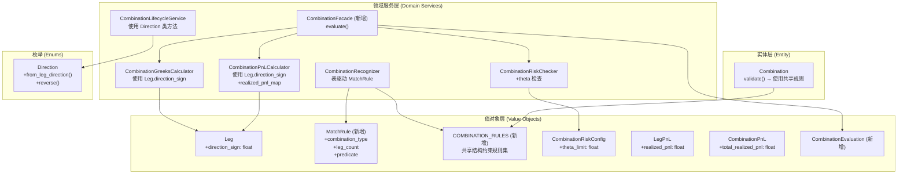

# 设计文档：组合策略领域服务优化

## 概述

本设计对 `src/strategy/domain/domain_service/combination/` 下的 5 个组合策略领域服务进行全面优化。优化分为两类：

1. **重构优化**（需求 1-4）：消除重复代码、表驱动化、统一约束规则、统一方向映射。这些变更不改变外部行为，所有现有测试应继续通过。
2. **功能增强**（需求 5-7）：补充 theta 风控检查、新增 CombinationFacade 编排层、PnL 支持已实现盈亏。

设计原则：最小化变更范围，保持 DDD 分层架构，确保向后兼容。

## 架构



## 组件与接口

### 1. Leg 值对象 — direction_sign 属性（需求 1）

在现有 `Leg` dataclass（`src/strategy/domain/value_object/combination.py`）上新增计算属性：

```python
@dataclass(frozen=True)
class Leg:
    vt_symbol: str
    option_type: OptionType
    strike_price: float
    expiry_date: str
    direction: str          # "long" 或 "short"
    volume: int
    open_price: float

    @property
    def direction_sign(self) -> float:
        """返回方向符号：long → 1.0, short → -1.0"""
        return 1.0 if self.direction == "long" else -1.0
```

**变更影响**：
- `CombinationGreeksCalculator`：删除模块级 `_DIRECTION_SIGN` 字典，改用 `leg.direction_sign`
- `CombinationPnLCalculator`：删除模块级 `_DIRECTION_SIGN` 字典，改用 `leg.direction_sign`

### 2. CombinationRecognizer 表驱动化（需求 2）

新增 `MatchRule` dataclass，将现有 `_is_straddle()` / `_is_strangle()` 等私有方法转换为规则列表：

```python
@dataclass(frozen=True)
class MatchRule:
    """组合类型匹配规则"""
    combination_type: CombinationType
    leg_count: int
    predicate: Callable[[List[OptionContract]], bool]
```

`CombinationRecognizer` 内部维护 `_RULES: List[MatchRule]`，按优先级排序（IRON_CONDOR → STRADDLE → STRANGLE → VERTICAL_SPREAD → CALENDAR_SPREAD）。`recognize()` 方法遍历规则列表：

```python
def recognize(self, positions, contracts) -> CombinationType:
    if not positions:
        return CombinationType.CUSTOM
    option_contracts = [contracts.get(p.vt_symbol) for p in positions]
    if any(c is None for c in option_contracts):
        return CombinationType.CUSTOM
    for rule in self._RULES:
        if len(positions) == rule.leg_count and rule.predicate(option_contracts):
            return rule.combination_type
    return CombinationType.CUSTOM
```

现有的 `_is_straddle`、`_is_strangle`、`_is_vertical_spread`、`_is_calendar_spread`、`_is_iron_condor` 私有方法保留为静态谓词函数，供 `MatchRule.predicate` 引用。`_get_contracts` 辅助方法不再需要（逻辑内联到 `recognize`）。

### 3. 共享结构约束规则（需求 3）

新增模块 `src/strategy/domain/value_object/combination_rules.py`，定义统一的腿结构描述和验证函数：

```python
@dataclass(frozen=True)
class LegStructure:
    """统一的腿结构描述，用于规则匹配和验证"""
    option_type: str      # "call" 或 "put"
    strike_price: float
    expiry_date: str
```

为每种 `CombinationType` 定义验证函数，返回 `Optional[str]`（None 表示通过，字符串为错误信息）：

```python
def validate_straddle(legs: List[LegStructure]) -> Optional[str]:
    """STRADDLE: 恰好 2 腿，同到期日、同行权价、一 Call 一 Put"""
    if len(legs) != 2:
        return f"STRADDLE 需要恰好 2 腿，当前 {len(legs)} 腿"
    l0, l1 = legs
    if l0.expiry_date != l1.expiry_date:
        return "STRADDLE 要求所有腿到期日相同"
    if l0.strike_price != l1.strike_price:
        return "STRADDLE 要求所有腿行权价相同"
    if {l0.option_type, l1.option_type} != {"call", "put"}:
        return "STRADDLE 要求一个 Call 和一个 Put"
    return None

# 类似定义 validate_strangle, validate_vertical_spread, validate_calendar_spread, validate_iron_condor, validate_custom

VALIDATION_RULES: Dict[CombinationType, Callable[[List[LegStructure]], Optional[str]]] = {
    CombinationType.STRADDLE: validate_straddle,
    CombinationType.STRANGLE: validate_strangle,
    CombinationType.VERTICAL_SPREAD: validate_vertical_spread,
    CombinationType.CALENDAR_SPREAD: validate_calendar_spread,
    CombinationType.IRON_CONDOR: validate_iron_condor,
    CombinationType.CUSTOM: validate_custom,
}
```

**转换适配**：
- `Leg` → `LegStructure`：取 `option_type`、`strike_price`、`expiry_date`
- `OptionContract` → `LegStructure`：取 `option_type`、`strike_price`、`expiry_date`

**变更影响**：
- `Combination.validate()`：将 `_validate_straddle()` 等私有方法替换为调用 `VALIDATION_RULES[self.combination_type]`
- `CombinationRecognizer`：`MatchRule.predicate` 内部复用 `validate_xxx` 函数（传入从 `OptionContract` 转换的 `LegStructure`）

### 4. Direction 类方法（需求 4）

在现有 `Direction` 枚举（`src/strategy/domain/value_object/order_instruction.py`）上新增方法：

```python
class Direction(Enum):
    LONG = "long"
    SHORT = "short"

    @classmethod
    def from_leg_direction(cls, leg_direction: str) -> "Direction":
        """将 Leg 的 direction 字符串映射为 Direction 枚举"""
        return cls(leg_direction)

    def reverse(self) -> "Direction":
        """返回反向 Direction"""
        return Direction.SHORT if self == Direction.LONG else Direction.LONG
```

**变更影响**：`CombinationLifecycleService` 中所有 `if leg.direction == "long"` 的 if-else 替换为 `Direction.from_leg_direction(leg.direction)` 和 `.reverse()` 调用。

### 5. CombinationRiskChecker — theta 检查（需求 5）

`CombinationRiskConfig` 新增 `theta_limit` 字段（默认值 100.0，向后兼容）：

```python
@dataclass(frozen=True)
class CombinationRiskConfig:
    delta_limit: float = 2.0
    gamma_limit: float = 0.5
    vega_limit: float = 200.0
    theta_limit: float = 100.0  # 新增
```

`CombinationRiskChecker.check()` 在现有 vega 检查之后新增 theta 检查：

```python
if abs(greeks.theta) > self._config.theta_limit:
    violations.append(f"theta={greeks.theta:.4f}(limit={self._config.theta_limit})")
```

### 6. CombinationFacade 编排层（需求 6）

新增 `src/strategy/domain/domain_service/combination/combination_facade.py`：

```python
@dataclass(frozen=True)
class CombinationEvaluation:
    """组合评估结果"""
    greeks: CombinationGreeks
    pnl: CombinationPnL
    risk_result: RiskCheckResult


class CombinationFacade:
    """组合策略编排层，提供高层评估接口"""

    def __init__(
        self,
        greeks_calculator: CombinationGreeksCalculator,
        pnl_calculator: CombinationPnLCalculator,
        risk_checker: CombinationRiskChecker,
    ) -> None:
        self._greeks_calculator = greeks_calculator
        self._pnl_calculator = pnl_calculator
        self._risk_checker = risk_checker

    def evaluate(
        self,
        combination: Combination,
        greeks_map: Dict[str, GreeksResult],
        current_prices: Dict[str, float],
        multiplier: float,
        realized_pnl_map: Optional[Dict[str, float]] = None,
    ) -> CombinationEvaluation:
        """依次调用 Greeks 计算、PnL 计算、风控检查，返回综合评估结果。"""
        greeks = self._greeks_calculator.calculate(combination, greeks_map, multiplier)
        pnl = self._pnl_calculator.calculate(
            combination, current_prices, multiplier, realized_pnl_map
        )
        risk_result = self._risk_checker.check(greeks)
        return CombinationEvaluation(greeks=greeks, pnl=pnl, risk_result=risk_result)
```

`CombinationEvaluation` 值对象定义在 `src/strategy/domain/value_object/combination.py` 中。

### 7. PnL 已实现盈亏支持（需求 7）

**值对象变更**（`src/strategy/domain/value_object/combination.py`）：

```python
@dataclass(frozen=True)
class LegPnL:
    vt_symbol: str
    unrealized_pnl: float
    price_available: bool = True
    realized_pnl: float = 0.0  # 新增

@dataclass(frozen=True)
class CombinationPnL:
    total_unrealized_pnl: float
    leg_details: List[LegPnL] = field(default_factory=list)
    timestamp: datetime = field(default_factory=datetime.now)
    total_realized_pnl: float = 0.0  # 新增
```

**CombinationPnLCalculator 变更**：

```python
def calculate(
    self,
    combination: Combination,
    current_prices: Dict[str, float],
    multiplier: float,
    realized_pnl_map: Optional[Dict[str, float]] = None,  # 新增可选参数
) -> CombinationPnL:
    realized_pnl_map = realized_pnl_map or {}
    total_realized = 0.0
    # ... 现有未实现盈亏计算逻辑不变 ...
    for leg in combination.legs:
        realized = realized_pnl_map.get(leg.vt_symbol, 0.0)
        total_realized += realized
        # LegPnL 构造时传入 realized_pnl=realized
    return CombinationPnL(..., total_realized_pnl=total_realized)
```

`realized_pnl_map` 默认为 `None`，不传时所有 `realized_pnl` 为 0.0，保持向后兼容。

## 数据模型

### 新增值对象

| 值对象 | 位置 | 说明 |
|--------|------|------|
| `LegStructure` | `combination_rules.py` | 统一的腿结构描述（option_type, strike_price, expiry_date） |
| `CombinationEvaluation` | `combination.py` | 组合评估结果（greeks, pnl, risk_result） |
| `MatchRule` | `combination_recognizer.py` | 组合类型匹配规则（combination_type, leg_count, predicate） |

### 修改的值对象

| 值对象 | 变更 |
|--------|------|
| `Leg` | 新增 `direction_sign` 计算属性 |
| `CombinationRiskConfig` | 新增 `theta_limit: float = 100.0` |
| `LegPnL` | 新增 `realized_pnl: float = 0.0` |
| `CombinationPnL` | 新增 `total_realized_pnl: float = 0.0` |

### 修改的枚举

| 枚举 | 变更 |
|------|------|
| `Direction` | 新增 `from_leg_direction()` 类方法和 `reverse()` 方法 |

### 新增文件

| 文件 | 说明 |
|------|------|
| `src/strategy/domain/value_object/combination_rules.py` | 共享结构约束规则集 |
| `src/strategy/domain/domain_service/combination/combination_facade.py` | 组合编排层 |

## 正确性属性

*正确性属性（Correctness Property）是一种在系统所有合法执行路径上都应成立的特征或行为——本质上是对系统应做什么的形式化陈述。属性是连接人类可读规格说明与机器可验证正确性保证之间的桥梁。*


### Property 1: direction_sign 正确性

*For any* Leg，当 direction 为 "long" 时 direction_sign 应为 1.0，当 direction 为 "short" 时 direction_sign 应为 -1.0。

**Validates: Requirements 1.1**

### Property 2: Greeks 计算方向加权正确性

*For any* Combination 和 greeks_map，CombinationGreeksCalculator 计算的组合级 Greeks 应等于各 Leg 的 Greeks 按 `volume × multiplier × direction_sign` 加权求和的结果。

**Validates: Requirements 1.2, 1.3, 1.5**

### Property 3: PnL 计算方向加权正确性

*For any* Combination、current_prices 和 multiplier，CombinationPnLCalculator 计算的每腿未实现盈亏应等于 `(current_price - open_price) × volume × multiplier × direction_sign`，总未实现盈亏应等于各腿之和。

**Validates: Requirements 1.3, 1.5**

### Property 4: Recognizer 表驱动行为等价性

*For any* 持仓列表和合约映射，表驱动重构后的 CombinationRecognizer 应返回与重构前完全相同的 CombinationType 结果。特别地：空列表返回 CUSTOM，合约缺失返回 CUSTOM，匹配规则按 IRON_CONDOR → STRADDLE → STRANGLE → VERTICAL_SPREAD → CALENDAR_SPREAD 优先级执行。

**Validates: Requirements 2.3, 2.4, 2.5, 2.6**

### Property 5: validate() 行为等价性

*For any* CombinationType 和 Leg 列表，使用共享规则集的 `Combination.validate()` 应产生与重构前完全相同的验证结果（通过或抛出相同错误信息）。

**Validates: Requirements 3.5**

### Property 6: Direction.from_leg_direction 映射正确性

*For any* 合法的 leg direction 字符串（"long" 或 "short"），`Direction.from_leg_direction()` 应返回对应的 Direction 枚举值。

**Validates: Requirements 4.1**

### Property 7: Direction.reverse 对合性（round-trip）

*For any* Direction 值 d，`d.reverse().reverse()` 应等于 d。且 `Direction.LONG.reverse()` 应为 `Direction.SHORT`，反之亦然。

**Validates: Requirements 4.2**

### Property 8: Lifecycle 指令生成等价性

*For any* Combination 和 price_map，重构后的 CombinationLifecycleService 生成的开仓、平仓、调整指令应与重构前完全相同。

**Validates: Requirements 4.5**

### Property 9: 风控检查 theta 集成正确性

*For any* CombinationGreeks 和 CombinationRiskConfig，RiskChecker 应在 |theta| > theta_limit 时将 theta 超限信息加入 reject_reason，且不影响现有 delta/gamma/vega 检查逻辑。当所有 Greeks 均未超限时返回 passed=True。

**Validates: Requirements 5.2, 5.3, 5.4, 5.5**

### Property 10: Facade evaluate 组合正确性

*For any* 合法的 Combination、greeks_map、current_prices 和 multiplier，CombinationFacade.evaluate() 返回的 CombinationEvaluation 中 greeks 应等于 GreeksCalculator 的结果，pnl 应等于 PnLCalculator 的结果，risk_result 应等于 RiskChecker 对计算出的 greeks 的检查结果。

**Validates: Requirements 6.2, 6.3**

### Property 11: PnL 已实现盈亏正确性

*For any* Combination 和 realized_pnl_map，每个 LegPnL 的 realized_pnl 应等于 realized_pnl_map 中对应 vt_symbol 的值（不存在则为 0.0），total_realized_pnl 应等于所有 Leg 的 realized_pnl 之和。当 realized_pnl_map 为空或未提供时，所有 realized_pnl 应为 0.0。

**Validates: Requirements 7.4, 7.5, 7.6**

## 错误处理

| 场景 | 处理方式 |
|------|----------|
| `Leg.direction` 非 "long"/"short" | `direction_sign` 返回 -1.0（else 分支兜底） |
| `Direction.from_leg_direction` 传入非法字符串 | 抛出 `ValueError`（Enum 构造函数行为） |
| `CombinationRecognizer` 合约缺失 | 返回 `CombinationType.CUSTOM` |
| `CombinationRiskChecker` 多个 Greeks 同时超限 | 所有超限信息拼接到 `reject_reason` |
| `CombinationFacade.evaluate` 子服务异常 | 异常直接传播，不静默吞没 |
| `CombinationPnLCalculator` 当前价格缺失 | `price_available=False`，该腿盈亏计为 0（现有行为不变） |
| `Combination.validate()` 结构不满足约束 | 抛出 `ValueError`，错误信息与重构前一致 |

## 测试策略

### 测试框架

- 单元测试：`pytest`
- 属性测试：`hypothesis`（Python 属性测试库）
- 每个属性测试至少运行 100 次迭代

### 单元测试

现有测试文件保持不变，新增以下测试：

| 测试文件 | 覆盖内容 |
|----------|----------|
| `test_combination_vo.py` | Leg.direction_sign 属性 |
| `test_combination_risk_checker.py` | theta 检查（超限/未超限/多指标同时超限） |
| `test_combination_pnl_calculator.py` | realized_pnl_map 参数（有值/无值/部分有值） |
| `test_combination_facade.py`（新增） | evaluate 正常流程、子服务异常传播 |
| `test_combination_rules.py`（新增） | 共享规则集各类型验证函数 |
| `test_combination_lifecycle_service.py` | Direction 类方法集成 |

### 属性测试

每个属性测试必须引用设计文档中的属性编号，标签格式：

```
Feature: combination-service-optimization, Property N: <property_text>
```

| 属性 | 测试策略 | 生成器 |
|------|----------|--------|
| P1: direction_sign | 生成随机 Leg，验证 direction_sign 映射 | direction ∈ {"long", "short"} |
| P2: Greeks 加权 | 生成随机 Combination + greeks_map，验证加权求和 | 随机 float Greeks 值 |
| P3: PnL 加权 | 生成随机 Combination + prices，验证盈亏公式 | 随机 float 价格 |
| P4: Recognizer 等价 | 生成各类型持仓结构，验证识别结果 | 按类型约束生成合法持仓 |
| P5: validate 等价 | 生成各类型 Leg 列表，验证验证结果 | 按类型约束生成合法/非法 Leg |
| P6: from_leg_direction | 枚举所有合法输入 | "long", "short" |
| P7: reverse round-trip | 枚举所有 Direction 值 | Direction.LONG, Direction.SHORT |
| P8: Lifecycle 等价 | 生成随机 Combination + price_map，验证指令 | 随机 Leg 方向和价格 |
| P9: theta 集成 | 生成随机 Greeks + config，验证检查结果 | 随机 float Greeks 和 limits |
| P10: Facade 组合 | 生成完整输入，验证 evaluate 结果一致性 | 组合 P2+P3+P9 的生成器 |
| P11: realized_pnl | 生成随机 Combination + realized_pnl_map，验证求和 | 随机 float realized 值 |
