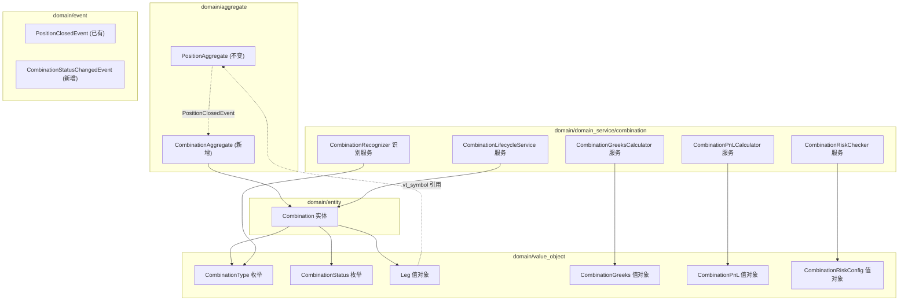
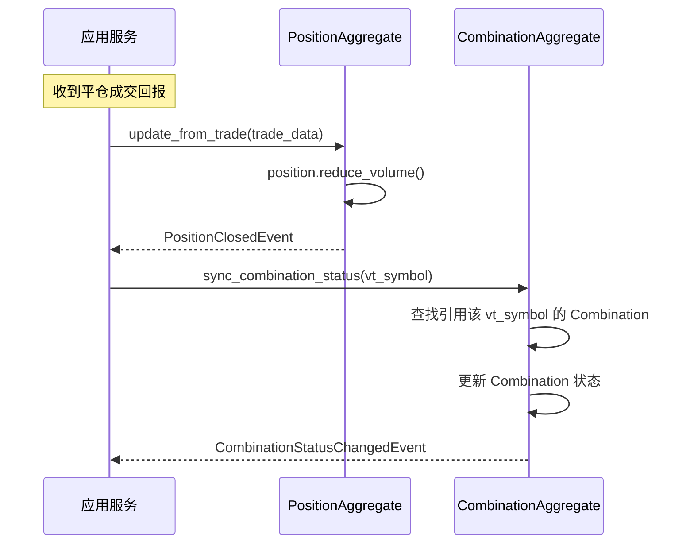
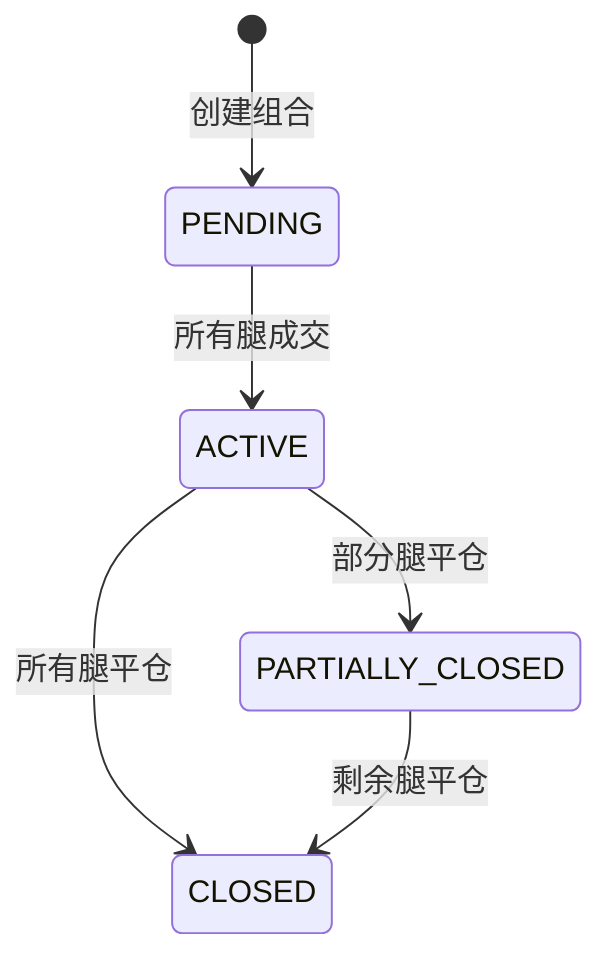

# 设计文档：组合策略管理

## 概述

本设计在现有 DDD 架构基础上引入 CombinationAggregate 作为独立聚合根，与 PositionAggregate 并列。Combination 通过 Leg 值对象松耦合引用 Position 的 vt_symbol，两个聚合根通过领域事件协调状态同步。

核心设计决策：
- CombinationAggregate 是独立聚合根，拥有自己的不变量边界和事件队列
- PositionAggregate 保持不变，继续管理所有 Position 的基础生命周期（成交、平仓、手动操作检测）
- Combination 通过 Leg 值对象引用 Position 的 vt_symbol（松耦合，路径 B）
- Position 的状态变化通过领域事件（PositionClosedEvent）通知 CombinationAggregate 同步状态
- 组合识别、Greeks 计算、盈亏计算、风控检查均为独立的领域服务（单一职责）
- 生命周期管理通过 CombinationLifecycleService 协调，生成 OrderInstruction 列表
- 单腿策略和组合策略可以共存：同一个 Position 可以独立存在，也可以被某个 Combination 引用

## 架构



### 两个聚合根的职责划分

| 聚合根 | 管理的不变量 | 管理的实体 |
|--------|-------------|-----------|
| PositionAggregate | Position 的成交/平仓生命周期、订单管理、手动操作检测、每日开仓限额 | Position, Order |
| CombinationAggregate | Combination 的结构约束（Leg 数量/类型）、组合状态机转换、Combination 注册表 | Combination |

### 协调机制

PositionAggregate 在 Position 平仓时产生 PositionClosedEvent（已有）。应用服务层监听此事件，调用 CombinationAggregate 的 `sync_combination_status` 方法同步组合状态。这保证了两个聚合根之间的最终一致性。



## 组件与接口

### 1. Combination 实体

文件：`src/strategy/domain/entity/combination.py`

```python
@dataclass
class Combination:
    combination_id: str                    # 唯一标识符 (UUID)
    combination_type: CombinationType      # 组合类型
    underlying_vt_symbol: str              # 标的合约代码
    legs: List[Leg]                        # 腿列表
    status: CombinationStatus              # 生命周期状态
    create_time: datetime                  # 创建时间
    close_time: Optional[datetime]         # 平仓时间

    def validate(self) -> None: ...        # 验证结构约束
    def update_status(self, closed_vt_symbols: Set[str]) -> Optional[CombinationStatus]: ...
    def get_active_legs(self) -> List[Leg]: ...
    def to_dict(self) -> Dict[str, Any]: ...
    @classmethod
    def from_dict(cls, data: Dict[str, Any]) -> "Combination": ...
```

`update_status` 接受一组已平仓的 vt_symbol 集合，根据 Leg 引用的 vt_symbol 是否在集合中来判断状态转换。返回新状态（如果发生变化）或 None。

验证规则：
- STRADDLE：恰好 2 腿，同标的、同到期日、同行权价、一 Call 一 Put
- STRANGLE：恰好 2 腿，同标的、同到期日、不同行权价、一 Call 一 Put
- VERTICAL_SPREAD：恰好 2 腿，同标的、同到期日、同类型、不同行权价
- CALENDAR_SPREAD：恰好 2 腿，同标的、不同到期日、同行权价、同类型
- IRON_CONDOR：恰好 4 腿，同标的、同到期日，构成 1 个 Put Spread + 1 个 Call Spread
- CUSTOM：无结构约束，至少 1 腿

### 2. Leg 值对象

文件：`src/strategy/domain/value_object/combination.py`

```python
@dataclass(frozen=True)
class Leg:
    vt_symbol: str              # 期权合约代码（松耦合引用 Position）
    option_type: OptionType     # call 或 put
    strike_price: float         # 行权价
    expiry_date: str            # 到期日
    direction: str              # "long" 或 "short"
    volume: int                 # 持仓量
    open_price: float           # 开仓价
```

### 3. CombinationType 和 CombinationStatus 枚举

文件：`src/strategy/domain/value_object/combination.py`

```python
class CombinationType(Enum):
    STRADDLE = "straddle"
    STRANGLE = "strangle"
    VERTICAL_SPREAD = "vertical_spread"
    CALENDAR_SPREAD = "calendar_spread"
    IRON_CONDOR = "iron_condor"
    CUSTOM = "custom"

class CombinationStatus(Enum):
    PENDING = "pending"              # 已创建，等待成交
    ACTIVE = "active"                # 所有腿已成交
    PARTIALLY_CLOSED = "partially_closed"  # 部分腿已平仓
    CLOSED = "closed"                # 所有腿已平仓
```

### 4. CombinationGreeks 和 CombinationPnL 值对象

文件：`src/strategy/domain/value_object/combination.py`

```python
@dataclass(frozen=True)
class CombinationGreeks:
    delta: float = 0.0
    gamma: float = 0.0
    theta: float = 0.0
    vega: float = 0.0
    failed_legs: List[str] = field(default_factory=list)  # 计算失败的腿

@dataclass(frozen=True)
class LegPnL:
    vt_symbol: str
    unrealized_pnl: float
    price_available: bool = True

@dataclass(frozen=True)
class CombinationPnL:
    total_unrealized_pnl: float
    leg_details: List[LegPnL]
    timestamp: datetime
```

### 5. CombinationRiskConfig 值对象

文件：`src/strategy/domain/value_object/combination.py`

```python
@dataclass(frozen=True)
class CombinationRiskConfig:
    delta_limit: float = 2.0
    gamma_limit: float = 0.5
    vega_limit: float = 200.0
```

### 6. CombinationRecognizer 领域服务

文件：`src/strategy/domain/domain_service/combination/combination_recognizer.py`

```python
class CombinationRecognizer:
    def recognize(
        self,
        positions: List[Position],
        contracts: Dict[str, OptionContract]
    ) -> CombinationType:
        """分析持仓结构，返回匹配的组合类型"""
        ...
```

识别逻辑按优先级匹配：IRON_CONDOR → STRADDLE → STRANGLE → VERTICAL_SPREAD → CALENDAR_SPREAD → CUSTOM

### 7. CombinationGreeksCalculator 领域服务

文件：`src/strategy/domain/domain_service/combination/combination_greeks_calculator.py`

```python
class CombinationGreeksCalculator:
    def calculate(
        self,
        combination: Combination,
        greeks_map: Dict[str, GreeksResult],
        multiplier: float
    ) -> CombinationGreeks:
        """计算组合级 Greeks 聚合"""
        ...
```

加权公式：`greek_total += greek_per_unit × volume × multiplier × direction_sign`
- direction_sign：long = +1，short = -1

### 8. CombinationPnLCalculator 领域服务

文件：`src/strategy/domain/domain_service/combination/combination_pnl_calculator.py`

```python
class CombinationPnLCalculator:
    def calculate(
        self,
        combination: Combination,
        current_prices: Dict[str, float],
        multiplier: float
    ) -> CombinationPnL:
        """计算组合级盈亏"""
        ...
```

单腿盈亏公式：`(current_price - open_price) × volume × multiplier × direction_sign`

### 9. CombinationRiskChecker 领域服务

文件：`src/strategy/domain/domain_service/combination/combination_risk_checker.py`

```python
class CombinationRiskChecker:
    def __init__(self, config: CombinationRiskConfig) -> None: ...

    def check(self, greeks: CombinationGreeks) -> RiskCheckResult:
        """检查组合级 Greeks 是否超限"""
        ...
```

复用现有 `RiskCheckResult` 值对象。

### 10. CombinationLifecycleService 领域服务

文件：`src/strategy/domain/domain_service/combination/combination_lifecycle_service.py`

```python
class CombinationLifecycleService:
    def generate_open_instructions(
        self,
        combination: Combination,
        price_map: Dict[str, float]
    ) -> List[OrderInstruction]:
        """为组合的每个腿生成开仓指令"""
        ...

    def generate_close_instructions(
        self,
        combination: Combination,
        price_map: Dict[str, float]
    ) -> List[OrderInstruction]:
        """为组合的所有活跃腿生成平仓指令"""
        ...

    def generate_adjust_instruction(
        self,
        combination: Combination,
        leg_vt_symbol: str,
        new_volume: int,
        current_price: float
    ) -> OrderInstruction:
        """为指定腿生成调整指令"""
        ...
```


### 11. CombinationAggregate 聚合根

文件：`src/strategy/domain/aggregate/combination_aggregate.py`

```python
class CombinationAggregate:
    """
    组合策略聚合根

    职责:
    1. 管理 Combination 注册表（按 combination_id 索引）
    2. 维护 vt_symbol → combination_id 的反向索引（用于事件驱动的状态同步）
    3. 保护 Combination 的结构不变量（创建时验证）
    4. 协调 Combination 状态机转换
    5. 管理领域事件队列
    """

    def __init__(self) -> None:
        self._combinations: Dict[str, Combination] = {}
        self._symbol_index: Dict[str, Set[str]] = {}  # vt_symbol → {combination_id}
        self._domain_events: List[DomainEvent] = []

    # ========== 持久化接口 ==========

    def to_snapshot(self) -> Dict[str, Any]: ...
    @classmethod
    def from_snapshot(cls, snapshot: Dict[str, Any]) -> "CombinationAggregate": ...

    # ========== 组合管理接口 ==========

    def register_combination(self, combination: Combination) -> None:
        """
        注册新组合（验证结构约束后注册）

        - 调用 combination.validate() 验证结构
        - 注册到 _combinations 字典
        - 建立 vt_symbol → combination_id 反向索引
        """
        ...

    def get_combination(self, combination_id: str) -> Optional[Combination]: ...

    def get_combinations_by_underlying(self, underlying: str) -> List[Combination]:
        """按标的合约查询所有关联的 Combination"""
        ...

    def get_active_combinations(self) -> List[Combination]:
        """获取所有活跃（非 CLOSED）的 Combination"""
        ...

    def get_combinations_by_symbol(self, vt_symbol: str) -> List[Combination]:
        """通过反向索引查找引用指定 vt_symbol 的所有 Combination"""
        ...

    # ========== 状态同步接口 ==========

    def sync_combination_status(
        self,
        vt_symbol: str,
        closed_vt_symbols: Set[str]
    ) -> None:
        """
        当 Position 状态变化时，同步更新关联的 Combination 状态。

        由应用服务在收到 PositionClosedEvent 后调用。

        流程:
        1. 通过 _symbol_index 查找引用该 vt_symbol 的所有 Combination
        2. 对每个 Combination 调用 update_status(closed_vt_symbols)
        3. 如果状态发生变化，产生 CombinationStatusChangedEvent
        """
        ...

    # ========== 领域事件接口 ==========

    def pop_domain_events(self) -> List[DomainEvent]: ...
    def has_pending_events(self) -> bool: ...
```

### 12. 新增领域事件

文件：`src/strategy/domain/event/event_types.py`（扩展）

```python
@dataclass
class CombinationStatusChangedEvent(DomainEvent):
    combination_id: str = ""
    old_status: str = ""
    new_status: str = ""
    combination_type: str = ""
```

注意：PositionClosedEvent 已存在于现有代码中，无需新增。应用服务层负责监听 PositionClosedEvent 并调用 CombinationAggregate.sync_combination_status。

## 数据模型

### Combination 实体状态机



### 状态判定逻辑

`Combination.update_status(closed_vt_symbols)` 的判定规则：
- 所有 Leg 的 vt_symbol 都在 closed_vt_symbols 中 → CLOSED
- 至少一个但非全部 Leg 的 vt_symbol 在 closed_vt_symbols 中 → PARTIALLY_CLOSED
- 没有 Leg 的 vt_symbol 在 closed_vt_symbols 中且所有 Leg volume > 0 → ACTIVE

### 序列化格式

Combination 的 `to_dict()` 输出格式：

```python
{
    "combination_id": "uuid-string",
    "combination_type": "straddle",
    "underlying_vt_symbol": "m2509.DCE",
    "legs": [
        {
            "vt_symbol": "m2509-C-2800.DCE",
            "option_type": "call",
            "strike_price": 2800.0,
            "expiry_date": "20250901",
            "direction": "short",
            "volume": 1,
            "open_price": 120.0
        },
        {
            "vt_symbol": "m2509-P-2800.DCE",
            "option_type": "put",
            "strike_price": 2800.0,
            "expiry_date": "20250901",
            "direction": "short",
            "volume": 1,
            "open_price": 95.0
        }
    ],
    "status": "active",
    "create_time": "2025-01-15T10:30:00",
    "close_time": null
}
```

### CombinationAggregate 快照格式

```python
{
    "combinations": {
        "uuid-1": { ... },  # Combination.to_dict()
        "uuid-2": { ... }
    },
    "symbol_index": {
        "m2509-C-2800.DCE": ["uuid-1"],
        "m2509-P-2800.DCE": ["uuid-1"]
    }
}
```

### YAML 配置扩展

在 `strategy_config.yaml` 中新增：

```yaml
combination_risk:
  delta_limit: 2.0
  gamma_limit: 0.5
  vega_limit: 200.0
```


## 正确性属性

*属性（Property）是在系统所有有效执行中都应成立的特征或行为——本质上是关于系统应该做什么的形式化陈述。属性是人类可读规范与机器可验证正确性保证之间的桥梁。*

### Property 1: 组合结构验证

*For any* CombinationType 和一组 Leg，当 Leg 数量和结构满足该类型的约束时，Combination 验证应通过；当不满足时，验证应失败并返回错误信息。具体约束包括：Leg 数量匹配（如 Straddle 必须 2 腿）、标的一致性（Calendar Spread 除外）、期权类型和行权价的结构要求。

**Validates: Requirements 1.2, 1.3, 1.4**

### Property 2: 组合类型识别

*For any* 一组 Position 和对应的 OptionContract，当持仓结构满足某个预定义组合类型的特征时，CombinationRecognizer 应返回该类型；当不满足任何预定义类型时，应返回 CUSTOM。

**Validates: Requirements 2.2, 2.3, 2.4, 2.5, 2.6, 2.7**

### Property 3: Greeks 加权求和

*For any* Combination 及其每个 Leg 的 GreeksResult，CombinationGreeksCalculator 计算的聚合 Greeks 应等于所有活跃 Leg 的 `greek × volume × multiplier × direction_sign` 之和（direction_sign: long=+1, short=-1）。

**Validates: Requirements 3.1, 3.4**

### Property 4: 盈亏计算正确性

*For any* Combination 及其每个 Leg 的当前市场价，CombinationPnLCalculator 计算的总未实现盈亏应等于所有 Leg 的 `(current_price - open_price) × volume × multiplier × direction_sign` 之和，且每腿盈亏明细应与公式一致。

**Validates: Requirements 4.1, 4.3**

### Property 5: 风控检查正确性

*For any* CombinationGreeks 和 CombinationRiskConfig，CombinationRiskChecker 返回通过当且仅当 |delta| ≤ delta_limit 且 |gamma| ≤ gamma_limit 且 |vega| ≤ vega_limit。

**Validates: Requirements 5.2, 5.3**

### Property 6: 生命周期指令生成

*For any* Combination，generate_open_instructions 应为每个 Leg 生成恰好一个 OrderInstruction（方向和偏移正确），generate_close_instructions 应为每个活跃 Leg 生成恰好一个平仓 OrderInstruction（已平仓 Leg 被跳过）。

**Validates: Requirements 6.1, 6.2, 6.6**

### Property 7: 组合状态反映腿的平仓状态

*For any* Combination 和一组 closed_vt_symbols，当至少一个但非全部 Leg 的 vt_symbol 在 closed_vt_symbols 中时，update_status 应返回 PARTIALLY_CLOSED；当所有 Leg 的 vt_symbol 在 closed_vt_symbols 中时，应返回 CLOSED；当没有 Leg 的 vt_symbol 在 closed_vt_symbols 中时，状态不变。

**Validates: Requirements 6.3, 6.4**

### Property 8: 调整指令生成

*For any* Combination 中的活跃 Leg 和目标持仓量，generate_adjust_instruction 应生成正确方向和数量的 OrderInstruction（增仓为开仓指令，减仓为平仓指令）。

**Validates: Requirements 6.5**

### Property 9: 聚合根注册与查询一致性

*For any* 一组 Combination 注册到 CombinationAggregate 后：
- 按 combination_id 查询应返回对应的 Combination
- 按标的合约查询应返回所有匹配该标的的 Combination，且不遗漏、不多余
- 按 vt_symbol 查询（反向索引）应返回所有引用该 vt_symbol 的 Combination

**Validates: Requirements 7.2, 7.5**

### Property 10: 跨聚合根状态同步

*For any* 属于某 Combination 的 Position，当该 Position 的 vt_symbol 加入 closed_vt_symbols 集合后，调用 CombinationAggregate.sync_combination_status 应正确更新关联的 Combination 状态，并产生 CombinationStatusChangedEvent 领域事件。

**Validates: Requirements 7.3, 7.4**

### Property 11: 序列化往返一致性

*For any* 有效的 Combination 实例，`Combination.from_dict(combination.to_dict())` 应产生与原始实例等价的 Combination（所有字段值相同）。

**Validates: Requirements 9.3**

### Property 12: 聚合根快照往返一致性

*For any* 有效的 CombinationAggregate 状态（包含若干已注册的 Combination），`CombinationAggregate.from_snapshot(aggregate.to_snapshot())` 应恢复等价的聚合根状态（所有 Combination 和反向索引一致）。

**Validates: Requirements 7.1**

### Property 13: 反向索引一致性

*For any* CombinationAggregate，注册 Combination 后，_symbol_index 中每个 Leg 的 vt_symbol 都应映射到该 Combination 的 combination_id；且 _symbol_index 中不存在未被任何 Combination 引用的 vt_symbol 条目。

**Validates: Requirements 7.2**

## 错误处理

| 场景 | 处理方式 |
|------|---------|
| Leg 数量不满足 CombinationType 约束 | `validate()` 抛出 `ValueError`，包含描述性错误信息 |
| Leg 标的不一致（非 Calendar Spread） | `validate()` 抛出 `ValueError` |
| 注册结构无效的 Combination | `register_combination` 调用 `validate()` 后抛出 `ValueError` |
| Greeks 计算失败（某个 Leg） | `CombinationGreeks.failed_legs` 记录失败的 vt_symbol，其余 Leg 正常聚合 |
| 当前市场价不可用（某个 Leg） | `LegPnL.price_available = False`，该腿盈亏计为 0 |
| 平仓已关闭的 Leg | 跳过该 Leg，继续处理其余 Leg |
| 调整不存在的 Leg | 抛出 `ValueError` |
| 反序列化数据格式错误 | `from_dict` 抛出 `KeyError` 或 `ValueError` |
| sync_combination_status 找不到关联的 Combination | 静默跳过（该 Position 不属于任何组合） |

## 测试策略

### 属性测试（Property-Based Testing）

使用 **Hypothesis** 库（项目已有依赖）进行属性测试，每个属性至少运行 100 次迭代。

每个正确性属性对应一个独立的属性测试：

- **Property 1**: 生成随机 CombinationType 和随机 Leg 列表，验证结构验证的正确性
- **Property 2**: 生成满足特定类型结构的随机持仓，验证识别结果
- **Property 3**: 生成随机 Combination 和随机 GreeksResult，验证加权求和
- **Property 4**: 生成随机 Combination 和随机价格，验证盈亏公式
- **Property 5**: 生成随机 CombinationGreeks 和随机阈值，验证风控判定
- **Property 6**: 生成随机 Combination，验证指令生成的数量和方向
- **Property 7**: 生成随机 Leg 集合和随机 closed_vt_symbols，验证状态转换
- **Property 8**: 生成随机调整参数，验证调整指令
- **Property 9**: 生成随机 Combination 集合注册到 CombinationAggregate，验证各种查询接口的一致性
- **Property 10**: 生成随机 Combination 和随机平仓事件序列，验证 sync_combination_status 的状态同步和事件产生
- **Property 11**: 生成随机 Combination，验证 to_dict/from_dict 往返一致性
- **Property 12**: 生成随机 CombinationAggregate 状态，验证 to_snapshot/from_snapshot 往返一致性
- **Property 13**: 生成随机 Combination 集合注册后，验证 _symbol_index 与 _combinations 的双向一致性

标签格式：`Feature: combination-strategy-management, Property N: <property_text>`

### 单元测试

单元测试聚焦于：
- 每种 CombinationType 的具体验证规则（边界情况）
- 识别服务的具体示例（如典型的 Straddle、Iron Condor 结构）
- CombinationAggregate 的注册、查询、反向索引
- 跨聚合根状态同步的具体场景
- 配置默认值加载
- 错误处理路径（无效输入、缺失数据）

### 测试文件组织

```
tests/strategy/domain/
├── aggregate/
│   └── test_combination_aggregate.py    # CombinationAggregate 聚合根测试
├── entity/
│   └── test_combination.py              # Combination 实体测试
├── value_object/
│   └── test_combination_vo.py           # 值对象测试
└── domain_service/
    └── combination/
        ├── test_combination_recognizer.py
        ├── test_combination_greeks_calculator.py
        ├── test_combination_pnl_calculator.py
        ├── test_combination_risk_checker.py
        ├── test_combination_lifecycle_service.py
        └── test_combination_properties.py   # 所有属性测试
```
