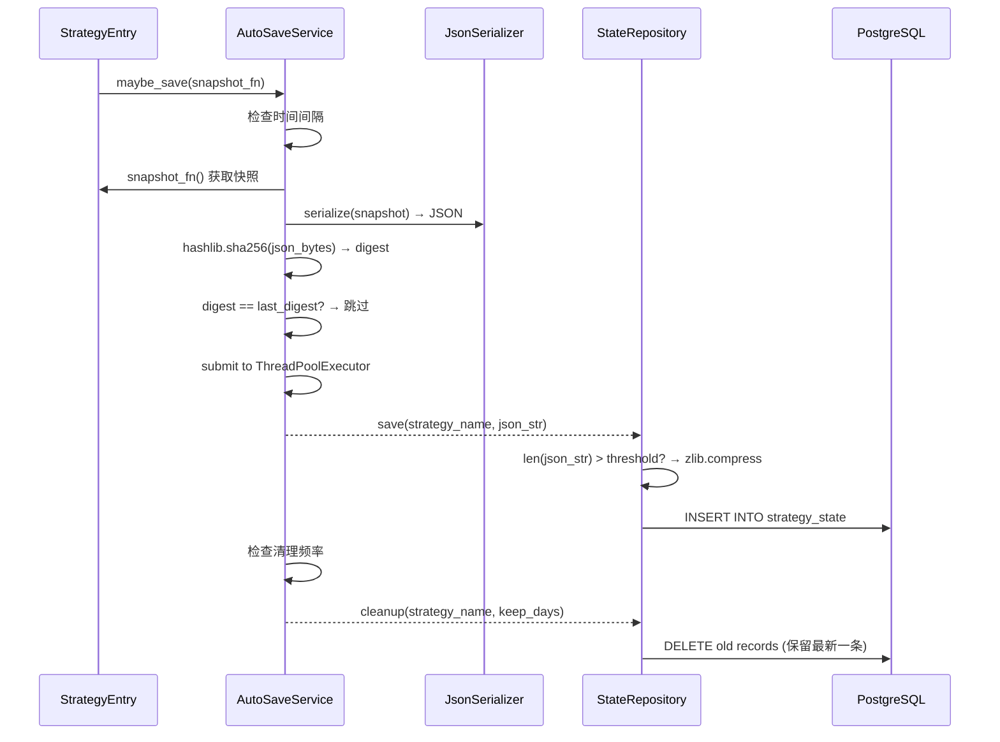
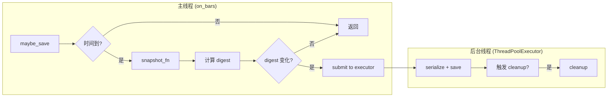

# 设计文档：数据持久化方案优化 (Data Persistence Optimization)

## 概述

本设计文档描述如何优化期权策略框架的数据持久化层，涵盖六个核心改进领域：

1. **CombinationAggregate 持久化补全**：将 `CombinationAggregate` 纳入快照，策略重启后恢复组合状态
2. **快照变更检测与去重**：基于 digest 哈希比较，跳过状态未变化时的重复保存
3. **快照压缩**：对超过阈值的 JSON 快照使用 zlib 压缩，减少数据库存储
4. **自动清理旧快照**：按可配置频率和保留天数自动清理历史快照
5. **异步保存机制**：使用 `ThreadPoolExecutor` 将保存操作移至后台线程，避免阻塞 `on_bars`
6. **JsonSerializer 往返一致性**：确保 `serialize → deserialize` 严格可逆，增加 `sort_keys` 确定性输出

### 设计原则

- 向后兼容：旧版快照（不含 `combination_aggregate`、未压缩）可正常加载
- 最小侵入：在现有 `StateRepository` / `AutoSaveService` / `JsonSerializer` 上扩展，不改变外部接口语义
- 失败安全：所有新增操作（压缩、异步、清理）失败时不影响策略主线程执行
- 确定性：序列化输出使用 `sort_keys=True`，保证相同状态产生相同 digest

## 架构

### 变更范围

```
src/strategy/
├── strategy_entry.py                          # 修改 _create_snapshot / 恢复逻辑
├── infrastructure/persistence/
│   ├── auto_save_service.py                   # 新增 digest 去重、异步保存、自动清理触发
│   ├── state_repository.py                    # 新增压缩/解压、cleanup 保留最新记录
│   ├── json_serializer.py                     # 新增 sort_keys=True、容错反序列化
│   └── strategy_state_model.py                # 新增 compressed 字段
```

### 数据流



### 异步保存线程模型



## 组件与接口

### 1. StrategyEntry 快照扩展

`_create_snapshot` 方法新增 `combination_aggregate` 字段：

```python
def _create_snapshot(self) -> Dict[str, Any]:
    snapshot = {
        "target_aggregate": self.target_aggregate.to_snapshot(),
        "position_aggregate": self.position_aggregate.to_snapshot(),
        "current_dt": self.current_dt,
    }
    if self.combination_aggregate:
        snapshot["combination_aggregate"] = self.combination_aggregate.to_snapshot()
    return snapshot
```

恢复逻辑在 `on_init` 中增加：

```python
if "combination_aggregate" in result:
    self.combination_aggregate = CombinationAggregate.from_snapshot(
        result["combination_aggregate"]
    )
else:
    # 兼容旧版本快照
    self.combination_aggregate = CombinationAggregate()
```

### 2. AutoSaveService 增强

新增构造参数和内部状态：

```python
class AutoSaveService:
    def __init__(
        self,
        state_repository: StateRepository,
        strategy_name: str,
        interval_seconds: float = 60.0,
        cleanup_interval_hours: float = 24.0,
        keep_days: int = 7,
        logger: Optional[Logger] = None,
    ) -> None:
        # ... 现有字段 ...
        self._last_digest: Optional[str] = None
        self._last_cleanup_time: float = time.monotonic()
        self._cleanup_interval_seconds = cleanup_interval_hours * 3600
        self._keep_days = keep_days
        self._executor = ThreadPoolExecutor(max_workers=1)
        self._pending_future: Optional[Future] = None
```

核心方法变更：

```python
def _compute_digest(self, json_str: str) -> str:
    """计算 JSON 字符串的 SHA-256 摘要"""
    return hashlib.sha256(json_str.encode("utf-8")).hexdigest()

def _do_save(self, snapshot_fn: Callable[[], Dict[str, Any]]) -> None:
    """异步保存：计算 digest → 去重 → 提交后台线程"""
    data = snapshot_fn()
    json_str = self._serializer.serialize(data)
    digest = self._compute_digest(json_str)

    if self._last_digest is not None and digest == self._last_digest:
        return  # 状态未变化，跳过

    if self._pending_future and not self._pending_future.done():
        self._logger.debug("上一次异步保存尚未完成，跳过本次")
        return

    self._pending_future = self._executor.submit(
        self._save_in_background, json_str
    )
    self._last_digest = digest
    self._last_save_time = time.monotonic()

def force_save(self, snapshot_fn: Callable[[], Dict[str, Any]]) -> None:
    """强制保存：等待当前异步完成 → 同步保存"""
    if self._pending_future and not self._pending_future.done():
        self._pending_future.result(timeout=30)
    data = snapshot_fn()
    self._repository.save(self._strategy_name, data)

def _save_in_background(self, json_str: str) -> None:
    """后台线程执行保存和清理"""
    try:
        self._repository.save_raw(self._strategy_name, json_str)
        self._maybe_cleanup()
    except Exception as e:
        self._logger.error(f"异步保存失败: {e}", exc_info=True)

def _maybe_cleanup(self) -> None:
    """检查是否需要触发清理"""
    now = time.monotonic()
    if now - self._last_cleanup_time >= self._cleanup_interval_seconds:
        try:
            self._repository.cleanup(self._strategy_name, self._keep_days)
            self._last_cleanup_time = now
        except Exception as e:
            self._logger.error(f"清理旧快照失败: {e}", exc_info=True)

def shutdown(self) -> None:
    """关闭线程池"""
    self._executor.shutdown(wait=True)
```

设计决策：
- `_do_save` 中 digest 计算在主线程完成（快速），序列化+DB写入在后台线程
- `AutoSaveService` 需要持有 `JsonSerializer` 引用以在主线程计算 digest
- `force_save` 忽略 digest 比较，确保 `on_stop` 时数据不丢失

### 3. StateRepository 压缩扩展

```python
COMPRESSION_PREFIX = b"ZLIB:"
DEFAULT_COMPRESSION_THRESHOLD = 10 * 1024  # 10KB

class StateRepository:
    def __init__(
        self,
        serializer: JsonSerializer,
        database_factory: DatabaseFactory,
        logger: Optional[Logger] = None,
        compression_threshold: int = DEFAULT_COMPRESSION_THRESHOLD,
    ) -> None:
        # ... 现有字段 ...
        self._compression_threshold = compression_threshold

    def save(self, strategy_name: str, data: Dict[str, Any]) -> None:
        json_str = self._serializer.serialize(data)
        self.save_raw(strategy_name, json_str)

    def save_raw(self, strategy_name: str, json_str: str) -> None:
        """保存已序列化的 JSON 字符串（支持压缩）"""
        stored_data, compressed = self._maybe_compress(json_str)
        # INSERT with compressed flag
        ...

    def load(self, strategy_name: str) -> Union[Dict[str, Any], ArchiveNotFound]:
        # ... 查询记录 ...
        raw = record.snapshot_json
        json_str = self._maybe_decompress(raw)
        return self._serializer.deserialize(json_str)

    def _maybe_compress(self, json_str: str) -> tuple[str, bool]:
        """超过阈值时压缩，压缩后更大则保留原始"""
        raw_bytes = json_str.encode("utf-8")
        if len(raw_bytes) <= self._compression_threshold:
            return json_str, False
        compressed = zlib.compress(raw_bytes)
        if len(compressed) >= len(raw_bytes):
            return json_str, False
        import base64
        return "ZLIB:" + base64.b64encode(compressed).decode("ascii"), True

    def _maybe_decompress(self, stored: str) -> str:
        """检测前缀并解压"""
        if stored.startswith("ZLIB:"):
            import base64
            compressed = base64.b64decode(stored[5:])
            return zlib.decompress(compressed).decode("utf-8")
        return stored

    def cleanup(self, strategy_name: str, keep_days: int = 7) -> int:
        """清理旧快照，保留至少一条最新记录"""
        # 先查询最新记录 ID
        latest = (
            StrategyStateModel.select(StrategyStateModel.id)
            .where(StrategyStateModel.strategy_name == strategy_name)
            .order_by(StrategyStateModel.saved_at.desc())
            .first()
        )
        if latest is None:
            return 0

        cutoff = datetime.now() - timedelta(days=keep_days)
        deleted = (
            StrategyStateModel.delete()
            .where(
                (StrategyStateModel.strategy_name == strategy_name)
                & (StrategyStateModel.saved_at < cutoff)
                & (StrategyStateModel.id != latest.id)  # 保留最新
            )
            .execute()
        )
        return deleted
```

设计决策：
- 使用 `ZLIB:` 前缀 + base64 编码存储压缩数据，兼容 TEXT 字段类型，无需修改数据库 schema
- 不新增 `compressed` 列，通过数据前缀自动检测，简化迁移
- `cleanup` 增加 `id != latest.id` 条件，保证至少保留一条记录

### 4. JsonSerializer 增强

```python
class JsonSerializer:
    def serialize(self, data: Dict[str, Any]) -> str:
        payload = {"schema_version": CURRENT_SCHEMA_VERSION, **data}
        return json.dumps(
            payload, cls=_CustomEncoder, ensure_ascii=False, sort_keys=True
        )
```

容错反序列化（已有实现，确认行为）：
- `_resolve_enum`: 找不到 Enum 类时返回原始字符串 ✓
- `_resolve_dataclass`: 找不到 dataclass 类时返回原始字典 ✓

## 数据模型

### strategy_state 表（现有，无 schema 变更）

| 字段 | 类型 | 说明 |
|------|------|------|
| id | AutoField | 主键 |
| strategy_name | CharField(128) | 策略名称，索引 |
| snapshot_json | TextField | JSON 快照（可能含 ZLIB: 前缀表示压缩） |
| schema_version | IntegerField | Schema 版本号 |
| saved_at | DateTimeField | 保存时间，索引 |

### Snapshot 数据结构（扩展后）

```json
{
  "schema_version": 1,
  "target_aggregate": { ... },
  "position_aggregate": { ... },
  "combination_aggregate": {
    "combinations": {
      "<combination_id>": {
        "combination_id": "...",
        "combination_type": "BULL_CALL_SPREAD",
        "underlying_vt_symbol": "...",
        "legs": [...],
        "status": "ACTIVE",
        "create_time": "2024-01-01T00:00:00",
        "close_time": null
      }
    },
    "symbol_index": {
      "<vt_symbol>": ["<combination_id>", ...]
    }
  },
  "current_dt": {"__datetime__": "2024-01-01T15:00:00"}
}
```

### Digest 计算输入

digest 基于 `JsonSerializer.serialize()` 的输出（含 `sort_keys=True`），使用 SHA-256 哈希。由于 `sort_keys=True` 保证键排序，相同状态始终产生相同的 JSON 字符串，从而产生相同的 digest。


## 正确性属性 (Correctness Properties)

*属性（Property）是在系统所有有效执行中都应成立的特征或行为——本质上是对系统应做什么的形式化陈述。属性是人类可读规格说明与机器可验证正确性保证之间的桥梁。*

### Property 1: CombinationAggregate 快照往返一致性

*For any* 有效的 `CombinationAggregate` 实例，调用 `to_snapshot()` 生成快照字典，再通过 `CombinationAggregate.from_snapshot()` 恢复，恢复后的实例应与原始实例在 `combinations` 和 `symbol_index` 上等价。

**Validates: Requirements 1.1, 1.2, 1.5**

### Property 2: JsonSerializer 序列化往返一致性

*For any* 包含 DataFrame、datetime、date、set、Enum、dataclass 类型组合的有效 Snapshot 字典，`JsonSerializer.serialize()` 后 `JsonSerializer.deserialize()` 应产生与原始数据等价的结果。

**Validates: Requirements 1.4, 6.1**

### Property 3: JsonSerializer 序列化确定性

*For any* 有效的 Snapshot 字典，连续两次调用 `JsonSerializer.serialize()` 应产生完全相同的 JSON 字符串（字节级一致）。

**Validates: Requirements 2.5, 6.2**

### Property 4: JsonSerializer 输出合法性

*For any* 有效的 Snapshot 字典，`JsonSerializer.serialize()` 的输出应能被 `json.loads()` 成功解析，不抛出异常。

**Validates: Requirements 6.5**

### Property 5: Digest 去重正确性

*For any* 有效的 Snapshot，如果连续两次保存相同的 Snapshot（状态未变化），第二次保存应被跳过（不产生数据库写入）；如果两次 Snapshot 不同，第二次保存应执行。

**Validates: Requirements 2.2, 2.3**

### Property 6: 压缩往返一致性

*For any* 有效的 JSON 字符串，经过 `StateRepository._maybe_compress()` 压缩后再经 `StateRepository._maybe_decompress()` 解压，应产生与原始 JSON 字符串完全一致的结果。

**Validates: Requirements 3.1, 3.2, 3.5**

### Property 7: 清理保留最新记录

*For any* 策略名称和一组历史快照记录（包含不同 `saved_at` 时间戳），执行 `cleanup` 后，所有 `saved_at` 早于保留天数的记录应被删除，但至少保留一条最新记录，即使该记录已超过保留天数。

**Validates: Requirements 4.3, 4.4**

### Property 8: 异步保存跳过未完成请求

*For any* 保存请求序列，当上一次异步保存尚未完成时，新的保存请求应被跳过而非排队等待，保证不会积压保存任务。

**Validates: Requirements 5.3**

## 错误处理

| 场景 | 处理方式 | 影响范围 |
|------|---------|---------|
| CombinationAggregate 快照字段缺失（旧版本） | 创建空的 CombinationAggregate 实例 | 无影响，向后兼容 |
| JsonSerializer 反序列化 Enum 失败 | 保留原始字符串值 | 数据降级但不丢失 |
| JsonSerializer 反序列化 dataclass 失败 | 保留原始字典 | 数据降级但不丢失 |
| zlib 压缩失败 | 存储未压缩的原始数据 | 存储空间未优化但功能正常 |
| zlib 解压失败 | 抛出 CorruptionError | 策略拒绝启动，需人工介入 |
| 异步保存线程异常 | 后台线程记录错误日志 | 主线程不受影响，下次保存重试 |
| cleanup 执行失败 | 记录错误日志，继续运行 | 旧快照未清理但不影响功能 |
| force_save 等待超时 | 超时后仍执行同步保存 | 可能短暂阻塞 on_stop |
| ThreadPoolExecutor 提交失败 | 回退到同步保存 | 可能阻塞 on_bars 一次 |

## 测试策略

### 双重测试方法

本特性采用单元测试 + 属性测试的双重策略：

- **单元测试**：验证具体示例、边界条件和错误处理
- **属性测试**：验证跨所有输入的通用属性

### 属性测试配置

- 使用 **Hypothesis** 库（Python 属性测试标准库）
- 每个属性测试最少运行 **100 次迭代**
- 每个属性测试必须通过注释引用设计文档中的属性编号
- 标签格式：**Feature: data-persistence-optimization, Property {number}: {property_text}**
- 每个正确性属性由**单个**属性测试实现

### 单元测试覆盖

| 测试场景 | 类型 | 对应需求 |
|---------|------|---------|
| 旧版快照（无 combination_aggregate）恢复为空实例 | 边界条件 | 1.3 |
| force_save 忽略 digest 比较 | 具体示例 | 2.4 |
| 压缩后数据更大时保留原始数据 | 边界条件 | 3.4 |
| cleanup 频率控制（24小时间隔） | 具体示例 | 4.2 |
| cleanup 失败不影响策略运行 | 错误处理 | 4.5 |
| force_save 等待异步完成 | 具体示例 | 5.4 |
| 异步保存异常不影响主线程 | 错误处理 | 5.5 |
| 无法还原的 Enum 保留原始字符串 | 错误处理 | 6.3 |
| 无法还原的 dataclass 保留原始字典 | 错误处理 | 6.4 |

### 属性测试覆盖

| 属性 | 测试文件 | 生成器策略 |
|------|---------|-----------|
| Property 1: CombinationAggregate 往返 | test_persistence_combination_properties.py | 生成随机 Combination 实体（随机 legs、status、timestamps） |
| Property 2: JsonSerializer 往返 | test_persistence_serializer_properties.py | 生成包含 DataFrame、datetime、set、Enum、dataclass 的嵌套字典 |
| Property 3: 序列化确定性 | test_persistence_serializer_properties.py | 同 Property 2 生成器 |
| Property 4: 输出合法性 | test_persistence_serializer_properties.py | 同 Property 2 生成器 |
| Property 5: Digest 去重 | test_persistence_autosave_properties.py | 生成随机 Snapshot 字典对（相同/不同） |
| Property 6: 压缩往返 | test_persistence_compression_properties.py | 生成随机长度 JSON 字符串（含超过/低于阈值） |
| Property 7: 清理保留最新 | test_persistence_cleanup_properties.py | 生成随机时间戳的快照记录列表 |
| Property 8: 异步跳过 | test_persistence_autosave_properties.py | 生成随机保存请求序列 |
