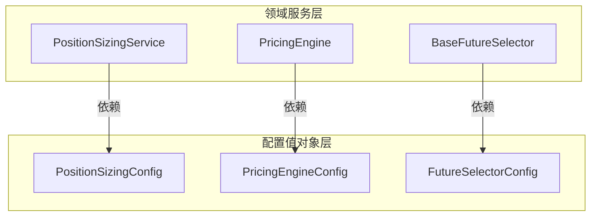

# 设计文档：领域服务配置增强

## 概述

本设计文档描述如何为 PositionSizingService、PricingEngine、BaseFutureSelector 三个领域服务提取配置值对象。参照现有的 OptionSelectorConfig 模式，将散装参数和硬编码常量收拢为统一的不可变配置对象。

### 设计目标

1. **可配置性**：将硬编码参数提取为可配置的值对象
2. **可测试性**：通过依赖注入配置对象，便于单元测试
3. **向后兼容**：默认配置值与重构前行为完全一致
4. **一致性**：遵循 OptionSelectorConfig 的设计模式

### 参考模式

```python
@dataclass(frozen=True)
class OptionSelectorConfig:
    """期权选择服务配置"""
    strike_level: int = 3
    min_bid_price: float = 10.0
    # ... 其他字段
```

服务通过构造函数注入配置：
```python
class OptionSelectorService:
    def __init__(self, config: Optional[OptionSelectorConfig] = None):
        self._config = config or OptionSelectorConfig()
```

## 架构

### 目录结构

```
src/strategy/domain/value_object/
├── config/                          # 新增配置值对象目录
│   ├── __init__.py                  # 导出所有配置类
│   ├── position_sizing_config.py    # PositionSizingConfig
│   ├── pricing_engine_config.py     # PricingEngineConfig
│   └── future_selector_config.py    # FutureSelectorConfig
├── option_selector_config.py        # 现有配置（保持不变）
└── ...
```

### 依赖关系



## 组件与接口

### 1. PositionSizingConfig

```python
@dataclass(frozen=True)
class PositionSizingConfig:
    """仓位管理服务配置"""
    
    # 持仓限制
    max_positions: int = 5              # 最大持仓数量
    global_daily_limit: int = 50        # 全局日开仓限制
    contract_daily_limit: int = 2       # 单合约日开仓限制
    
    # 保证金参数
    margin_ratio: float = 0.12          # 保证金比例
    min_margin_ratio: float = 0.07      # 最低保证金比例
    margin_usage_limit: float = 0.6     # 保证金使用率上限
    
    # 订单限制
    max_volume_per_order: int = 10      # 单笔最大手数
```

### 2. PricingEngineConfig

```python
@dataclass(frozen=True)
class PricingEngineConfig:
    """定价引擎配置"""
    
    american_model: PricingModel = PricingModel.BAW  # 美式期权定价模型
    crr_steps: int = 100                             # CRR 二叉树步数
```

### 3. FutureSelectorConfig

```python
@dataclass(frozen=True)
class FutureSelectorConfig:
    """期货选择器配置"""
    
    volume_weight: float = 0.6    # 成交量权重
    oi_weight: float = 0.4        # 持仓量权重
    rollover_days: int = 5        # 移仓阈值天数
```

### 4. 服务接口变更

#### PositionSizingService

```python
# 重构前
class PositionSizingService:
    def __init__(
        self,
        max_positions: int = 5,
        global_daily_limit: int = 50,
        contract_daily_limit: int = 2,
        margin_ratio: float = 0.12,
        min_margin_ratio: float = 0.07,
        margin_usage_limit: float = 0.6,
        max_volume_per_order: int = 10,
    ): ...

# 重构后
class PositionSizingService:
    def __init__(self, config: Optional[PositionSizingConfig] = None):
        self._config = config or PositionSizingConfig()
```

#### PricingEngine

```python
# 重构前
class PricingEngine:
    def __init__(
        self,
        american_model: PricingModel = PricingModel.BAW,
        crr_steps: int = 100,
    ): ...

# 重构后
class PricingEngine:
    def __init__(self, config: Optional[PricingEngineConfig] = None):
        self._config = config or PricingEngineConfig()
```

#### BaseFutureSelector

```python
# 重构前
class BaseFutureSelector:
    def select_dominant_contract(
        self, ..., volume_weight: float = 0.6, oi_weight: float = 0.4, ...
    ): ...
    
    def check_rollover(
        self, ..., rollover_days: int = 5, ...
    ): ...

# 重构后
class BaseFutureSelector:
    def __init__(self, config: Optional[FutureSelectorConfig] = None):
        self._config = config or FutureSelectorConfig()
    
    def select_dominant_contract(self, ...):  # 移除 volume_weight, oi_weight 参数
        ...
    
    def check_rollover(self, ...):  # 移除 rollover_days 参数
        ...
```

## 数据模型

### 配置值对象特性

| 特性 | 说明 |
|------|------|
| 不可变性 | 使用 `@dataclass(frozen=True)` |
| 默认值 | 所有字段提供默认值，与重构前一致 |
| 类型安全 | 使用类型注解 |
| 可选注入 | 服务构造函数接受 `Optional[Config]` |

### 默认值对照表

| 配置类 | 字段 | 默认值 | 来源 |
|--------|------|--------|------|
| PositionSizingConfig | max_positions | 5 | PositionSizingService.__init__ |
| PositionSizingConfig | global_daily_limit | 50 | PositionSizingService.__init__ |
| PositionSizingConfig | contract_daily_limit | 2 | PositionSizingService.__init__ |
| PositionSizingConfig | margin_ratio | 0.12 | PositionSizingService.__init__ |
| PositionSizingConfig | min_margin_ratio | 0.07 | PositionSizingService.__init__ |
| PositionSizingConfig | margin_usage_limit | 0.6 | PositionSizingService.__init__ |
| PositionSizingConfig | max_volume_per_order | 10 | PositionSizingService.__init__ |
| PricingEngineConfig | american_model | PricingModel.BAW | PricingEngine.__init__ |
| PricingEngineConfig | crr_steps | 100 | PricingEngine.__init__ |
| FutureSelectorConfig | volume_weight | 0.6 | select_dominant_contract 参数 |
| FutureSelectorConfig | oi_weight | 0.4 | select_dominant_contract 参数 |
| FutureSelectorConfig | rollover_days | 5 | check_rollover 参数 |


## 正确性属性

*属性是指在系统所有有效执行中都应该保持为真的特征或行为——本质上是关于系统应该做什么的形式化陈述。属性是人类可读规范与机器可验证正确性保证之间的桥梁。*

### 属性 1：配置值对象不可变性

*对于任意* 配置值对象实例（PositionSizingConfig、PricingEngineConfig、FutureSelectorConfig），尝试修改其任意字段都应该抛出 `FrozenInstanceError` 异常。

**验证需求: 2.1, 3.1, 4.1**

### 属性 2：PositionSizingService 行为一致性

*对于任意* 有效的仓位计算输入（account_balance > 0, total_equity > 0, contract_price > 0 等），使用默认配置实例化的 PositionSizingService 调用 `compute_sizing` 方法，应该产生与重构前使用默认参数实例化的服务相同的 SizingResult。

**验证需求: 2.6, 5.1**

### 属性 3：PricingEngine 行为一致性

*对于任意* 有效的 PricingInput（spot_price > 0, strike_price > 0, volatility > 0, time_to_expiry >= 0），使用默认配置实例化的 PricingEngine 调用 `price` 方法，应该产生与重构前使用默认参数实例化的引擎相同的 PricingResult。

**验证需求: 3.6, 5.2**

### 属性 4：BaseFutureSelector 主力合约选择一致性

*对于任意* 合约列表和行情数据组合，使用默认配置实例化的 BaseFutureSelector 调用 `select_dominant_contract` 方法，应该选择与重构前使用默认参数（volume_weight=0.6, oi_weight=0.4）调用时相同的合约。

**验证需求: 5.3**

### 属性 5：BaseFutureSelector 移仓检查一致性

*对于任意* 当前合约、合约列表和当前日期组合，使用默认配置实例化的 BaseFutureSelector 调用 `check_rollover` 方法，应该产生与重构前使用默认参数（rollover_days=5）调用时相同的 RolloverRecommendation。

**验证需求: 5.3**

### 属性 6：配置字段可自定义

*对于任意* 配置值对象，使用非默认值创建实例后，服务应该使用自定义的配置值进行计算，而非默认值。

**验证需求: 2.4, 3.4, 4.4**

## 错误处理

### 配置验证

配置值对象使用 `@dataclass(frozen=True)` 定义，依赖 Python 类型系统进行基本类型检查。由于配置字段都有合理的默认值，不需要额外的运行时验证。

### 向后兼容

- 服务构造函数接受 `Optional[Config]`，未提供时使用默认配置
- 默认配置值与重构前的默认参数值完全一致
- 不会引入破坏性变更

## 测试策略

### 双重测试方法

本功能采用单元测试和属性测试相结合的方式：

- **单元测试**：验证具体示例、边界情况和错误条件
- **属性测试**：验证跨所有输入的通用属性

### 单元测试覆盖

1. **配置值对象测试**
   - 默认值正确性
   - 不可变性验证
   - 自定义值创建

2. **服务集成测试**
   - 默认配置注入
   - 自定义配置注入
   - 配置字段读取

3. **文件结构测试**
   - 目录存在性
   - 模块导入正确性

### 属性测试配置

- **测试库**：hypothesis
- **迭代次数**：每个属性测试至少 100 次
- **标签格式**：`Feature: domain-service-config-enhancement, Property {number}: {property_text}`

### 属性测试实现

每个正确性属性对应一个属性测试：

| 属性 | 测试文件 | 测试函数 |
|------|----------|----------|
| 属性 1 | test_config_properties.py | test_config_immutability |
| 属性 2 | test_position_sizing_config_properties.py | test_sizing_behavior_consistency |
| 属性 3 | test_pricing_engine_config_properties.py | test_pricing_behavior_consistency |
| 属性 4 | test_future_selector_config_properties.py | test_dominant_selection_consistency |
| 属性 5 | test_future_selector_config_properties.py | test_rollover_check_consistency |
| 属性 6 | test_config_properties.py | test_custom_config_usage |
