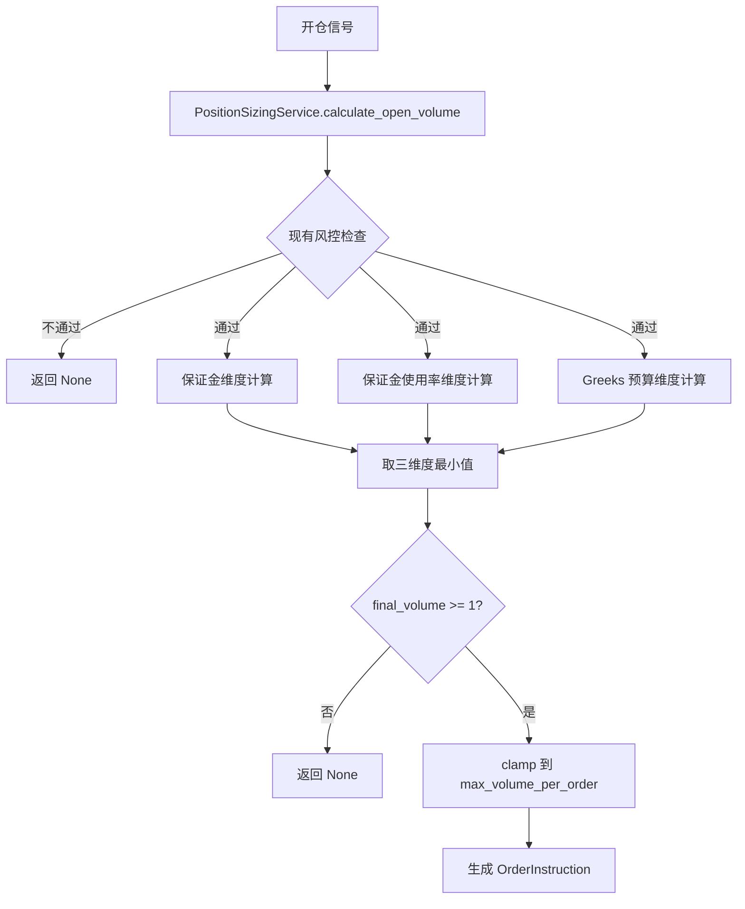

# 设计文档：动态仓位计算与 Greeks 感知开仓决策

## 概述

本设计将 PositionSizingService 从固定1手开仓升级为多维度约束的动态仓位计算。核心思路是将仓位计算拆分为三个独立的维度计算器（保证金、保证金使用率、Greeks 预算），各自计算允许的最大手数，最终取最小值作为安全开仓手数。

设计遵循 DDD 原则：计算逻辑封装在领域服务中，新增 SizingResult 值对象承载计算结果，保持与现有 PortfolioRiskAggregator 和 OrderInstruction 的协作关系不变。

## 架构



### 计算流程

1. 执行现有风控前置检查（最大持仓、日限额、重复合约）
2. 估算单手保证金
3. 并行计算三个维度的最大允许手数：
   - 保证金维度：`floor(可用资金 / 单手保证金)`
   - 使用率维度：`floor((总权益 × margin_usage_limit - 已用保证金) / 单手保证金)`
   - Greeks 维度：`min(floor(budget_X / |greek_X × multiplier|))` 对 Delta/Gamma/Vega
4. 取三个维度的最小值
5. Clamp 到 `[1, max_volume_per_order]`
6. 生成 OrderInstruction 或拒绝

## 组件与接口

### PositionSizingService（重构）

现有类的 `calculate_open_volumn` 方法将重构为 `calculate_open_volume`（修正拼写），新增以下内部方法：

```python
class PositionSizingService:
    def __init__(
        self,
        max_positions: int = 5,
        global_daily_limit: int = 50,
        contract_daily_limit: int = 2,
        margin_ratio: float = 0.12,
        min_margin_ratio: float = 0.07,
        margin_usage_limit: float = 0.6,
        max_volume_per_order: int = 10,
    ): ...

    def calculate_open_volume(
        self,
        account_balance: float,          # 可用资金
        total_equity: float,             # 账户总权益
        used_margin: float,              # 已用保证金
        signal: str,                     # 信号类型
        vt_symbol: str,                  # 合约代码
        contract_price: float,           # 权利金
        underlying_price: float,         # 标的价格
        strike_price: float,             # 行权价
        option_type: str,                # "call" | "put"
        multiplier: float,               # 合约乘数
        greeks: GreeksResult,            # 单手 Greeks
        portfolio_greeks: PortfolioGreeks,  # 当前组合 Greeks
        risk_thresholds: RiskThresholds, # Greeks 阈值
        current_positions: List[Position],
        current_daily_open_count: int = 0,
        current_contract_open_count: int = 0,
    ) -> Optional[OrderInstruction]: ...

    def estimate_margin(
        self,
        contract_price: float,
        underlying_price: float,
        strike_price: float,
        option_type: str,
        multiplier: float,
    ) -> float:
        """估算单手卖出期权保证金"""
        ...

    def _calc_margin_volume(
        self, available_funds: float, margin_per_lot: float
    ) -> int:
        """保证金维度：可用资金 / 单手保证金"""
        ...

    def _calc_usage_volume(
        self, total_equity: float, used_margin: float, margin_per_lot: float
    ) -> int:
        """使用率维度：(总权益 × limit - 已用保证金) / 单手保证金"""
        ...

    def _calc_greeks_volume(
        self,
        greeks: GreeksResult,
        multiplier: float,
        portfolio_greeks: PortfolioGreeks,
        risk_thresholds: RiskThresholds,
    ) -> Tuple[int, float, float, float]:
        """Greeks 维度：返回 (允许手数, delta_budget, gamma_budget, vega_budget)"""
        ...

    def compute_sizing(
        self,
        account_balance: float,
        total_equity: float,
        used_margin: float,
        contract_price: float,
        underlying_price: float,
        strike_price: float,
        option_type: str,
        multiplier: float,
        greeks: GreeksResult,
        portfolio_greeks: PortfolioGreeks,
        risk_thresholds: RiskThresholds,
    ) -> SizingResult:
        """纯计算方法：综合三维度计算最终手数，返回 SizingResult"""
        ...

    def calculate_close_volume(self, position: Position, close_price: float, signal: str = "") -> Optional[OrderInstruction]:
        """平仓指令生成（保持不变，仅修正方法名拼写）"""
        ...
```

### 设计决策

1. **`compute_sizing` 作为纯计算方法**：将三维度计算逻辑提取为独立的纯函数 `compute_sizing`，不包含风控前置检查（持仓数、日限额等），方便单元测试和属性测试。`calculate_open_volume` 负责编排：先做前置检查，再调用 `compute_sizing`，最后生成 OrderInstruction。

2. **保留 `calculate_close_volume`**：平仓逻辑不涉及动态仓位计算，保持原有逻辑不变，仅修正方法名拼写（`volumn` → `volume`）。

3. **保证金估算内置**：保证金估算作为 PositionSizingService 的方法而非独立服务，因为它是仓位计算的内部步骤，不需要被其他服务复用。

## 数据模型

### SizingResult 值对象（新增）

```python
@dataclass(frozen=True)
class SizingResult:
    """仓位计算综合结果"""
    final_volume: int          # 最终手数（0 表示拒绝）
    margin_volume: int         # 保证金维度允许手数
    usage_volume: int          # 使用率维度允许手数
    greeks_volume: int         # Greeks 维度允许手数
    delta_budget: float        # Delta 剩余空间
    gamma_budget: float        # Gamma 剩余空间
    vega_budget: float         # Vega 剩余空间
    passed: bool               # 是否通过
    reject_reason: str = ""    # 拒绝原因
```

文件位置：`src/strategy/domain/value_object/sizing.py`

### 配置扩展

在 `strategy_config.yaml` 中新增 `position_sizing` 配置节：

```yaml
position_sizing:
  margin_ratio: 0.12            # 保证金比例
  min_margin_ratio: 0.07        # 最低保证金比例
  margin_usage_limit: 0.6       # 保证金使用率上限
  max_volume_per_order: 10      # 单笔最大手数
```


## 正确性属性

*属性（Property）是在系统所有有效执行中都应成立的特征或行为——本质上是对系统应做什么的形式化陈述。属性是人类可读规格与机器可验证正确性保证之间的桥梁。*

### Property 1: 保证金估算公式正确性

*For any* 有效的权利金（> 0）、标的价格（> 0）、行权价（> 0）、合约乘数（> 0），`estimate_margin` 的返回值应等于 `权利金 × 合约乘数 + max(标的价格 × 合约乘数 × margin_ratio - 虚值额, 标的价格 × 合约乘数 × min_margin_ratio)`，其中虚值额对 put 为 `max(行权价 - 标的价格, 0) × 合约乘数`，对 call 为 `max(标的价格 - 行权价, 0) × 合约乘数`。

**Validates: Requirements 1.1**

### Property 2: 保证金使用率不变量

*For any* 总权益（> 0）、已用保证金（>= 0）、单手保证金（> 0）和 margin_usage_limit（0 < limit <= 1），`_calc_usage_volume` 返回的手数 n 应满足：`(used_margin + n * margin_per_lot) / total_equity <= margin_usage_limit`，且 `(used_margin + (n+1) * margin_per_lot) / total_equity > margin_usage_limit`（即 n 是满足约束的最大整数）。

**Validates: Requirements 2.2**

### Property 3: Greeks 预算计算正确性

*For any* 有效的组合 Greeks、风控阈值和单手 Greeks（至少一个维度非零），`_calc_greeks_volume` 返回的手数应等于各非零维度 `floor((limit - |current|) / |greek × multiplier|)` 的最小值，且返回的 delta_budget、gamma_budget、vega_budget 应分别等于 `limit - |current|`。

**Validates: Requirements 3.1, 3.2**

### Property 4: 综合决策不变量

*For any* 有效输入使得三个维度手数均 >= 1，`compute_sizing` 返回的 `final_volume` 应等于 `min(margin_volume, usage_volume, greeks_volume)` clamped 到 `[1, max_volume_per_order]`，且 `passed` 为 True，且 SizingResult 中的 margin_volume、usage_volume、greeks_volume 字段与各维度独立计算结果一致。

**Validates: Requirements 4.1, 4.2, 4.4**

## 错误处理

| 场景 | 处理方式 |
|------|---------|
| 单手保证金 <= 0 | `compute_sizing` 返回 `SizingResult(passed=False, reject_reason="保证金估算异常")` |
| 可用资金不足一手 | `compute_sizing` 返回 `SizingResult(passed=False, reject_reason="可用资金不足")` |
| 保证金使用率已超限 | `compute_sizing` 返回 `SizingResult(passed=False, reject_reason="保证金使用率超限")` |
| Greeks 某维度超限 | `compute_sizing` 返回 `SizingResult(passed=False, reject_reason="Greeks 超限: {维度}")` |
| 综合手数 < 1 | `compute_sizing` 返回 `SizingResult(passed=False, reject_reason="综合计算手数不足")` |
| Greeks 计算失败 | `calculate_open_volume` 检查 `greeks.success`，失败时返回 None |
| 现有风控不通过 | `calculate_open_volume` 直接返回 None（保持现有行为） |

所有拒绝场景均通过 SizingResult 的 reject_reason 字段传递原因，不抛出异常。`calculate_open_volume` 作为编排方法，将 SizingResult 的拒绝转换为返回 None（保持与现有调用方的兼容性）。

## 测试策略

### 属性测试（Property-Based Testing）

使用 `hypothesis` 库，每个属性测试运行至少 100 次迭代。

| 测试 | 对应属性 | 说明 |
|------|---------|------|
| `test_margin_estimate_formula` | Property 1 | 生成随机期权参数，验证保证金公式 |
| `test_usage_volume_invariant` | Property 2 | 生成随机账户状态，验证使用率不超限 |
| `test_greeks_budget_calculation` | Property 3 | 生成随机 Greeks 和阈值，验证预算计算 |
| `test_compute_sizing_invariant` | Property 4 | 生成随机完整输入，验证综合决策不变量 |

每个测试标注格式：`Feature: dynamic-position-sizing, Property N: {property_text}`

### 单元测试

单元测试覆盖属性测试不便覆盖的具体场景：

- 边界条件：保证金 <= 0、资金不足一手、使用率已超限、Greeks 某维度超限、Greek 值为零
- 配置默认值验证
- 现有风控检查保留验证（最大持仓、日限额、重复合约）
- `calculate_open_volume` 编排逻辑：前置检查 → compute_sizing → 生成 OrderInstruction
- `calculate_close_volume` 保持不变验证
