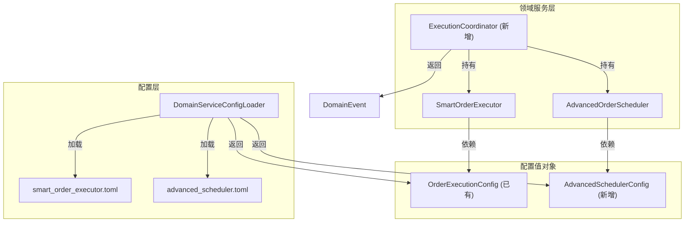

# 设计文档：执行服务增强 (Execution Service Enhancement)

## 概述

本设计文档描述如何系统性增强执行领域服务模块，使其与对冲、风控、选择等模块在架构一致性上对齐。主要变更包括：

1. **TOML 配置加载**：为 SmartOrderExecutor 和 AdvancedOrderScheduler 添加 TOML 配置文件和加载函数
2. **工厂方法**：添加 `from_yaml_config()` 类方法，与对冲服务模式一致
3. **配置值对象**：提取 AdvancedSchedulerConfig frozen dataclass
4. **协调层**：新增 ExecutionCoordinator 协调 SmartOrderExecutor 与 AdvancedOrderScheduler 联动
5. **缺陷修复**：删除重复的 `submit_timed_split` 方法定义、修复未使用的 OrderRetryExhaustedEvent
6. **模块导出**：补充 `execution/__init__.py` 导出
7. **序列化**：为 SmartOrderExecutor 和 AdvancedOrderScheduler 添加 `to_dict()`/`from_dict()` 方法

### 设计原则

- 遵循现有 DomainServiceConfigLoader 的 overrides > TOML > dataclass 默认值优先级模式
- 遵循对冲服务的 `from_yaml_config()` 工厂方法模式
- ExecutionCoordinator 不直接调用交易网关，仅返回领域事件列表
- 所有配置值对象使用 `@dataclass(frozen=True)`

## 架构

### 目录结构变更

```
src/strategy/domain/
├── domain_service/execution/
│   ├── __init__.py                      # 补充导出
│   ├── smart_order_executor.py          # 添加 from_yaml_config, to_dict, from_dict
│   ├── advanced_order_scheduler.py      # 修复重复方法, 添加 config, from_yaml_config, to_dict, from_dict
│   └── execution_coordinator.py         # 新增协调器
├── value_object/trading/
│   └── order_execution.py               # 新增 AdvancedSchedulerConfig
└── event/event_types.py                 # OrderRetryExhaustedEvent (已存在)

src/main/config/
└── domain_service_config_loader.py      # 新增 load_smart_order_executor_config, load_advanced_scheduler_config

config/domain_service/execution/
├── smart_order_executor.toml            # 新增
└── advanced_scheduler.toml              # 新增
```

### 依赖关系



## 组件与接口

### 1. AdvancedSchedulerConfig 配置值对象

在 `order_execution.py` 中新增：

```python
@dataclass(frozen=True)
class AdvancedSchedulerConfig:
    """高级订单调度器配置"""
    default_batch_size: int = 10              # 默认冰山单批量
    default_interval_seconds: int = 60        # 默认拆单间隔(秒)
    default_num_slices: int = 5               # 默认分片数
    default_volume_randomize_ratio: float = 0.1  # 默认量随机比例
    default_price_offset_ticks: int = 1       # 默认价格偏移跳数
    default_price_tick: float = 0.01          # 默认最小变动价位
```

### 2. TOML 配置文件

#### smart_order_executor.toml

```toml
# 智能订单执行器配置
# 对应 OrderExecutionConfig

[timeout]
seconds = 30                    # 超时秒数

[retry]
max_retries = 3                 # 最大重试次数

[price]
slippage_ticks = 2              # 滑点跳数
price_tick = 0.2                # 最小变动价位
```

#### advanced_scheduler.toml

```toml
# 高级订单调度器配置
# 对应 AdvancedSchedulerConfig

[iceberg]
default_batch_size = 10         # 默认冰山单批量

[split]
default_interval_seconds = 60   # 默认拆单间隔(秒)
default_num_slices = 5          # 默认分片数

[randomize]
default_volume_randomize_ratio = 0.1  # 默认量随机比例

[price]
default_price_offset_ticks = 1  # 默认价格偏移跳数
default_price_tick = 0.01       # 默认最小变动价位
```

### 3. DomainServiceConfigLoader 新增函数

```python
def load_smart_order_executor_config(
    overrides: Optional[dict] = None,
) -> OrderExecutionConfig:
    """
    加载智能订单执行器配置
    优先级: overrides > TOML 文件 > dataclass 默认值
    """
    data = _load_toml(_DOMAIN_SERVICE_CONFIG_DIR / "execution" / "smart_order_executor.toml")
    overrides = overrides or {}
    timeout = data.get("timeout", {})
    retry = data.get("retry", {})
    price = data.get("price", {})
    kwargs = {}
    _map_field(kwargs, "timeout_seconds", overrides, "timeout_seconds", timeout, "seconds")
    _map_field(kwargs, "max_retries", overrides, "max_retries", retry, "max_retries")
    _map_field(kwargs, "slippage_ticks", overrides, "slippage_ticks", price, "slippage_ticks")
    _map_field(kwargs, "price_tick", overrides, "price_tick", price, "price_tick")
    return OrderExecutionConfig(**kwargs)


def load_advanced_scheduler_config(
    overrides: Optional[dict] = None,
) -> AdvancedSchedulerConfig:
    """
    加载高级订单调度器配置
    优先级: overrides > TOML 文件 > dataclass 默认值
    """
    data = _load_toml(_DOMAIN_SERVICE_CONFIG_DIR / "execution" / "advanced_scheduler.toml")
    overrides = overrides or {}
    iceberg = data.get("iceberg", {})
    split = data.get("split", {})
    randomize = data.get("randomize", {})
    price = data.get("price", {})
    kwargs = {}
    _map_field(kwargs, "default_batch_size", overrides, "default_batch_size", iceberg, "default_batch_size")
    _map_field(kwargs, "default_interval_seconds", overrides, "default_interval_seconds", split, "default_interval_seconds")
    _map_field(kwargs, "default_num_slices", overrides, "default_num_slices", split, "default_num_slices")
    _map_field(kwargs, "default_volume_randomize_ratio", overrides, "default_volume_randomize_ratio", randomize, "default_volume_randomize_ratio")
    _map_field(kwargs, "default_price_offset_ticks", overrides, "default_price_offset_ticks", price, "default_price_offset_ticks")
    _map_field(kwargs, "default_price_tick", overrides, "default_price_tick", price, "default_price_tick")
    return AdvancedSchedulerConfig(**kwargs)
```

### 4. SmartOrderExecutor 变更

#### from_yaml_config 工厂方法

```python
@classmethod
def from_yaml_config(cls, config_dict: dict) -> "SmartOrderExecutor":
    """从 YAML 配置字典创建实例，缺失字段使用 OrderExecutionConfig 默认值"""
    defaults = OrderExecutionConfig()
    config = OrderExecutionConfig(
        timeout_seconds=config_dict.get("timeout_seconds", defaults.timeout_seconds),
        max_retries=config_dict.get("max_retries", defaults.max_retries),
        slippage_ticks=config_dict.get("slippage_ticks", defaults.slippage_ticks),
        price_tick=config_dict.get("price_tick", defaults.price_tick),
    )
    return cls(config)
```

#### prepare_retry 返回类型变更

```python
def prepare_retry(
    self, managed_order: ManagedOrder, price_tick: float
) -> Tuple[Optional[OrderInstruction], List[DomainEvent]]:
    """准备重试指令，重试耗尽时返回 OrderRetryExhaustedEvent"""
    if managed_order.retry_count >= self.config.max_retries:
        event = OrderRetryExhaustedEvent(
            vt_symbol=managed_order.instruction.vt_symbol,
            total_retries=managed_order.retry_count,
            original_price=managed_order.instruction.price,
            final_price=managed_order.instruction.price,
        )
        return None, [event]
    # ... 计算新价格逻辑不变 ...
    return new_instruction, []
```

#### to_dict / from_dict 序列化

```python
def to_dict(self) -> Dict[str, Any]:
    """序列化内部状态为 JSON 兼容字典"""
    return {
        "config": {
            "timeout_seconds": self.config.timeout_seconds,
            "max_retries": self.config.max_retries,
            "slippage_ticks": self.config.slippage_ticks,
            "price_tick": self.config.price_tick,
        },
        "orders": {
            oid: order.to_dict() for oid, order in self._orders.items()
        },
    }

@classmethod
def from_dict(cls, data: Dict[str, Any], config: Optional[OrderExecutionConfig] = None) -> "SmartOrderExecutor":
    """从字典恢复内部状态"""
    if config is None:
        cfg_data = data.get("config", {})
        config = OrderExecutionConfig(**cfg_data)
    executor = cls(config)
    for oid, order_data in data.get("orders", {}).items():
        executor._orders[oid] = ManagedOrder.from_dict(order_data)
    return executor
```

### 5. AdvancedOrderScheduler 变更

#### 构造函数接受 config

```python
def __init__(self, config: Optional[AdvancedSchedulerConfig] = None):
    self.config = config or AdvancedSchedulerConfig()
    self._orders: Dict[str, AdvancedOrder] = {}
```

#### from_yaml_config 工厂方法

```python
@classmethod
def from_yaml_config(cls, config_dict: dict) -> "AdvancedOrderScheduler":
    """从 YAML 配置字典创建实例，缺失字段使用 AdvancedSchedulerConfig 默认值"""
    defaults = AdvancedSchedulerConfig()
    config = AdvancedSchedulerConfig(
        default_batch_size=config_dict.get("default_batch_size", defaults.default_batch_size),
        default_interval_seconds=config_dict.get("default_interval_seconds", defaults.default_interval_seconds),
        default_num_slices=config_dict.get("default_num_slices", defaults.default_num_slices),
        default_volume_randomize_ratio=config_dict.get("default_volume_randomize_ratio", defaults.default_volume_randomize_ratio),
        default_price_offset_ticks=config_dict.get("default_price_offset_ticks", defaults.default_price_offset_ticks),
        default_price_tick=config_dict.get("default_price_tick", defaults.default_price_tick),
    )
    return cls(config)
```

#### to_dict / from_dict 序列化

```python
def to_dict(self) -> Dict[str, Any]:
    """序列化内部状态"""
    return {
        "config": {
            "default_batch_size": self.config.default_batch_size,
            "default_interval_seconds": self.config.default_interval_seconds,
            "default_num_slices": self.config.default_num_slices,
            "default_volume_randomize_ratio": self.config.default_volume_randomize_ratio,
            "default_price_offset_ticks": self.config.default_price_offset_ticks,
            "default_price_tick": self.config.default_price_tick,
        },
        "orders": {
            oid: order.to_dict() for oid, order in self._orders.items()
        },
    }

@classmethod
def from_dict(cls, data: Dict[str, Any], config: Optional[AdvancedSchedulerConfig] = None) -> "AdvancedOrderScheduler":
    """从字典恢复内部状态"""
    if config is None:
        cfg_data = data.get("config", {})
        config = AdvancedSchedulerConfig(**cfg_data)
    scheduler = cls(config)
    for oid, order_data in data.get("orders", {}).items():
        scheduler._orders[oid] = AdvancedOrder.from_dict(order_data)
    return scheduler
```

### 6. ExecutionCoordinator 协调器

```python
class ExecutionCoordinator:
    """
    执行协调器
    协调 SmartOrderExecutor 与 AdvancedOrderScheduler 的联动。
    不直接调用交易网关，返回领域事件列表。
    """

    def __init__(
        self,
        executor: SmartOrderExecutor,
        scheduler: AdvancedOrderScheduler,
    ) -> None:
        self.executor = executor
        self.scheduler = scheduler

    def process_pending_children(
        self,
        current_time: datetime,
        bid_price: float,
        ask_price: float,
        price_tick: float,
    ) -> Tuple[List[OrderInstruction], List[DomainEvent]]:
        """
        处理待提交子单：
        1. 从 scheduler 获取到期子单
        2. 用 executor 计算自适应价格
        3. 返回带自适应价格的指令列表
        """
        ...

    def on_child_order_submitted(
        self, child_id: str, vt_orderid: str, instruction: OrderInstruction
    ) -> None:
        """子单提交后，注册到 executor 的超时管理"""
        self.executor.register_order(vt_orderid, instruction)

    def check_timeouts_and_retry(
        self, current_time: datetime, price_tick: float
    ) -> Tuple[List[str], List[OrderInstruction], List[DomainEvent]]:
        """
        检查超时并准备重试：
        1. 检查超时订单
        2. 对超时订单准备重试指令
        3. 重试耗尽时产生 OrderRetryExhaustedEvent
        返回: (需撤销ID列表, 重试指令列表, 事件列表)
        """
        ...

    def on_child_filled(self, child_id: str) -> List[DomainEvent]:
        """子单成交回报，委托给 scheduler"""
        return self.scheduler.on_child_filled(child_id)
```

### 7. __init__.py 导出

```python
from .smart_order_executor import SmartOrderExecutor
from .advanced_order_scheduler import AdvancedOrderScheduler
from .execution_coordinator import ExecutionCoordinator

__all__ = [
    "SmartOrderExecutor",
    "AdvancedOrderScheduler",
    "ExecutionCoordinator",
]
```

### 8. 修复重复方法定义

删除 `advanced_order_scheduler.py` 中第二个 `submit_timed_split` 方法定义（第 122-172 行），保留第一个（第 69-120 行）。

### 9. 修复 prepare_retry 返回 OrderRetryExhaustedEvent

将 `prepare_retry` 返回类型从 `Optional[OrderInstruction]` 改为 `Tuple[Optional[OrderInstruction], List[DomainEvent]]`，重试耗尽时返回 `OrderRetryExhaustedEvent`。

## 数据模型

### 配置值对象对照表

| 配置类 | 字段 | 默认值 | 用途 |
|--------|------|--------|------|
| OrderExecutionConfig | timeout_seconds | 30 | 超时秒数 |
| OrderExecutionConfig | max_retries | 3 | 最大重试次数 |
| OrderExecutionConfig | slippage_ticks | 2 | 滑点跳数 |
| OrderExecutionConfig | price_tick | 0.2 | 最小变动价位 |
| AdvancedSchedulerConfig | default_batch_size | 10 | 默认冰山单批量 |
| AdvancedSchedulerConfig | default_interval_seconds | 60 | 默认拆单间隔 |
| AdvancedSchedulerConfig | default_num_slices | 5 | 默认分片数 |
| AdvancedSchedulerConfig | default_volume_randomize_ratio | 0.1 | 默认量随机比例 |
| AdvancedSchedulerConfig | default_price_offset_ticks | 1 | 默认价格偏移跳数 |
| AdvancedSchedulerConfig | default_price_tick | 0.01 | 默认最小变动价位 |

### 序列化格式

SmartOrderExecutor 和 AdvancedOrderScheduler 的 `to_dict()` 输出为 JSON 兼容字典，包含 `config` 和 `orders` 两个顶层键。`orders` 中每个条目委托给 ManagedOrder.to_dict() 或 AdvancedOrder.to_dict()（已有实现）。

## 正确性属性

*属性是指在系统所有有效执行中都应该保持为真的特征或行为——本质上是关于系统应该做什么的形式化陈述。属性是人类可读规范与机器可验证正确性保证之间的桥梁。*

### 属性 1：SmartOrderExecutor 配置加载优先级

*对于任意* overrides 字典和 TOML 文件内容组合，`load_smart_order_executor_config(overrides)` 返回的 OrderExecutionConfig 中，overrides 中存在的字段应等于 overrides 值，不在 overrides 中但在 TOML 中的字段应等于 TOML 值，两者都不存在的字段应等于 OrderExecutionConfig 的 dataclass 默认值。

**验证需求: 1.1, 1.3, 1.4**

### 属性 2：AdvancedScheduler 配置加载优先级

*对于任意* overrides 字典和 TOML 文件内容组合，`load_advanced_scheduler_config(overrides)` 返回的 AdvancedSchedulerConfig 中，overrides 中存在的字段应等于 overrides 值，不在 overrides 中但在 TOML 中的字段应等于 TOML 值，两者都不存在的字段应等于 AdvancedSchedulerConfig 的 dataclass 默认值。

**验证需求: 1.2, 1.3, 1.4**

### 属性 3：SmartOrderExecutor from_yaml_config 一致性

*对于任意* 配置字典（可能缺少部分字段或包含未知字段），`SmartOrderExecutor.from_yaml_config(config_dict)` 生成的 OrderExecutionConfig 中，已提供的已知字段应与字典值一致，缺失的字段应等于 OrderExecutionConfig 的默认值，未知字段应被忽略。

**验证需求: 2.1, 2.3, 2.4**

### 属性 4：AdvancedOrderScheduler from_yaml_config 一致性

*对于任意* 配置字典（可能缺少部分字段或包含未知字段），`AdvancedOrderScheduler.from_yaml_config(config_dict)` 生成的 AdvancedSchedulerConfig 中，已提供的已知字段应与字典值一致，缺失的字段应等于 AdvancedSchedulerConfig 的默认值，未知字段应被忽略。

**验证需求: 2.2, 2.3, 2.4**

### 属性 5：AdvancedSchedulerConfig 不可变性

*对于任意* AdvancedSchedulerConfig 实例，尝试修改其任意字段都应该抛出 `FrozenInstanceError` 异常。

**验证需求: 3.2**

### 属性 6：协调器使用自适应价格计算

*对于任意* 待提交子单和有效的 bid/ask 价格，ExecutionCoordinator.process_pending_children 返回的指令价格应等于 SmartOrderExecutor.calculate_adaptive_price 对该子单计算的结果（经 round_price_to_tick 对齐后）。

**验证需求: 4.2**

### 属性 7：协调器注册子单到超时管理

*对于任意* 通过 ExecutionCoordinator.on_child_order_submitted 注册的子单，该子单对应的 vt_orderid 应出现在 SmartOrderExecutor 的 _orders 字典中。

**验证需求: 4.3**

### 属性 8：重试耗尽产生正确的 OrderRetryExhaustedEvent

*对于任意* retry_count >= max_retries 的 ManagedOrder，调用 prepare_retry 应返回 (None, [event])，其中 event 为 OrderRetryExhaustedEvent，且 event.vt_symbol 等于原始指令的 vt_symbol，event.total_retries 等于 managed_order.retry_count，event.original_price 和 event.final_price 等于原始指令价格。

**验证需求: 6.1, 6.2**

### 属性 9：定时拆单子单总量守恒

*对于任意* 有效的 OrderInstruction（volume > 0）、正整数 interval_seconds 和 per_order_volume，submit_timed_split 产生的所有子单 volume 之和应等于原始指令的 volume。

**验证需求: 5.2**

### 属性 10：SmartOrderExecutor 序列化 round-trip

*对于任意* 有效的 SmartOrderExecutor 内部状态（包含任意数量的 ManagedOrder），`from_dict(executor.to_dict())` 应产生等价的内部状态：config 字段相同，_orders 字典中每个 ManagedOrder 的所有字段相同。

**验证需求: 9.1, 9.2, 9.3**

### 属性 11：AdvancedOrderScheduler 序列化 round-trip

*对于任意* 有效的 AdvancedOrderScheduler 内部状态（包含任意数量的 AdvancedOrder），`from_dict(scheduler.to_dict())` 应产生等价的内部状态：config 字段相同，_orders 字典中每个 AdvancedOrder 的所有字段相同。

**验证需求: 9.4, 9.5**

## 错误处理

### 配置加载

- TOML 文件不存在时，`_load_toml` 返回空字典，配置使用 dataclass 默认值
- overrides 中包含无效类型时，由 dataclass 构造函数抛出 TypeError
- `from_yaml_config` 忽略未知字段，不抛出异常

### 执行协调

- ExecutionCoordinator 不直接调用交易网关，所有外部交互通过返回的指令和事件列表传递
- 子单成交回报找不到对应子单时，返回空事件列表（现有行为）
- prepare_retry 重试耗尽时返回 `(None, [OrderRetryExhaustedEvent(...)])`，而非静默返回 None

### 序列化

- `from_dict` 接受可选的 config 参数，未提供时从字典中的 config 字段恢复
- 字典中缺少可选字段时使用合理默认值（与 AdvancedOrder.from_dict 现有模式一致）

## 测试策略

### 双重测试方法

本功能采用单元测试和属性测试相结合的方式：

- **单元测试**：验证具体示例、边界情况和错误条件
- **属性测试**：验证跨所有输入的通用属性

### 属性测试库

- **测试库**：hypothesis
- **迭代次数**：每个属性测试至少 100 次
- **标签格式**：`Feature: execution-service-enhancement, Property {number}: {property_text}`
- **每个正确性属性对应一个属性测试**

### 单元测试覆盖

1. **配置加载测试**
   - TOML 文件存在时正确加载
   - TOML 文件不存在时使用默认值
   - overrides 覆盖 TOML 值

2. **工厂方法测试**
   - 空字典使用全部默认值
   - 部分字段覆盖
   - 未知字段被忽略

3. **ExecutionCoordinator 集成测试**
   - 子单使用自适应价格
   - 子单超时触发重试
   - 重试耗尽产生事件
   - 全部子单成交产生完成事件

4. **缺陷修复测试**
   - submit_timed_split 无重复定义
   - prepare_retry 重试耗尽返回事件

5. **序列化测试**
   - 空状态 round-trip
   - 含多个订单的 round-trip

### 属性测试实现

| 属性 | 测试文件 | 测试函数 |
|------|----------|----------|
| 属性 1 | test_execution_config_properties.py | test_smart_order_executor_config_loading_priority |
| 属性 2 | test_execution_config_properties.py | test_advanced_scheduler_config_loading_priority |
| 属性 3 | test_execution_config_properties.py | test_smart_order_executor_from_yaml_config_consistency |
| 属性 4 | test_execution_config_properties.py | test_advanced_scheduler_from_yaml_config_consistency |
| 属性 5 | test_execution_config_properties.py | test_advanced_scheduler_config_immutability |
| 属性 6 | test_execution_coordinator_properties.py | test_coordinator_uses_adaptive_pricing |
| 属性 7 | test_execution_coordinator_properties.py | test_coordinator_registers_children_to_timeout |
| 属性 8 | test_execution_config_properties.py | test_retry_exhausted_produces_correct_event |
| 属性 9 | test_execution_config_properties.py | test_timed_split_volume_conservation |
| 属性 10 | test_execution_serialization_properties.py | test_smart_order_executor_round_trip |
| 属性 11 | test_execution_serialization_properties.py | test_advanced_order_scheduler_round_trip |
