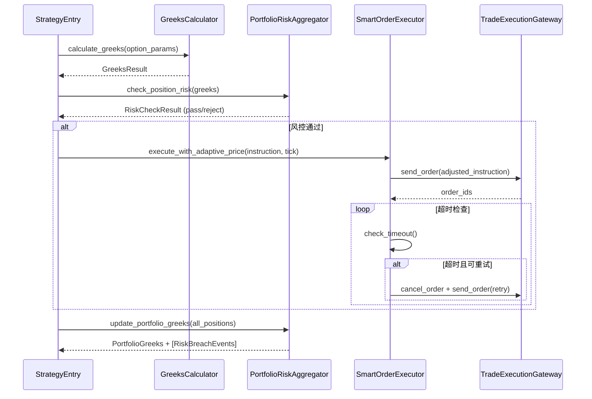

# Design Document: Greeks 风控层、组合级风险聚合、订单执行增强

## Overview

本设计在现有 DDD 架构基础上新增三个核心能力：

1. **Greeks 计算引擎** — 基于 Black-Scholes 模型计算 Delta/Gamma/Theta/Vega 及隐含波动率反推
2. **组合级风险聚合** — 将持仓级 Greeks 汇总为组合级指标，执行阈值检查并产生领域事件
3. **订单执行增强** — 自适应委托价格、超时撤单、自动重试机制

设计遵循现有项目的 Pragmatic DDD 风格：领域逻辑封装在 domain 层，基础设施逻辑封装在 infrastructure 层，StrategyEntry 充当应用层编排。

## Architecture

### 分层架构扩展

```
┌─────────────────────────────────────────────────┐
│              StrategyEntry (应用层)               │
│  on_bar → Greeks计算 → 风控检查 → 下单 → 超时管理  │
└──────────┬──────────────┬───────────────┬────────┘
           │              │               │
    ┌──────▼──────┐ ┌─────▼──────┐ ┌──────▼──────┐
    │  Domain     │ │  Domain    │ │  Domain     │
    │  Greeks     │ │  Portfolio │ │  Order      │
    │  Calculator │ │  Risk Agg  │ │  Execution  │
    └──────┬──────┘ └─────┬──────┘ └──────┬──────┘
           │              │               │
    ┌──────▼──────────────▼───────────────▼──────┐
    │           Infrastructure Layer              │
    │  Config / Gateway / Persistence / Monitor   │
    └─────────────────────────────────────────────┘
```

### 数据流



## Components and Interfaces

### 1. GreeksCalculator (领域服务)

**位置**: `src/strategy/domain/domain_service/greeks_calculator.py`

**职责**: 纯计算服务，无副作用。计算单个期权的 Greeks 和隐含波动率。

```python
@dataclass(frozen=True)
class GreeksInput:
    """Greeks 计算输入参数"""
    spot_price: float           # 标的价格
    strike_price: float         # 行权价
    time_to_expiry: float       # 剩余到期时间 (年化)
    risk_free_rate: float       # 无风险利率
    volatility: float           # 波动率 (隐含或历史)
    option_type: str            # "call" | "put"

@dataclass(frozen=True)
class GreeksResult:
    """Greeks 计算结果"""
    delta: float
    gamma: float
    theta: float
    vega: float
    success: bool = True
    error_message: str = ""

class GreeksCalculator:
    def calculate_greeks(self, params: GreeksInput) -> GreeksResult:
        """计算 Greeks (Black-Scholes)"""
        ...

    def calculate_implied_volatility(
        self,
        market_price: float,
        spot_price: float,
        strike_price: float,
        time_to_expiry: float,
        risk_free_rate: float,
        option_type: str,
        max_iterations: int = 100,
        tolerance: float = 0.01
    ) -> IVResult:
        """牛顿法求解隐含波动率"""
        ...

    def bs_price(self, params: GreeksInput) -> float:
        """Black-Scholes 理论价格"""
        ...
```

### 2. PortfolioRiskAggregator (领域服务)

**位置**: `src/strategy/domain/domain_service/portfolio_risk_aggregator.py`

**职责**: 持仓级风控检查 + 组合级 Greeks 聚合 + 阈值突破事件。

```python
@dataclass(frozen=True)
class RiskThresholds:
    """风控阈值配置"""
    # 单持仓阈值
    position_delta_limit: float = 0.8
    position_gamma_limit: float = 0.1
    position_vega_limit: float = 50.0
    # 组合级阈值
    portfolio_delta_limit: float = 5.0
    portfolio_gamma_limit: float = 1.0
    portfolio_vega_limit: float = 500.0

@dataclass(frozen=True)
class RiskCheckResult:
    """风控检查结果"""
    passed: bool
    reject_reason: str = ""

@dataclass
class PortfolioGreeks:
    """组合级 Greeks 快照"""
    total_delta: float = 0.0
    total_gamma: float = 0.0
    total_theta: float = 0.0
    total_vega: float = 0.0
    position_count: int = 0
    timestamp: datetime = field(default_factory=datetime.now)

class PortfolioRiskAggregator:
    def __init__(self, thresholds: RiskThresholds): ...

    def check_position_risk(self, greeks: GreeksResult, volume: int, multiplier: float) -> RiskCheckResult:
        """开仓前单持仓 Greeks 风控检查"""
        ...

    def aggregate_portfolio_greeks(
        self, positions: List[PositionGreeksEntry]
    ) -> Tuple[PortfolioGreeks, List[DomainEvent]]:
        """聚合组合级 Greeks，返回快照和可能的突破事件"""
        ...
```

### 3. SmartOrderExecutor (领域服务)

**位置**: `src/strategy/domain/domain_service/smart_order_executor.py`

**职责**: 自适应价格计算、超时管理、重试逻辑。不直接调用网关，返回执行指令。

```python
@dataclass(frozen=True)
class OrderExecutionConfig:
    """订单执行配置"""
    timeout_seconds: int = 30       # 超时秒数
    max_retries: int = 3            # 最大重试次数
    slippage_ticks: int = 2         # 滑点跳数
    price_tick: float = 0.2         # 最小变动价位

@dataclass
class ManagedOrder:
    """受管理的订单状态"""
    vt_orderid: str
    instruction: OrderInstruction
    submit_time: datetime
    retry_count: int = 0
    is_active: bool = True

class SmartOrderExecutor:
    def __init__(self, config: OrderExecutionConfig): ...

    def calculate_adaptive_price(
        self,
        instruction: OrderInstruction,
        bid_price: float,
        ask_price: float,
        price_tick: float
    ) -> float:
        """根据盘口计算自适应委托价格"""
        ...

    def round_price_to_tick(self, price: float, price_tick: float) -> float:
        """将价格对齐到最小变动价位"""
        ...

    def register_order(self, vt_orderid: str, instruction: OrderInstruction) -> ManagedOrder:
        """注册新订单到超时管理"""
        ...

    def check_timeouts(self, current_time: datetime) -> Tuple[List[str], List[DomainEvent]]:
        """检查超时订单，返回需撤销的订单ID列表和事件"""
        ...

    def prepare_retry(self, managed_order: ManagedOrder, price_tick: float) -> Optional[OrderInstruction]:
        """准备重试指令，返回 None 表示重试耗尽"""
        ...

    def mark_order_filled(self, vt_orderid: str) -> None:
        """标记订单已成交"""
        ...

    def mark_order_cancelled(self, vt_orderid: str) -> None:
        """标记订单已撤销"""
        ...
```

### 4. 新增领域事件

**位置**: 扩展 `src/strategy/domain/event/event_types.py`

```python
@dataclass
class GreeksRiskBreachEvent(DomainEvent):
    """Greeks 风控阈值突破事件"""
    level: str = ""          # "position" | "portfolio"
    greek_name: str = ""     # "delta" | "gamma" | "vega"
    current_value: float = 0.0
    limit_value: float = 0.0
    vt_symbol: str = ""

@dataclass
class OrderTimeoutEvent(DomainEvent):
    """订单超时事件"""
    vt_orderid: str = ""
    vt_symbol: str = ""
    elapsed_seconds: float = 0.0

@dataclass
class OrderRetryExhaustedEvent(DomainEvent):
    """订单重试耗尽事件"""
    vt_symbol: str = ""
    total_retries: int = 0
    original_price: float = 0.0
    final_price: float = 0.0
```

### 5. 配置扩展

**位置**: `config/strategy_config.yaml` 新增节

```yaml
greeks_risk:
  risk_free_rate: 0.02
  position_limits:
    delta: 0.8
    gamma: 0.1
    vega: 50.0
  portfolio_limits:
    delta: 5.0
    gamma: 1.0
    vega: 500.0

order_execution:
  timeout_seconds: 30
  max_retries: 3
  slippage_ticks: 2
```

## Data Models

### GreeksInput (值对象)

| 字段 | 类型 | 说明 |
|------|------|------|
| spot_price | float | 标的价格 |
| strike_price | float | 行权价 |
| time_to_expiry | float | 剩余到期时间（年化） |
| risk_free_rate | float | 无风险利率 |
| volatility | float | 波动率 |
| option_type | str | "call" 或 "put" |

### GreeksResult (值对象)

| 字段 | 类型 | 说明 |
|------|------|------|
| delta | float | Delta |
| gamma | float | Gamma |
| theta | float | Theta |
| vega | float | Vega |
| success | bool | 计算是否成功 |
| error_message | str | 失败时的错误描述 |

### IVResult (值对象)

| 字段 | 类型 | 说明 |
|------|------|------|
| implied_volatility | float | 隐含波动率 |
| iterations | int | 迭代次数 |
| success | bool | 是否收敛 |
| error_message | str | 失败时的错误描述 |

### PortfolioGreeks (值对象)

| 字段 | 类型 | 说明 |
|------|------|------|
| total_delta | float | 组合 Delta |
| total_gamma | float | 组合 Gamma |
| total_theta | float | 组合 Theta |
| total_vega | float | 组合 Vega |
| position_count | int | 活跃持仓数 |
| timestamp | datetime | 快照时间 |

### PositionGreeksEntry (值对象)

| 字段 | 类型 | 说明 |
|------|------|------|
| vt_symbol | str | 合约代码 |
| greeks | GreeksResult | 单手 Greeks |
| volume | int | 持仓手数 |
| multiplier | float | 合约乘数 |

### RiskThresholds (值对象)

| 字段 | 类型 | 说明 |
|------|------|------|
| position_delta_limit | float | 单持仓 Delta 阈值 |
| position_gamma_limit | float | 单持仓 Gamma 阈值 |
| position_vega_limit | float | 单持仓 Vega 阈值 |
| portfolio_delta_limit | float | 组合 Delta 阈值 |
| portfolio_gamma_limit | float | 组合 Gamma 阈值 |
| portfolio_vega_limit | float | 组合 Vega 阈值 |

### ManagedOrder (实体)

| 字段 | 类型 | 说明 |
|------|------|------|
| vt_orderid | str | 订单 ID |
| instruction | OrderInstruction | 原始交易指令 |
| submit_time | datetime | 提交时间 |
| retry_count | int | 已重试次数 |
| is_active | bool | 是否活跃 |

### OrderExecutionConfig (值对象)

| 字段 | 类型 | 说明 |
|------|------|------|
| timeout_seconds | int | 超时秒数 |
| max_retries | int | 最大重试次数 |
| slippage_ticks | int | 滑点跳数 |
| price_tick | float | 最小变动价位 |


## Correctness Properties

*A property is a characteristic or behavior that should hold true across all valid executions of a system — essentially, a formal statement about what the system should do. Properties serve as the bridge between human-readable specifications and machine-verifiable correctness guarantees.*

### Property 1: Greeks 计算对所有有效输入产生有效结果

*For any* valid GreeksInput (spot_price > 0, strike_price > 0, time_to_expiry > 0, volatility > 0, risk_free_rate >= 0), the GreeksCalculator SHALL return a GreeksResult with success=True, and delta should be in [-1, 1] for puts and [0, 1] for calls.

**Validates: Requirements 1.1**

### Property 2: Put-Call Parity 不变量

*For any* valid option parameters (spot_price > 0, strike_price > 0, time_to_expiry > 0, volatility > 0), computing call delta and put delta with the same parameters should satisfy: call_delta - put_delta ≈ 1 (within tolerance of 1e-6).

**Validates: Requirements 1.4**

### Property 3: 到期时 Greeks 边界值

*For any* spot_price and strike_price (both > 0) with time_to_expiry = 0:
- Call delta = 1.0 if spot > strike, else 0.0
- Put delta = -1.0 if spot < strike, else 0.0
- Gamma, Theta, Vega all = 0.0

**Validates: Requirements 1.3**

### Property 4: 隐含波动率 Round-Trip

*For any* valid option parameters and known volatility σ ∈ (0.01, 3.0), computing the BS price with σ, then solving for implied volatility from that price, should recover σ within tolerance of 0.01.

**Validates: Requirements 2.1, 2.3**

### Property 5: 持仓级风控检查正确性

*For any* GreeksResult, volume, multiplier, and RiskThresholds, the risk check passes if and only if all of the following hold:
- |delta * volume * multiplier| <= position_delta_limit
- |gamma * volume * multiplier| <= position_gamma_limit
- |vega * volume * multiplier| <= position_vega_limit

**Validates: Requirements 3.1, 3.2, 3.3, 3.4**

### Property 6: 组合级 Greeks 聚合为正确的加权求和

*For any* list of PositionGreeksEntry, the aggregated PortfolioGreeks should satisfy:
- total_delta = Σ(entry.greeks.delta * entry.volume * entry.multiplier)
- total_gamma = Σ(entry.greeks.gamma * entry.volume * entry.multiplier)
- total_theta = Σ(entry.greeks.theta * entry.volume * entry.multiplier)
- total_vega = Σ(entry.greeks.vega * entry.volume * entry.multiplier)

**Validates: Requirements 4.1, 4.2**

### Property 7: 组合级阈值突破事件产生

*For any* PortfolioGreeks and RiskThresholds, a GreeksRiskBreachEvent for a specific greek_name is produced if and only if the absolute value of that greek in the portfolio exceeds the corresponding portfolio limit.

**Validates: Requirements 4.3, 4.4, 4.5**

### Property 8: 订单超时检查正确性

*For any* set of ManagedOrders and current_time, check_timeouts returns an order ID in the cancel list if and only if the order is_active=True and (current_time - submit_time).total_seconds() >= timeout_seconds. Each cancelled order also produces an OrderTimeoutEvent.

**Validates: Requirements 6.1, 6.2, 6.3**

### Property 9: 自适应委托价格计算

*For any* OrderInstruction, bid_price, ask_price, and slippage_ticks:
- If instruction is sell (SHORT direction): adaptive_price = bid_price - slippage_ticks * price_tick
- If instruction is buy (LONG direction): adaptive_price = ask_price + slippage_ticks * price_tick

**Validates: Requirements 7.1, 7.2**

### Property 10: 价格对齐到最小变动价位

*For any* computed price and price_tick (> 0), round_price_to_tick(price, price_tick) should produce a result where result % price_tick ≈ 0 (within floating point tolerance), and |result - price| < price_tick.

**Validates: Requirements 7.4**

### Property 11: 订单重试逻辑

*For any* ManagedOrder with retry_count and OrderExecutionConfig with max_retries:
- If retry_count < max_retries: prepare_retry returns a new OrderInstruction with price adjusted by one price_tick in the more aggressive direction
- If retry_count >= max_retries: prepare_retry returns None

**Validates: Requirements 8.1, 8.2, 8.3**

### Property 12: PortfolioGreeks 序列化 Round-Trip

*For any* valid PortfolioGreeks object, serializing to JSON then deserializing should produce an object with equivalent field values.

**Validates: Requirements 9.2**

### Property 13: ManagedOrder 序列化 Round-Trip

*For any* valid ManagedOrder state (including instruction, submit_time, retry_count), serializing to JSON then deserializing should produce an object with equivalent field values.

**Validates: Requirements 9.4**

## Error Handling

### Greeks 计算错误

| 场景 | 处理方式 |
|------|----------|
| 波动率 <= 0 | 返回 GreeksResult(success=False, error_message="...") |
| 到期时间 < 0 | 返回 GreeksResult(success=False, error_message="...") |
| 标的价格或行权价 <= 0 | 返回 GreeksResult(success=False, error_message="...") |
| 数学溢出 (exp 溢出) | 捕获异常，返回失败结果 |

### 隐含波动率求解错误

| 场景 | 处理方式 |
|------|----------|
| 市场价格 < 内在价值 | 返回 IVResult(success=False, error_message="...") |
| 迭代未收敛 | 返回 IVResult(success=False, error_message="...") |
| 市场价格 <= 0 | 返回 IVResult(success=False, error_message="...") |

### 风控检查错误

| 场景 | 处理方式 |
|------|----------|
| Greeks 计算失败 | 拒绝开仓，返回 RiskCheckResult(passed=False, reject_reason="Greeks 计算失败") |
| 配置缺失 | 使用默认阈值，记录警告日志 |

### 订单执行错误

| 场景 | 处理方式 |
|------|----------|
| 盘口数据不可用 (bid/ask = 0) | 使用原始指令价格 |
| 撤单失败 | 记录错误日志，下次超时检查时重试 |
| 重试耗尽 | 产生 OrderRetryExhaustedEvent，停止重试 |

## Testing Strategy

### 测试框架

- **单元测试**: pytest
- **属性测试**: hypothesis (已在 requirements.txt 中，版本 6.151.4)
- **最小迭代次数**: 每个属性测试至少 100 次

### 属性测试 (Property-Based Testing)

每个属性测试对应设计文档中的一个 Correctness Property，使用 hypothesis 库生成随机输入。

测试标注格式: `# Feature: greeks-risk-portfolio-execution, Property N: {property_text}`

**生成器策略**:
- GreeksInput 生成器: spot_price ∈ (1, 100000), strike_price ∈ (1, 100000), time_to_expiry ∈ (0.001, 5.0), volatility ∈ (0.01, 3.0), risk_free_rate ∈ (0, 0.2)
- PortfolioGreeksEntry 列表生成器: 0-20 个持仓，每个持仓 volume ∈ (1, 100), multiplier ∈ (1, 300)
- ManagedOrder 生成器: 随机 OrderInstruction + 随机 submit_time + retry_count ∈ (0, 10)
- 价格生成器: price ∈ (0.1, 100000), price_tick ∈ (0.01, 10.0)

### 单元测试

单元测试覆盖以下场景:
- 具体数值验证 (已知 BS 价格的期权参数)
- 边界条件 (到期时间=0, 波动率=0, 深度虚值/实值)
- 配置加载 (YAML 解析、默认值回退)
- 领域事件产生 (风控突破、订单超时)
- 集成点 (StrategyEntry 编排流程)
