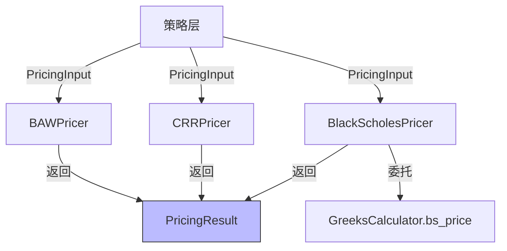

# 设计文档：期权定价引擎

## 概述

在现有 `pricing` 模块下新增三个独立的期权定价器：BAWPricer（美式近似解析）、CRRPricer（二叉树）和 BlackScholesPricer（欧式解析，委托 GreeksCalculator）。策略层直接使用各定价器，无需统一入口层。各定价器各自负责输入校验和错误处理。

## 架构



策略层根据需要直接实例化并调用对应的定价器。每个定价器接收 `PricingInput`，返回 `PricingResult`，内部各自完成输入校验、边界处理和异常捕获。

## 组件与接口

### 1. 值对象（`src/strategy/domain/value_object/pricing.py`）

```python
from dataclasses import dataclass
from enum import Enum


class ExerciseStyle(str, Enum):
    """期权行权方式"""
    AMERICAN = "american"
    EUROPEAN = "european"


class PricingModel(str, Enum):
    """定价模型枚举"""
    BAW = "baw"
    CRR = "crr"
    BLACK_SCHOLES = "black_scholes"


@dataclass(frozen=True)
class PricingInput:
    """
    定价输入参数

    Attributes:
        spot_price: 标的价格
        strike_price: 行权价
        time_to_expiry: 剩余到期时间（年化）
        risk_free_rate: 无风险利率
        volatility: 波动率
        option_type: 期权类型 ("call" | "put")
        exercise_style: 行权方式
    """
    spot_price: float
    strike_price: float
    time_to_expiry: float
    risk_free_rate: float
    volatility: float
    option_type: str  # "call" | "put"
    exercise_style: ExerciseStyle


@dataclass(frozen=True)
class PricingResult:
    """
    定价结果

    Attributes:
        price: 理论价格
        model_used: 实际使用的定价模型名称
        success: 是否成功
        error_message: 错误描述
    """
    price: float = 0.0
    model_used: str = ""
    success: bool = True
    error_message: str = ""
```

### 2. BlackScholesPricer（`src/strategy/domain/domain_service/pricing/bs_pricer.py`）

委托给现有 `GreeksCalculator.bs_price`，适用于欧式期权。内部负责输入校验。

```python
class BlackScholesPricer:
    """Black-Scholes 定价器，委托给 GreeksCalculator"""

    def __init__(self, greeks_calculator: GreeksCalculator):
        self._calculator = greeks_calculator

    def price(self, params: PricingInput) -> PricingResult:
        # 1. 输入校验（spot_price, strike_price, volatility, time_to_expiry）
        # 2. 将 PricingInput 转换为 GreeksInput，调用 bs_price
        # 3. 异常捕获，返回 error PricingResult
        greeks_input = GreeksInput(
            spot_price=params.spot_price,
            strike_price=params.strike_price,
            time_to_expiry=params.time_to_expiry,
            risk_free_rate=params.risk_free_rate,
            volatility=params.volatility,
            option_type=params.option_type,
        )
        price = self._calculator.bs_price(greeks_input)
        return PricingResult(price=price, model_used="black_scholes")
```

### 3. BAWPricer（`src/strategy/domain/domain_service/pricing/baw_pricer.py`）

实现 Barone-Adesi Whaley (1987) 美式期权近似解析定价。内部负责输入校验。

算法核心思路：
- 美式期权价格 = 欧式 BS 价格 + 提前行权溢价
- 通过求解一个关于临界标的价格 S* 的非线性方程来确定提前行权边界
- 使用牛顿法迭代求解 S*
- 当 S 低于 S*（看涨）或高于 S*（看跌）时，价格为 BS 价格加上溢价项

```python
class BAWPricer:
    """Barone-Adesi Whaley 美式期权近似定价器"""

    def price(self, params: PricingInput) -> PricingResult:
        # 1. 输入校验（spot_price, strike_price, volatility, time_to_expiry）
        # 2. T=0 边界处理，返回内在价值
        # 3. 计算欧式 BS 价格作为基准
        # 4. 计算 BAW 参数: M, N, K, q
        # 5. 牛顿法求解临界价格 S*
        # 6. 根据 S 与 S* 的关系计算美式价格
        # 7. 异常捕获，返回 error PricingResult
        ...
```

关键公式：
- `M = 2r / σ²`，`N = 2(r-q) / σ²`（q 为股息率，此处为 0）
- `K = 1 - e^(-rT)`
- 看涨: `q₂ = (-(N-1) + √((N-1)² + 4M/K)) / 2`
- 看跌: `q₁ = (-(N-1) - √((N-1)² + 4M/K)) / 2`

### 4. CRRPricer（`src/strategy/domain/domain_service/pricing/crr_pricer.py`）

实现 Cox-Ross-Rubinstein 二叉树定价模型，支持美式和欧式。内部负责输入校验。

```python
class CRRPricer:
    """CRR 二叉树定价器"""

    def __init__(self, steps: int = 100):
        self._steps = steps

    def price(self, params: PricingInput) -> PricingResult:
        # 1. 输入校验（spot_price, strike_price, volatility, time_to_expiry）
        # 2. T=0 边界处理，返回内在价值
        # 3. 计算参数: dt, u, d, p
        #    dt = T / steps
        #    u = exp(σ√dt), d = 1/u
        #    p = (exp(r·dt) - d) / (u - d)
        # 4. 构建到期节点的期权价值
        # 5. 从叶子节点向根节点回溯
        #    - 欧式: 仅折现
        #    - 美式: max(折现值, 提前行权价值)
        # 6. 返回根节点价格
        # 7. 异常捕获，返回 error PricingResult
        ...
```

## 数据模型

### 新增值对象

| 值对象 | 文件 | 说明 |
|--------|------|------|
| `ExerciseStyle` | `value_object/pricing.py` | 行权方式枚举: AMERICAN, EUROPEAN |
| `PricingModel` | `value_object/pricing.py` | 定价模型枚举: BAW, CRR, BLACK_SCHOLES |
| `PricingInput` | `value_object/pricing.py` | 定价输入，frozen dataclass |
| `PricingResult` | `value_object/pricing.py` | 定价结果，frozen dataclass |

### 新增领域服务文件

| 文件 | 类 | 说明 |
|------|-----|------|
| `bs_pricer.py` | `BlackScholesPricer` | BS 适配器，委托 GreeksCalculator |
| `baw_pricer.py` | `BAWPricer` | BAW 美式近似定价 |
| `crr_pricer.py` | `CRRPricer` | CRR 二叉树定价 |

### 与现有模型的关系

- `PricingInput` 与 `GreeksInput` 语义一致，新增 `exercise_style` 字段
- `PricingResult` 遵循现有 `GreeksResult` 的 `success` + `error_message` 模式
- `BlackScholesPricer` 内部将 `PricingInput` 转换为 `GreeksInput` 调用现有代码

## 正确性属性

*正确性属性是系统在所有有效执行中都应保持为真的特征或行为——本质上是关于系统应该做什么的形式化陈述。属性是人类可读规范与机器可验证正确性保证之间的桥梁。*

### Property 1: 美式期权价格不低于欧式 BS 价格

*For any* 有效的定价参数（spot_price > 0, strike_price > 0, time_to_expiry > 0, volatility > 0），BAWPricer 或 CRRPricer（美式模式）的定价结果应不低于相同参数下 BlackScholesPricer 的欧式定价结果。

**Validates: Requirements 2.2, 3.3**

### Property 2: 美式看跌价格不低于内在价值

*For any* 有效的美式看跌期权参数，BAWPricer 定价结果应不低于期权内在价值 max(strike_price - spot_price, 0)。

**Validates: Requirements 2.3**

### Property 3: CRR 欧式定价收敛到 BS

*For any* 有效的欧式期权参数，CRRPricer（100 步）的定价结果与 BlackScholesPricer 价格的绝对差值应小于 BS 价格的 2%（或绝对误差 < 0.05，取较大者）。

**Validates: Requirements 3.2**

### Property 4: BS 委托一致性

*For any* 有效的欧式 PricingInput，通过 BlackScholesPricer 定价的结果应与直接调用 GreeksCalculator.bs_price 的结果完全一致。

**Validates: Requirements 4.1**

### Property 5: 无效输入返回错误

*For any* 包含无效参数的 PricingInput（spot_price <= 0 或 strike_price <= 0 或 volatility <= 0 或 time_to_expiry < 0），调用任意定价器（BAWPricer、CRRPricer、BlackScholesPricer）的 price 方法应返回 success 为 False 的 PricingResult。

**Validates: Requirements 2.5, 3.6, 4.3**

## 错误处理

| 错误场景 | 处理方式 | 对应需求 |
|----------|----------|----------|
| spot_price <= 0 或 strike_price <= 0 | 各定价器内部返回 `PricingResult(success=False, error_message="...")` | 2.5, 3.6, 4.3 |
| volatility <= 0 | 各定价器内部返回 `PricingResult(success=False, error_message="...")` | 2.5, 3.6, 4.3 |
| time_to_expiry < 0 | 各定价器内部返回 `PricingResult(success=False, error_message="...")` | 2.5, 3.6, 4.3 |
| time_to_expiry == 0 | BAWPricer 和 CRRPricer 直接返回内在价值 | 2.4, 3.5 |
| 数值溢出 / 计算异常 | 各定价器内部捕获异常，返回 `PricingResult(success=False, error_message=str(e))` | 2.6, 3.7, 4.4 |

输入校验在各定价器内部各自执行。T=0 边界处理也在各定价器内部处理。

## 测试策略

### 测试框架

- 单元测试: `pytest`
- 属性测试: `hypothesis`（Python 属性测试库）
- 每个属性测试最少运行 100 次迭代

### 单元测试

单元测试聚焦于具体示例和边界条件：

- BAWPricer：使用已知参数验证与文献参考值的一致性、T=0 返回内在价值
- CRRPricer：验证默认步数为 100、T=0 返回内在价值
- BlackScholesPricer：验证委托调用的具体场景
- 边界条件：T=0、极端参数（极深实值/虚值）、数值溢出

### 属性测试

属性测试验证跨所有输入的通用属性，使用 `hypothesis` 的 `@given` 装饰器生成随机有效参数：

- 生成器策略：使用 `st.floats` 生成合理范围内的金融参数（如 spot_price 在 0.01~10000，volatility 在 0.01~5.0，time_to_expiry 在 0.001~5.0）
- 每个属性测试对应设计文档中的一个 Property
- 标注格式：`# Feature: option-pricing-engine, Property N: {property_text}`
- 每个正确性属性由一个单独的属性测试实现

### 测试文件结构

```
tests/strategy/domain/domain_service/
  test_baw_pricer.py          # BAW 单元测试 + 属性测试
  test_crr_pricer.py          # CRR 单元测试 + 属性测试
  test_bs_pricer.py            # BS 单元测试 + 属性测试
```
