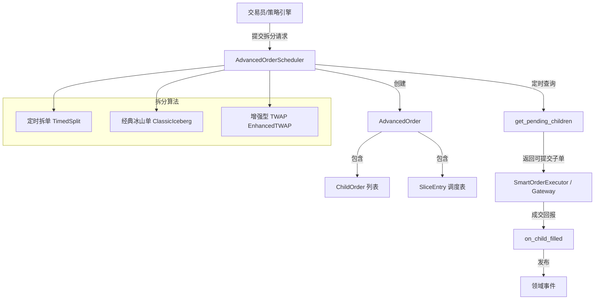

# 设计文档：订单拆分算法

## 概述

本设计为期权量化交易策略框架新增三种订单拆分算法：定时拆单（TimedSplit）、经典冰山单（ClassicIceberg）和增强型 TWAP。设计遵循现有 DDD 架构，扩展 `AdvancedOrderScheduler` 领域服务和 `AdvancedOrder` 值对象体系，复用已有的 `ChildOrder`、`SliceEntry`、`OrderInstruction` 等基础设施。

### 设计决策

1. **扩展现有调度器**：在 `AdvancedOrderScheduler` 中新增三个 `submit_*` 方法，而非创建新的调度器类。理由：三种新算法与现有冰山单/TWAP/VWAP 共享子单生命周期管理逻辑（`on_child_filled`、`get_pending_children`、`cancel_order`），统一管理降低复杂度。
2. **枚举扩展**：在 `AdvancedOrderType` 中新增 `TIMED_SPLIT`、`CLASSIC_ICEBERG`、`ENHANCED_TWAP` 三个枚举值。
3. **随机化策略**：经典冰山单的数量随机化和价格偏移通过可选参数实现，不配置时退化为固定数量拆单。随机化后通过调整最后一笔子单确保总量精确。
4. **请求扩展**：在 `AdvancedOrderRequest` 中新增字段以支持三种算法的参数，保持向后兼容。

## 架构



## 组件与接口

### 1. AdvancedOrderScheduler 扩展方法

```python
class AdvancedOrderScheduler:
    # 现有方法保持不变...

    def submit_timed_split(
        self,
        instruction: OrderInstruction,
        interval_seconds: int,
        per_order_volume: int,
        start_time: datetime,
    ) -> AdvancedOrder:
        """
        提交定时拆单
        
        Args:
            instruction: 交易指令（包含总量、价格等）
            interval_seconds: 每笔子单之间的时间间隔（秒）
            per_order_volume: 每笔子单数量
            start_time: 首笔子单的计划提交时间
        
        Returns:
            AdvancedOrder 包含所有子单和调度表
        
        Raises:
            ValueError: 参数无效时
        """

    def submit_classic_iceberg(
        self,
        instruction: OrderInstruction,
        per_order_volume: int,
        volume_randomize_ratio: float = 0.0,
        price_offset_ticks: int = 0,
        price_tick: float = 0.0,
    ) -> AdvancedOrder:
        """
        提交经典冰山单
        
        Args:
            instruction: 交易指令
            per_order_volume: 每笔子单基础数量
            volume_randomize_ratio: 数量随机浮动比例 [0, 1)，0 表示不随机
            price_offset_ticks: 价格偏移跳数，0 表示不偏移
            price_tick: 最小变动价位（price_offset_ticks > 0 时必须 > 0）
        
        Returns:
            AdvancedOrder
        
        Raises:
            ValueError: 参数无效时
        """

    def submit_enhanced_twap(
        self,
        instruction: OrderInstruction,
        time_window_seconds: int,
        num_slices: int,
        start_time: datetime,
    ) -> AdvancedOrder:
        """
        提交增强型 TWAP
        
        Args:
            instruction: 交易指令
            time_window_seconds: 总执行时长（秒）
            num_slices: 分片数量
            start_time: 首个时间片的计划提交时间
        
        Returns:
            AdvancedOrder
        
        Raises:
            ValueError: 参数无效时
        """
```

### 2. get_pending_children 扩展逻辑

```python
def get_pending_children(self, current_time: datetime) -> List[ChildOrder]:
    # 现有逻辑 + 新增：
    # TIMED_SPLIT: 按 scheduled_time 提交，到达时间即可提交（与 TWAP 类似）
    # CLASSIC_ICEBERG: 前一笔成交后才提交下一笔（与现有 ICEBERG 类似）
    # ENHANCED_TWAP: 按 scheduled_time 提交（与现有 TWAP 相同）
```

### 3. 领域事件

```python
@dataclass
class TimedSplitCompleteEvent(DomainEvent):
    """定时拆单完成事件"""
    order_id: str = ""
    vt_symbol: str = ""
    total_volume: int = 0
    filled_volume: int = 0

@dataclass
class ClassicIcebergCompleteEvent(DomainEvent):
    """经典冰山单完成事件"""
    order_id: str = ""
    vt_symbol: str = ""
    total_volume: int = 0
    filled_volume: int = 0

@dataclass
class ClassicIcebergCancelledEvent(DomainEvent):
    """经典冰山单取消事件"""
    order_id: str = ""
    vt_symbol: str = ""
    filled_volume: int = 0
    remaining_volume: int = 0

@dataclass
class EnhancedTWAPCompleteEvent(DomainEvent):
    """增强型 TWAP 完成事件"""
    order_id: str = ""
    vt_symbol: str = ""
    total_volume: int = 0
```

## 数据模型

### AdvancedOrderType 枚举扩展

```python
class AdvancedOrderType(Enum):
    ICEBERG = "iceberg"
    TWAP = "twap"
    VWAP = "vwap"
    # 新增
    TIMED_SPLIT = "timed_split"
    CLASSIC_ICEBERG = "classic_iceberg"
    ENHANCED_TWAP = "enhanced_twap"
```

### AdvancedOrderRequest 字段扩展

```python
@dataclass
class AdvancedOrderRequest:
    order_type: AdvancedOrderType
    instruction: OrderInstruction
    batch_size: int = 0
    time_window_seconds: int = 0
    num_slices: int = 0
    volume_profile: List[float] = field(default_factory=list)
    # 新增字段
    interval_seconds: int = 0              # 定时拆单：时间间隔
    per_order_volume: int = 0              # 定时拆单/经典冰山单：每笔数量
    volume_randomize_ratio: float = 0.0    # 经典冰山单：数量随机比例
    price_offset_ticks: int = 0            # 经典冰山单：价格偏移跳数
    price_tick: float = 0.0                # 经典冰山单：最小变动价位
```

### ChildOrder 扩展

```python
@dataclass
class ChildOrder:
    child_id: str
    parent_id: str
    volume: int
    scheduled_time: Optional[datetime] = None
    is_submitted: bool = False
    is_filled: bool = False
    # 新增字段
    price_offset: float = 0.0  # 经典冰山单：该子单的价格偏移量
```

### 拆分算法详细逻辑

#### 定时拆单

```
输入: total_volume, per_order_volume, interval_seconds, start_time
子单数量 = ceil(total_volume / per_order_volume)
for i in range(子单数量):
    volume = min(per_order_volume, remaining)
    scheduled_time = start_time + i * interval_seconds
    创建 ChildOrder(volume, scheduled_time)
```

#### 经典冰山单（含随机化）

```
输入: total_volume, per_order_volume, volume_randomize_ratio, price_offset_ticks, price_tick
remaining = total_volume
children = []
while remaining > 0:
    if volume_randomize_ratio > 0:
        randomized = per_order_volume * uniform(1 - ratio, 1 + ratio)
        vol = clamp(round(randomized), 1, remaining)
    else:
        vol = min(per_order_volume, remaining)
    
    if price_offset_ticks > 0 and price_tick > 0:
        offset = uniform(-price_offset_ticks, price_offset_ticks) * price_tick
    else:
        offset = 0.0
    
    创建 ChildOrder(volume=vol, price_offset=offset)
    remaining -= vol

# 最后一笔调整确保总量精确
```

#### 增强型 TWAP

```
输入: total_volume, time_window_seconds, num_slices, start_time
base_vol = total_volume // num_slices
remainder = total_volume % num_slices
interval = time_window_seconds / num_slices
for i in range(num_slices):
    vol = base_vol + (1 if i < remainder else 0)
    scheduled_time = start_time + round(interval * i) 秒
    创建 ChildOrder(volume=vol, scheduled_time=scheduled_time)
```


## 正确性属性

*正确性属性是在系统所有有效执行中都应成立的特征或行为——本质上是关于系统应该做什么的形式化陈述。属性是人类可读规范与机器可验证正确性保证之间的桥梁。*

### Property 1: 定时拆单拆分正确性

*For any* 有效的 total_volume 和 per_order_volume，提交定时拆单后：
- 每笔子单 volume ≤ per_order_volume
- 所有子单 volume 之和 == total_volume
- 子单数量 == ceil(total_volume / per_order_volume)
- 第 i 笔子单的 scheduled_time == start_time + i × interval_seconds

**Validates: Requirements 1.1, 1.2**

### Property 2: 经典冰山单拆分正确性（含随机化不变量）

*For any* 有效的 total_volume、per_order_volume 和 volume_randomize_ratio，提交经典冰山单后：
- 所有子单 volume 之和精确等于 total_volume
- 当 volume_randomize_ratio == 0 时，每笔子单 volume ≤ per_order_volume
- 当 volume_randomize_ratio > 0 时，每笔子单 volume 在 per_order_volume × (1 ± ratio) 范围内（最后一笔除外）
- 每笔子单 volume ≥ 1

**Validates: Requirements 2.1, 2.2**

### Property 3: 经典冰山单价格偏移范围

*For any* 经典冰山单配置了 price_offset_ticks 和 price_tick，每笔子单的 price_offset 绝对值不超过 price_offset_ticks × price_tick

**Validates: Requirements 2.3**

### Property 4: 经典冰山单生命周期——顺序执行与完成

*For any* 经典冰山单，逐笔成交所有子单后：
- 每次 get_pending_children 最多返回 1 笔子单
- 仅当前面所有子单已成交时才返回下一笔
- 全部成交后父订单状态为 COMPLETED
- 恰好产生 1 个 ClassicIcebergCompleteEvent

**Validates: Requirements 2.4, 2.5**

### Property 5: 经典冰山单取消正确性

*For any* 经典冰山单，部分成交后取消：
- 父订单状态为 CANCELLED
- 产生 1 个 ClassicIcebergCancelledEvent
- 事件中 filled_volume + remaining_volume == total_volume

**Validates: Requirements 2.6**

### Property 6: 增强型 TWAP 拆分正确性

*For any* 有效的 total_volume、time_window_seconds 和 num_slices，提交增强型 TWAP 后：
- 各片数量差异不超过 1（max - min ≤ 1）
- 所有子单 volume 之和 == total_volume
- 相邻时间片间隔 == time_window_seconds / num_slices（±1 秒舍入误差）

**Validates: Requirements 3.1, 3.2**

### Property 7: 成交量追踪不变量

*For any* 订单类型和任意子单成交序列，filled_volume 始终等于所有已成交子单的 volume 之和

**Validates: Requirements 4.1, 4.2**

### Property 8: 序列化 Round-Trip

*For any* 有效的 AdvancedOrder 对象（定时拆单、经典冰山单、增强型 TWAP），序列化为字典后再反序列化，应产生与原始对象等价的结果

**Validates: Requirements 5.1, 5.2, 5.3**

### Property 9: 无效参数拒绝

*For any* 无效参数组合（总量 ≤ 0、间隔 ≤ 0、每笔数量 ≤ 0、分片数 ≤ 0、ratio < 0 或 ≥ 1），提交请求应抛出 ValueError

**Validates: Requirements 1.5, 2.7, 2.8, 3.6**

## 错误处理

| 错误场景 | 处理方式 |
|---------|---------|
| total_volume ≤ 0 | 抛出 ValueError("总量必须大于 0") |
| interval_seconds ≤ 0 | 抛出 ValueError("时间间隔必须大于 0") |
| per_order_volume ≤ 0 | 抛出 ValueError("每笔数量必须大于 0") |
| num_slices ≤ 0 | 抛出 ValueError("分片数必须大于 0") |
| time_window_seconds ≤ 0 | 抛出 ValueError("时间窗口必须大于 0") |
| volume_randomize_ratio < 0 或 ≥ 1 | 抛出 ValueError("随机比例必须在 [0, 1) 范围内") |
| price_offset_ticks > 0 但 price_tick ≤ 0 | 抛出 ValueError("使用价格偏移时 price_tick 必须大于 0") |
| 子单成交回报找不到对应子单 | 静默忽略，返回空事件列表 |
| 取消已完成或已取消的订单 | 返回空列表，不产生事件 |

## 测试策略

### 属性测试（Property-Based Testing）

使用 `hypothesis` 库（版本 6.151.4），每个属性测试至少运行 100 次迭代。

每个正确性属性对应一个独立的属性测试：

- **Property 1**: 生成随机 total_volume、per_order_volume、interval_seconds，验证拆分和调度正确性
- **Property 2**: 生成随机 total_volume、per_order_volume、volume_randomize_ratio，验证总量不变量
- **Property 3**: 生成随机 price_offset_ticks 和 price_tick，验证偏移范围
- **Property 4**: 生成随机冰山单，模拟逐笔成交，验证顺序执行和完成事件
- **Property 5**: 生成随机冰山单，部分成交后取消，验证取消事件
- **Property 6**: 生成随机 total_volume、time_window_seconds、num_slices，验证均匀分配和时间间隔
- **Property 7**: 生成随机订单和成交序列，验证 filled_volume 不变量
- **Property 8**: 生成随机订单，执行 to_dict → from_dict round-trip
- **Property 9**: 生成无效参数，验证 ValueError

每个测试标注格式：**Feature: order-splitting-algorithms, Property {number}: {property_text}**

### 单元测试

单元测试聚焦于具体示例和边界情况：

- 定时拆单：100 总量 / 30 每笔 = 4 子单 (30, 30, 30, 10)
- 经典冰山单：无随机化时的确定性拆分
- 增强型 TWAP：300 秒 / 5 片的均匀分配
- 经典冰山单取消：部分成交后取消的事件验证
- 参数校验：各种无效参数的 ValueError 验证
