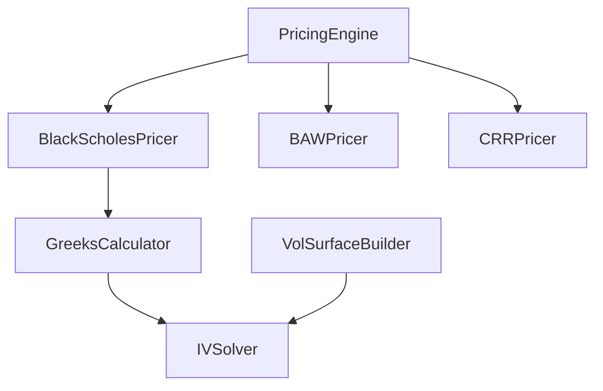

# 设计文档：定价服务增强

## 概述

本设计对 `src/strategy/domain/domain_service/pricing/` 模块进行两项核心增强：

1. **IVSolver 独立服务**：将隐含波动率求解逻辑从 `GreeksCalculator.calculate_implied_volatility` 中提取为独立的 `IVSolver` 类，支持多算法（牛顿法、二分法、Brent 法）和批量求解，同时保持 `GreeksCalculator` 的向后兼容。
2. **PricingEngine 统一入口**：创建 `PricingEngine` 类，根据 `ExerciseStyle` 和可选配置自动路由到 `BlackScholesPricer`、`BAWPricer` 或 `CRRPricer`，简化调用方代码。

同时对目录结构进行重组，按职责将代码分为 `pricers/`、`iv/`、`volatility/` 三个子目录，顶层 `__init__.py` 保持所有现有导出不变。

## 架构

### 当前结构

```
pricing/
├── __init__.py
├── greeks_calculator.py    # Greeks 计算 + IV 求解（耦合）
├── bs_pricer.py            # 欧式 BS 定价器
├── baw_pricer.py           # 美式 BAW 定价器
├── crr_pricer.py           # CRR 二叉树定价器
└── vol_surface_builder.py  # 波动率曲面构建器
```

### 目标结构

```
pricing/
├── __init__.py              # 顶层导出（向后兼容）
├── pricing_engine.py        # PricingEngine 统一入口
├── pricers/
│   ├── __init__.py
│   ├── bs_pricer.py
│   ├── baw_pricer.py
│   └── crr_pricer.py
├── iv/
│   ├── __init__.py
│   ├── iv_solver.py         # IVSolver 独立服务
│   └── greeks_calculator.py # 委托给 IVSolver
└── volatility/
    ├── __init__.py
    └── vol_surface_builder.py
```

### 依赖关系



## 组件与接口

### 1. IVSolver（新增）

位置：`pricing/iv/iv_solver.py`

IVSolver 从 `GreeksCalculator.calculate_implied_volatility` 中提取核心求解逻辑，增加多算法支持。

```python
from enum import Enum
from typing import List
from ...value_object.greeks import GreeksInput, IVResult

class SolveMethod(str, Enum):
    """IV 求解算法枚举"""
    NEWTON = "newton"       # 牛顿法（默认）
    BISECTION = "bisection" # 二分法
    BRENT = "brent"         # Brent 法


class IVSolver:
    """隐含波动率求解器"""

    def solve(
        self,
        market_price: float,
        spot_price: float,
        strike_price: float,
        time_to_expiry: float,
        risk_free_rate: float,
        option_type: str,
        method: SolveMethod = SolveMethod.NEWTON,
        max_iterations: int = 100,
        tolerance: float = 0.01,
    ) -> IVResult:
        """
        求解单个期权的隐含波动率。
        默认使用牛顿法，牛顿法未收敛时自动回退到二分法。
        调用方可通过 method 参数指定算法。
        """
        ...

    def solve_batch(
        self,
        quotes: List[IVQuote],
        method: SolveMethod = SolveMethod.NEWTON,
        max_iterations: int = 100,
        tolerance: float = 0.01,
    ) -> List[IVResult]:
        """
        批量求解隐含波动率。
        每个报价独立求解，单个失败不影响其他。
        返回列表与输入列表保持相同顺序和长度。
        """
        ...
```

**内部算法实现**：

- `_solve_newton()`：牛顿法迭代，使用 Vega 作为导数。与现有 `GreeksCalculator` 中的实现逻辑一致，初始猜测 σ=0.5，维护二分法边界 [0.001, 10.0]，当牛顿步超出边界时回退到二分法步。
- `_solve_bisection()`：纯二分法，在 [0.001, 10.0] 区间内搜索。
- `_solve_brent()`：Brent 求根法，结合二分法、割线法和逆二次插值，收敛速度优于二分法。使用 `scipy.optimize.brentq` 或手动实现。

**输入校验**（在 `solve` 入口统一执行）：
- `market_price <= 0` → 返回失败 IVResult
- `market_price < intrinsic_value - tolerance` → 返回失败 IVResult

### 2. IVQuote（新增值对象）

位置：`src/strategy/domain/value_object/greeks.py`（追加）

```python
@dataclass(frozen=True)
class IVQuote:
    """批量 IV 求解的单个报价输入"""
    market_price: float
    spot_price: float
    strike_price: float
    time_to_expiry: float
    risk_free_rate: float
    option_type: str  # "call" | "put"
```

### 3. GreeksCalculator（修改）

位置：`pricing/iv/greeks_calculator.py`

修改后的 `GreeksCalculator` 在构造时接受可选的 `IVSolver` 实例。`calculate_implied_volatility` 方法委托给 `IVSolver.solve`，方法签名和返回类型完全不变。

```python
class GreeksCalculator:
    def __init__(self, iv_solver: IVSolver | None = None):
        self._iv_solver = iv_solver or IVSolver()

    def calculate_greeks(self, params: GreeksInput) -> GreeksResult:
        # 保持不变
        ...

    def bs_price(self, params: GreeksInput) -> float:
        # 保持不变
        ...

    def calculate_implied_volatility(
        self,
        market_price: float,
        spot_price: float,
        strike_price: float,
        time_to_expiry: float,
        risk_free_rate: float,
        option_type: str,
        max_iterations: int = 100,
        tolerance: float = 0.01,
    ) -> IVResult:
        """委托给 IVSolver，签名和返回类型不变"""
        return self._iv_solver.solve(
            market_price=market_price,
            spot_price=spot_price,
            strike_price=strike_price,
            time_to_expiry=time_to_expiry,
            risk_free_rate=risk_free_rate,
            option_type=option_type,
            max_iterations=max_iterations,
            tolerance=tolerance,
        )
```

### 4. PricingEngine（新增）

位置：`pricing/pricing_engine.py`

```python
from .pricers.bs_pricer import BlackScholesPricer
from .pricers.baw_pricer import BAWPricer
from .pricers.crr_pricer import CRRPricer
from .iv.greeks_calculator import GreeksCalculator
from ..value_object.pricing import ExerciseStyle, PricingInput, PricingResult, PricingModel


class PricingEngine:
    """统一定价引擎入口"""

    def __init__(
        self,
        american_model: PricingModel = PricingModel.BAW,
        crr_steps: int = 100,
    ):
        self._greeks_calc = GreeksCalculator()
        self._bs_pricer = BlackScholesPricer(self._greeks_calc)
        self._baw_pricer = BAWPricer()
        self._crr_pricer = CRRPricer(steps=crr_steps)
        self._american_model = american_model

    def price(self, params: PricingInput) -> PricingResult:
        """
        统一定价入口。
        根据 exercise_style 和配置路由到对应定价器。
        """
        # 输入校验
        error = self._validate(params)
        if error:
            return PricingResult(success=False, error_message=error, model_used="")

        # 路由
        if params.exercise_style == ExerciseStyle.EUROPEAN:
            return self._bs_pricer.price(params)
        else:  # AMERICAN
            if self._american_model == PricingModel.CRR:
                return self._crr_pricer.price(params)
            else:
                return self._baw_pricer.price(params)

    @staticmethod
    def _validate(params: PricingInput) -> str:
        if params.spot_price <= 0:
            return "spot_price 必须大于 0"
        if params.strike_price <= 0:
            return "strike_price 必须大于 0"
        if params.volatility <= 0:
            return "volatility 必须大于 0"
        if params.time_to_expiry < 0:
            return "time_to_expiry 不能为负数"
        return ""
```

### 5. 顶层 `__init__.py`（修改）

保持所有现有导出，新增 `IVSolver`、`PricingEngine`、`SolveMethod`：

```python
# 向后兼容导出
from .iv.greeks_calculator import GreeksCalculator
from .iv.iv_solver import IVSolver, SolveMethod
from .volatility.vol_surface_builder import VolSurfaceBuilder
from .pricers.baw_pricer import BAWPricer
from .pricers.crr_pricer import CRRPricer
from .pricers.bs_pricer import BlackScholesPricer
from .pricing_engine import PricingEngine

__all__ = [
    "GreeksCalculator",
    "VolSurfaceBuilder",
    "BAWPricer",
    "CRRPricer",
    "BlackScholesPricer",
    "IVSolver",
    "SolveMethod",
    "PricingEngine",
]
```

## 数据模型

### 现有值对象（不变）

| 值对象 | 位置 | 说明 |
|--------|------|------|
| `PricingInput` | `value_object/pricing.py` | 定价输入参数 |
| `PricingResult` | `value_object/pricing.py` | 定价结果 |
| `ExerciseStyle` | `value_object/pricing.py` | 行权方式枚举 |
| `PricingModel` | `value_object/pricing.py` | 定价模型枚举 |
| `GreeksInput` | `value_object/greeks.py` | Greeks 计算输入 |
| `GreeksResult` | `value_object/greeks.py` | Greeks 计算结果 |
| `IVResult` | `value_object/greeks.py` | IV 求解结果 |

### 新增值对象

| 值对象 | 位置 | 说明 |
|--------|------|------|
| `IVQuote` | `value_object/greeks.py` | 批量 IV 求解的单个报价输入 |
| `SolveMethod` | `pricing/iv/iv_solver.py` | IV 求解算法枚举 |

### IVQuote 字段定义

```python
@dataclass(frozen=True)
class IVQuote:
    market_price: float       # 期权市场价格
    spot_price: float         # 标的价格
    strike_price: float       # 行权价
    time_to_expiry: float     # 剩余到期时间（年化）
    risk_free_rate: float     # 无风险利率
    option_type: str          # "call" | "put"
```

## 正确性属性

*正确性属性是系统在所有有效执行中应保持为真的特征或行为——本质上是关于系统应做什么的形式化陈述。属性作为人类可读规范与机器可验证正确性保证之间的桥梁。*

### Property 1: IV 求解 Round-Trip（跨算法）

*For any* 有效的期权参数组合（spot_price, strike_price, time_to_expiry, risk_free_rate, volatility, option_type），先用 BS 公式计算理论价格，再用 IVSolver 的任意算法（Newton / Bisection / Brent）反推隐含波动率，恢复的 IV 与原始 volatility 的误差应小于容差阈值。

**Validates: Requirements 1.1, 1.2, 1.4, 1.5**

### Property 2: IVSolver 错误输入处理

*For any* 非正市场价格（market_price ≤ 0）或市场价格低于期权内在价值的输入，IVSolver.solve 应返回 success=False 的 IVResult 且 error_message 非空。

**Validates: Requirements 1.6, 1.7**

### Property 3: 批量求解不变量（长度、顺序、隔离性）

*For any* IVQuote 列表（包含有效和无效报价的混合），IVSolver.solve_batch 返回的 IVResult 列表长度等于输入列表长度，且有效报价对应的结果 success=True，无效报价对应的结果 success=False，互不影响。

**Validates: Requirements 2.1, 2.2, 2.3**

### Property 4: GreeksCalculator 向后兼容（行为等价）

*For any* 有效的 IV 求解输入，GreeksCalculator.calculate_implied_volatility 的返回结果应与直接调用 IVSolver.solve（使用默认牛顿法）的结果完全一致（implied_volatility 和 success 字段相同）。

**Validates: Requirements 3.1, 3.2, 3.3**

### Property 5: PricingEngine 路由正确性

*For any* 有效的 PricingInput：
- 当 exercise_style=EUROPEAN 时，PricingResult.model_used 为 "black_scholes"
- 当 exercise_style=AMERICAN 且配置为 BAW 时，PricingResult.model_used 为 "baw"
- 当 exercise_style=AMERICAN 且配置为 CRR 时，PricingResult.model_used 为 "crr"

**Validates: Requirements 4.1, 4.2, 4.3, 4.4, 4.6**

### Property 6: PricingEngine 错误输入处理

*For any* 包含无效参数的 PricingInput（spot_price ≤ 0 或 strike_price ≤ 0 或 volatility ≤ 0 或 time_to_expiry < 0），PricingEngine.price 应返回 success=False 的 PricingResult 且 error_message 非空。

**Validates: Requirements 4.5**

## 错误处理

### IVSolver 错误处理策略

| 错误场景 | 处理方式 | 返回值 |
|----------|----------|--------|
| market_price ≤ 0 | 入口校验拒绝 | `IVResult(success=False, error_message="市场价格必须大于 0")` |
| market_price < intrinsic | 入口校验拒绝 | `IVResult(success=False, error_message="市场价格低于期权内在价值")` |
| 牛顿法未收敛 | 自动回退二分法 | 继续求解 |
| 所有算法未收敛 | 返回失败结果 | `IVResult(success=False, iterations=N, error_message="在 N 次迭代内未收敛")` |
| 计算溢出 | 捕获异常 | `IVResult(success=False, error_message="计算异常: ...")` |

### PricingEngine 错误处理策略

| 错误场景 | 处理方式 | 返回值 |
|----------|----------|--------|
| 无效输入参数 | 入口校验拒绝 | `PricingResult(success=False, error_message="...", model_used="")` |
| 底层定价器异常 | 由各定价器内部处理 | 各定价器返回自己的错误 PricingResult |

### 批量求解错误隔离

`solve_batch` 对每个报价独立调用 `solve`，使用 try-except 包裹，确保单个报价的异常不会中断整个批量操作。失败的报价返回 `IVResult(success=False, ...)`，成功的报价正常返回。

## 测试策略

### 属性测试（Property-Based Testing）

使用 `hypothesis` 库，每个属性测试至少运行 200 次迭代。

| 属性 | 测试文件 | 说明 |
|------|----------|------|
| Property 1: IV Round-Trip | `test_iv_solver_properties.py` | 跨算法 round-trip 验证 |
| Property 2: IVSolver 错误处理 | `test_iv_solver_properties.py` | 非法输入拒绝 |
| Property 3: 批量求解不变量 | `test_iv_solver_properties.py` | 长度/顺序/隔离性 |
| Property 4: 向后兼容 | `test_iv_solver_properties.py` | GreeksCalculator 委托等价 |
| Property 5: 路由正确性 | `test_pricing_engine_properties.py` | PricingEngine 路由验证 |
| Property 6: PricingEngine 错误处理 | `test_pricing_engine_properties.py` | 无效输入拒绝 |

**标注格式**：每个测试用 `# Feature: pricing-service-enhancement, Property N: <title>` 注释标注。

### 单元测试

| 测试文件 | 覆盖内容 |
|----------|----------|
| `test_iv_solver.py` | IVSolver 各算法的具体数值验证、边界条件 |
| `test_pricing_engine.py` | PricingEngine 路由逻辑、配置切换 |

### 现有测试兼容

目录重组后，通过顶层 `__init__.py` 的重新导出，以下现有测试文件无需修改导入路径：
- `test_greeks_calculator.py`
- `test_bs_pricer.py`
- `test_baw_pricer.py`
- `test_crr_pricer.py`
- `test_vol_surface_builder.py`
- `test_pricing_properties.py`
