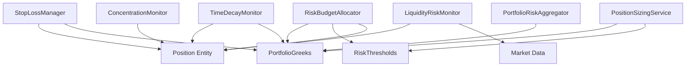

# 设计文档：风险管理服务增强

## 概述

本设计文档定义期权交易策略系统中风险管理领域服务的增强实现。当前系统已实现基础的组合风险聚合（PortfolioRiskAggregator）和仓位管理（PositionSizingService）功能，本次增强将添加五个新的风险监控领域服务：

1. **StopLossManager**: 止损管理服务 - 监控持仓盈亏并触发止损（支持固定止损和移动止损）
2. **RiskBudgetAllocator**: 风险预算分配服务 - 在不同策略/品种间分配 Greeks 预算
3. **LiquidityRiskMonitor**: 持仓流动性监控服务 - 监控已持仓合约的流动性变化趋势
4. **ConcentrationMonitor**: 集中度风险监控服务 - 监控品种、到期日、行权价的集中度
5. **TimeDecayMonitor**: 时间衰减风险监控服务 - 监控 Theta 和临近到期持仓

这些服务遵循 DDD 架构原则，作为独立的领域服务类实现，与现有的 PortfolioRiskAggregator 和 PositionSizingService 协同工作。

### 职责边界

本次增强的服务聚焦于**持仓后的风险监控**，与 selection 服务形成清晰的职责边界：

- **selection 服务**：开仓前的合约选择、流动性检查、虚值档位选择、到期日过滤等
- **risk 服务**（本次增强）：持仓后的风险监控、止损触发、风险预算管理、集中度监控、时间衰减监控等

## 架构

### 领域服务层次结构

```
src/strategy/domain/domain_service/risk/
├── portfolio_risk_aggregator.py      # 现有：组合风险聚合器
├── position_sizing_service.py        # 现有：仓位管理服务
├── stop_loss_manager.py              # 新增：止损管理服务
├── risk_budget_allocator.py          # 新增：风险预算分配服务
├── liquidity_risk_monitor.py         # 新增：持仓流动性监控服务
├── concentration_monitor.py          # 新增：集中度风险监控服务
└── time_decay_monitor.py             # 新增：时间衰减监控服务
```


### 服务依赖关系



### 设计原则

1. **单一职责**：每个服务专注于一个特定的风险监控维度
2. **无状态服务**：服务本身不持有业务状态，仅持有配置
3. **纯函数计算**：核心计算逻辑为纯函数，便于测试
4. **事件驱动**：通过领域事件解耦风险监控和后续处理
5. **配置驱动**：所有阈值和参数通过配置对象注入

## 组件和接口

### 1. StopLossManager（止损管理服务）

#### 职责
- 监控单个持仓的浮动盈亏
- 检查是否触发固定止损或移动止损
- 监控组合总亏损是否超过每日止损限额
- 生成止损触发事件和平仓指令

#### 接口设计

```python
class StopLossManager:
    """止损管理服务"""
    
    def __init__(self, config: StopLossConfig) -> None:
        """初始化止损管理器"""
        
    def check_position_stop_loss(
        self,
        position: Position,
        current_price: float,
        peak_profit: float = 0.0
    ) -> Optional[StopLossTrigger]:
        """
        检查单个持仓是否触发止损
        
        Args:
            position: 持仓实体
            current_price: 当前市场价格
            peak_profit: 历史最高盈利（用于移动止损）
            
        Returns:
            StopLossTrigger 或 None
        """
        
    def check_portfolio_stop_loss(
        self,
        positions: List[Position],
        current_prices: Dict[str, float],
        daily_start_equity: float,
        current_equity: float
    ) -> Optional[PortfolioStopLossTrigger]:
        """
        检查组合级止损
        
        Args:
            positions: 所有活跃持仓
            current_prices: 当前价格字典
            daily_start_equity: 当日起始权益
            current_equity: 当前权益
            
        Returns:
            PortfolioStopLossTrigger 或 None
        """
```


### 2. RiskBudgetAllocator（风险预算分配服务）

#### 职责
- 按品种或策略分配 Greeks 预算
- 计算当前 Greeks 使用量
- 检查是否超过分配额度
- 计算剩余预算

#### 接口设计

```python
class RiskBudgetAllocator:
    """风险预算分配服务"""
    
    def __init__(self, config: RiskBudgetConfig) -> None:
        """初始化风险预算分配器"""
        
    def allocate_budget_by_underlying(
        self,
        total_limits: RiskThresholds
    ) -> Dict[str, GreeksBudget]:
        """
        按品种分配 Greeks 预算
        
        Args:
            total_limits: 组合级 Greeks 限额
            
        Returns:
            品种 -> GreeksBudget 映射
        """
        
    def calculate_usage(
        self,
        positions: List[Position],
        greeks_map: Dict[str, GreeksResult],
        dimension: str = "underlying"
    ) -> Dict[str, GreeksUsage]:
        """
        计算当前 Greeks 使用量
        
        Args:
            positions: 活跃持仓列表
            greeks_map: 合约代码 -> Greeks 映射
            dimension: "underlying" 或 "strategy"
            
        Returns:
            维度键 -> GreeksUsage 映射
        """
        
    def check_budget_limit(
        self,
        usage: GreeksUsage,
        budget: GreeksBudget
    ) -> BudgetCheckResult:
        """
        检查是否超过预算限额
        
        Args:
            usage: 当前使用量
            budget: 分配的预算
            
        Returns:
            BudgetCheckResult
        """
```

### 3. LiquidityRiskMonitor（持仓流动性监控服务）

#### 职责
- 计算持仓合约的流动性评分
- 监控流动性趋势变化
- 检测流动性恶化
- 生成流动性警告事件

#### 接口设计

```python
class LiquidityRiskMonitor:
    """持仓流动性监控服务"""
    
    def __init__(self, config: LiquidityMonitorConfig) -> None:
        """初始化流动性监控器"""
        
    def calculate_liquidity_score(
        self,
        vt_symbol: str,
        current_data: MarketData,
        historical_data: List[MarketData]
    ) -> LiquidityScore:
        """
        计算流动性评分
        
        Args:
            vt_symbol: 合约代码
            current_data: 当前市场数据
            historical_data: 历史市场数据（用于趋势分析）
            
        Returns:
            LiquidityScore
        """
        
    def monitor_positions(
        self,
        positions: List[Position],
        market_data: Dict[str, MarketData],
        historical_data: Dict[str, List[MarketData]]
    ) -> List[LiquidityWarning]:
        """
        监控所有持仓的流动性
        
        Args:
            positions: 活跃持仓列表
            market_data: 当前市场数据
            historical_data: 历史市场数据
            
        Returns:
            流动性警告列表
        """
```


### 4. ConcentrationMonitor（集中度风险监控服务）

#### 职责
- 计算品种、到期日、行权价的集中度
- 计算 HHI（赫芬达尔指数）
- 检测集中度超限
- 生成集中度警告

#### 接口设计

```python
class ConcentrationMonitor:
    """集中度风险监控服务"""
    
    def __init__(self, config: ConcentrationConfig) -> None:
        """初始化集中度监控器"""
        
    def calculate_concentration(
        self,
        positions: List[Position],
        prices: Dict[str, float]
    ) -> ConcentrationMetrics:
        """
        计算集中度指标
        
        Args:
            positions: 活跃持仓列表
            prices: 当前价格字典
            
        Returns:
            ConcentrationMetrics（包含各维度集中度和 HHI）
        """
        
    def check_concentration_limits(
        self,
        metrics: ConcentrationMetrics
    ) -> List[ConcentrationWarning]:
        """
        检查集中度是否超限
        
        Args:
            metrics: 集中度指标
            
        Returns:
            集中度警告列表
        """
```

### 5. TimeDecayMonitor（时间衰减监控服务）

#### 职责
- 计算组合总 Theta
- 识别临近到期的持仓
- 计算每日预期时间价值衰减
- 生成到期提醒事件

#### 接口设计

```python
class TimeDecayMonitor:
    """时间衰减监控服务"""
    
    def __init__(self, config: TimeDecayConfig) -> None:
        """初始化时间衰减监控器"""
        
    def calculate_portfolio_theta(
        self,
        positions: List[Position],
        greeks_map: Dict[str, GreeksResult]
    ) -> ThetaMetrics:
        """
        计算组合 Theta 指标
        
        Args:
            positions: 活跃持仓列表
            greeks_map: 合约代码 -> Greeks 映射
            
        Returns:
            ThetaMetrics
        """
        
    def identify_expiring_positions(
        self,
        positions: List[Position],
        current_date: datetime
    ) -> List[ExpiringPosition]:
        """
        识别临近到期的持仓
        
        Args:
            positions: 活跃持仓列表
            current_date: 当前日期
            
        Returns:
            临近到期持仓列表
        """
        
    def calculate_expiry_distribution(
        self,
        positions: List[Position]
    ) -> Dict[str, ExpiryGroup]:
        """
        按到期日分组统计持仓分布
        
        Args:
            positions: 活跃持仓列表
            
        Returns:
            到期日 -> ExpiryGroup 映射
        """
```

## 数据模型

### 值对象（Value Objects）

#### 1. 止损相关

```python
@dataclass(frozen=True)
class StopLossConfig:
    """止损配置"""
    # 固定止损
    enable_fixed_stop: bool = True
    fixed_stop_loss_amount: float = 1000.0      # 单笔止损金额
    fixed_stop_loss_percent: float = 0.5        # 单笔止损百分比（相对开仓价值）
    
    # 移动止损
    enable_trailing_stop: bool = False
    trailing_stop_percent: float = 0.3          # 回撤百分比触发移动止损
    
    # 组合级止损
    enable_portfolio_stop: bool = True
    daily_loss_limit: float = 5000.0            # 每日最大亏损限额


@dataclass(frozen=True)
class StopLossTrigger:
    """止损触发结果"""
    vt_symbol: str
    trigger_type: str                            # "fixed" | "trailing"
    current_loss: float
    threshold: float
    current_price: float
    open_price: float
    message: str


@dataclass(frozen=True)
class PortfolioStopLossTrigger:
    """组合级止损触发结果"""
    total_loss: float
    daily_limit: float
    positions_to_close: List[str]                # 需要平仓的合约代码列表
    message: str
```


#### 2. 风险预算相关

```python
@dataclass(frozen=True)
class RiskBudgetConfig:
    """风险预算配置"""
    allocation_dimension: str = "underlying"     # "underlying" | "strategy"
    allocation_ratios: Dict[str, float] = field(default_factory=dict)
    # 例如: {"50ETF": 0.4, "300ETF": 0.3, "500ETF": 0.3}
    
    # 是否允许动态调整
    allow_dynamic_adjustment: bool = False


@dataclass(frozen=True)
class GreeksBudget:
    """Greeks 预算"""
    delta_budget: float
    gamma_budget: float
    vega_budget: float


@dataclass
class GreeksUsage:
    """Greeks 使用量"""
    delta_used: float = 0.0
    gamma_used: float = 0.0
    vega_used: float = 0.0
    position_count: int = 0


@dataclass(frozen=True)
class BudgetCheckResult:
    """预算检查结果"""
    passed: bool
    exceeded_dimensions: List[str]               # ["delta", "gamma", "vega"]
    usage: GreeksUsage
    budget: GreeksBudget
    message: str = ""
```

#### 3. 流动性监控相关

```python
@dataclass(frozen=True)
class LiquidityMonitorConfig:
    """流动性监控配置"""
    # 流动性评分权重
    volume_weight: float = 0.4
    spread_weight: float = 0.3
    open_interest_weight: float = 0.3
    
    # 阈值
    liquidity_score_threshold: float = 0.3       # 低于此分数触发警告
    
    # 历史数据窗口
    lookback_days: int = 5


@dataclass(frozen=True)
class MarketData:
    """市场数据快照"""
    vt_symbol: str
    timestamp: datetime
    volume: float                                # 成交量
    bid_price: float
    ask_price: float
    open_interest: float                         # 持仓量


@dataclass(frozen=True)
class LiquidityScore:
    """流动性评分"""
    vt_symbol: str
    overall_score: float                         # 综合评分 [0, 1]
    volume_score: float
    spread_score: float
    open_interest_score: float
    trend: str                                   # "improving" | "stable" | "deteriorating"


@dataclass(frozen=True)
class LiquidityWarning:
    """流动性警告"""
    vt_symbol: str
    current_score: float
    threshold: float
    trend: str
    message: str
```


#### 4. 集中度监控相关

```python
@dataclass(frozen=True)
class ConcentrationConfig:
    """集中度监控配置"""
    # 各维度集中度阈值
    underlying_concentration_limit: float = 0.5  # 单一品种占比上限
    expiry_concentration_limit: float = 0.6      # 单一到期日占比上限
    strike_concentration_limit: float = 0.4      # 单一行权价区间占比上限
    
    # HHI 阈值
    hhi_threshold: float = 0.25                  # HHI 超过此值视为高集中度
    
    # 计算基准
    concentration_basis: str = "notional"        # "notional" | "margin"


@dataclass
class ConcentrationMetrics:
    """集中度指标"""
    # 按品种
    underlying_concentration: Dict[str, float]   # 品种 -> 占比
    max_underlying_ratio: float
    
    # 按到期日
    expiry_concentration: Dict[str, float]       # 到期日 -> 占比
    max_expiry_ratio: float
    
    # 按行权价
    strike_concentration: Dict[str, float]       # 行权价区间 -> 占比
    max_strike_ratio: float
    
    # HHI
    underlying_hhi: float
    expiry_hhi: float
    strike_hhi: float


@dataclass(frozen=True)
class ConcentrationWarning:
    """集中度警告"""
    dimension: str                               # "underlying" | "expiry" | "strike" | "hhi"
    key: str                                     # 具体的品种/到期日/行权价
    concentration: float
    limit: float
    message: str
```

#### 5. 时间衰减监控相关

```python
@dataclass(frozen=True)
class TimeDecayConfig:
    """时间衰减监控配置"""
    expiry_warning_days: int = 7                 # 距离到期 N 天时提醒
    critical_expiry_days: int = 3                # 距离到期 N 天时视为紧急


@dataclass
class ThetaMetrics:
    """Theta 指标"""
    total_theta: float                           # 组合总 Theta
    daily_decay_amount: float                    # 每日预期衰减金额
    position_count: int
    timestamp: datetime = field(default_factory=datetime.now)


@dataclass(frozen=True)
class ExpiringPosition:
    """临近到期持仓"""
    vt_symbol: str
    expiry_date: str
    days_to_expiry: int
    volume: int
    theta: float
    urgency: str                                 # "warning" | "critical"


@dataclass
class ExpiryGroup:
    """到期日分组"""
    expiry_date: str
    position_count: int
    total_volume: int
    total_theta: float
    positions: List[str]                         # 合约代码列表
```


### 领域事件（Domain Events）

```python
@dataclass
class StopLossTriggeredEvent(DomainEvent):
    """止损触发事件"""
    vt_symbol: str = ""
    trigger_type: str = ""                       # "fixed" | "trailing" | "portfolio"
    current_loss: float = 0.0
    threshold: float = 0.0
    message: str = ""


@dataclass
class RiskBudgetExceededEvent(DomainEvent):
    """风险预算超限事件"""
    dimension: str = ""                          # "underlying" | "strategy"
    key: str = ""                                # 品种或策略名称
    exceeded_greeks: List[str] = field(default_factory=list)  # ["delta", "gamma"]
    message: str = ""


@dataclass
class LiquidityDeterioratedEvent(DomainEvent):
    """流动性恶化事件"""
    vt_symbol: str = ""
    current_score: float = 0.0
    threshold: float = 0.0
    trend: str = ""
    message: str = ""


@dataclass
class ConcentrationExceededEvent(DomainEvent):
    """集中度超限事件"""
    dimension: str = ""                          # "underlying" | "expiry" | "strike" | "hhi"
    key: str = ""
    concentration: float = 0.0
    limit: float = 0.0
    message: str = ""


@dataclass
class ExpiryWarningEvent(DomainEvent):
    """到期提醒事件"""
    vt_symbol: str = ""
    expiry_date: str = ""
    days_to_expiry: int = 0
    urgency: str = ""                            # "warning" | "critical"
    message: str = ""
```

现在我需要使用 prework 工具来分析验收标准，然后编写正确性属性。


## 正确性属性

*属性是一个特征或行为，应该在系统的所有有效执行中保持为真——本质上是关于系统应该做什么的形式化陈述。属性作为人类可读规范和机器可验证正确性保证之间的桥梁。*

### 止损管理服务属性

#### 属性 1：止损触发正确性

*对于任意*持仓、当前价格和历史最高盈利，当浮动亏损超过配置的止损阈值（固定止损或移动止损）时，止损检查应该返回包含完整信息的触发结果（合约代码、触发类型、亏损金额、阈值、价格信息）

**验证需求：1.1, 1.2, 1.4, 1.5, 1.6**

#### 属性 2：组合止损全平仓

*对于任意*持仓组合和价格字典，当组合总亏损超过每日止损限额时，组合止损检查应该返回包含所有活跃持仓合约代码的平仓列表

**验证需求：1.3**

#### 属性 3：止损计算一致性

*对于任意*持仓和价格，按金额止损和按百分比止损计算的亏损值应该与实际盈亏一致（当前价值 - 开仓价值）

**验证需求：1.2**

### 风险预算分配服务属性

#### 属性 4：预算分配守恒

*对于任意*总预算限额和分配比例，所有维度（品种或策略）的预算分配总和不应超过组合级 Greeks 限额

**验证需求：2.7**

#### 属性 5：使用量计算正确性

*对于任意*持仓列表和 Greeks 映射，计算的 Greeks 使用量应该等于所有持仓的 Greeks 加权和（greek × volume × multiplier）

**验证需求：2.4**

#### 属性 6：预算超限检测

*对于任意*使用量和预算，当任一 Greek 维度的使用量超过预算时，预算检查应该返回失败并标识所有超限的维度

**验证需求：2.3**

#### 属性 7：剩余预算一致性

*对于任意*预算和使用量，剩余预算应该等于分配预算减去当前使用量，且不应为负数

**验证需求：2.5**

#### 属性 8：多维度预算分配

*对于任意*分配维度（品种或策略）和分配比例，预算分配应该按照配置的比例正确分配到各个维度

**验证需求：2.1, 2.2, 2.6**

### 持仓流动性监控服务属性

#### 属性 9：流动性评分范围

*对于任意*市场数据，计算的流动性评分应该在 [0, 1] 范围内，且综合评分应该是各子评分的加权平均

**验证需求：3.1, 3.6**

#### 属性 10：流动性趋势识别

*对于任意*历史市场数据序列，当成交量递减、价差扩大或持仓量减少时，流动性趋势应该识别为"deteriorating"

**验证需求：3.2, 3.3, 3.4**

#### 属性 11：流动性警告触发

*对于任意*持仓合约和流动性评分，当评分低于配置阈值时，监控结果应该包含该合约的流动性警告

**验证需求：3.5**

#### 属性 12：持仓过滤正确性

*对于任意*持仓列表和市场数据，流动性监控结果应该只包含持仓列表中的合约，不包含其他合约

**验证需求：3.8**

### 集中度风险监控服务属性

#### 属性 13：集中度占比计算

*对于任意*持仓列表和价格字典，各维度（品种、到期日、行权价）的集中度占比总和应该等于 1.0，且单个占比应该在 [0, 1] 范围内

**验证需求：4.1, 4.2, 4.3, 4.7**

#### 属性 14：HHI 计算正确性

*对于任意*持仓分布，HHI（赫芬达尔指数）应该等于各占比的平方和，且在 [0, 1] 范围内

**验证需求：4.6**

#### 属性 15：集中度警告触发

*对于任意*集中度指标，当任一维度的最大占比或 HHI 超过配置阈值时，应该生成相应维度的集中度警告

**验证需求：4.4, 4.5**

#### 属性 16：集中度单调性

*对于任意*持仓列表，增加某一维度（品种/到期日/行权价）的持仓应该增加该维度的集中度和 HHI

**验证需求：4.1, 4.2, 4.3, 4.6**

### 时间衰减监控服务属性

#### 属性 17：Theta 聚合正确性

*对于任意*持仓列表和 Greeks 映射，组合总 Theta 应该等于所有持仓的 Theta 加权和（theta × volume × multiplier），且每日预期衰减金额应该等于总 Theta 的绝对值

**验证需求：5.1, 5.4, 5.7**

#### 属性 18：到期识别正确性

*对于任意*持仓列表和当前日期，识别的临近到期持仓应该只包含距离到期日少于配置天数的持仓，且应该生成相应的到期提醒事件

**验证需求：5.2, 5.3, 5.6**

#### 属性 19：到期分组完整性

*对于任意*持仓列表，按到期日分组后，所有分组的持仓总数应该等于原始持仓列表的大小，且每个持仓应该只出现在一个分组中

**验证需求：5.5**


## 错误处理

### 输入验证

所有领域服务应该验证输入参数的有效性：

1. **空值检查**：持仓列表、价格字典、Greeks 映射不应为 None
2. **数值范围**：价格、手数、Greeks 值应该在合理范围内
3. **数据一致性**：持仓合约代码应该在价格字典和 Greeks 映射中存在

### 异常处理策略

1. **配置错误**：
   - 阈值为负数或超出合理范围
   - 分配比例总和不等于 1.0
   - 权重参数总和不等于 1.0
   - 处理方式：在初始化时抛出 `ValueError`

2. **数据缺失**：
   - 持仓合约的价格或 Greeks 数据缺失
   - 处理方式：记录警告日志，跳过该持仓，继续处理其他持仓

3. **计算异常**：
   - 除零错误（如总价值为 0 时计算占比）
   - 处理方式：返回默认值（如占比为 0），记录警告日志

4. **边界情况**：
   - 空持仓列表：返回空结果或默认值
   - 单一持仓：集中度为 100%，HHI 为 1.0
   - 所有持仓盈利：不触发止损

### 日志记录

所有服务应该记录关键操作和异常情况：

1. **INFO 级别**：止损触发、预算超限、流动性警告、集中度警告、到期提醒
2. **WARNING 级别**：数据缺失、计算异常、配置异常
3. **DEBUG 级别**：详细的计算过程和中间结果

## 测试策略

### 双重测试方法

本功能采用单元测试和基于属性的测试（PBT）相结合的方法：

- **单元测试**：验证特定示例、边界情况和错误条件
- **属性测试**：验证所有输入的通用属性

两者互补，共同确保全面覆盖：单元测试捕获具体错误，属性测试验证通用正确性。

### 单元测试策略

单元测试应该专注于：

1. **具体示例**：
   - 典型的止损触发场景
   - 标准的预算分配计算
   - 常见的流动性评分计算

2. **边界情况**：
   - 空持仓列表
   - 单一持仓
   - 极端价格变化
   - 零成交量或持仓量

3. **错误条件**：
   - 无效配置参数
   - 缺失的市场数据
   - 不一致的输入数据

4. **集成点**：
   - 与 Position 实体的交互
   - 与 PortfolioGreeks 的交互
   - 领域事件的生成

### 基于属性的测试（PBT）

#### 测试库选择

使用 **Hypothesis** 作为 Python 的属性测试库。

#### 测试配置

- **最小迭代次数**：每个属性测试至少运行 100 次
- **标签格式**：`# Feature: risk-service-enhancement, Property {N}: {property_text}`
- **映射关系**：每个正确性属性对应一个属性测试

#### 属性测试用例

每个正确性属性应该实现为一个属性测试：

1. **属性 1-3**（止损管理）：
   - 生成随机持仓（开仓价格、手数、合约乘数）
   - 生成随机当前价格
   - 验证止损触发逻辑

2. **属性 4-8**（风险预算）：
   - 生成随机预算限额和分配比例
   - 生成随机持仓和 Greeks
   - 验证预算分配和使用量计算

3. **属性 9-12**（流动性监控）：
   - 生成随机市场数据（成交量、价差、持仓量）
   - 生成历史数据序列
   - 验证流动性评分和趋势识别

4. **属性 13-16**（集中度监控）：
   - 生成随机持仓分布（品种、到期日、行权价）
   - 生成随机价格
   - 验证集中度计算和 HHI

5. **属性 19-19**（时间衰减）：
   - 生成随机持仓和到期日
   - 生成随机 Theta 值
   - 验证 Theta 聚合和到期识别

#### 数据生成策略

使用 Hypothesis 的策略组合器生成测试数据：

```python
from hypothesis import strategies as st

# 持仓生成策略
position_strategy = st.builds(
    Position,
    vt_symbol=st.text(min_size=5, max_size=20),
    volume=st.integers(min_value=1, max_value=100),
    open_price=st.floats(min_value=0.01, max_value=10.0),
    multiplier=st.sampled_from([10000, 1000, 100])
)

# Greeks 生成策略
greeks_strategy = st.builds(
    GreeksResult,
    delta=st.floats(min_value=-1.0, max_value=1.0),
    gamma=st.floats(min_value=0.0, max_value=0.1),
    theta=st.floats(min_value=-1.0, max_value=0.0),
    vega=st.floats(min_value=0.0, max_value=100.0)
)

# 市场数据生成策略
market_data_strategy = st.builds(
    MarketData,
    volume=st.floats(min_value=0.0, max_value=100000.0),
    bid_price=st.floats(min_value=0.01, max_value=10.0),
    ask_price=st.floats(min_value=0.01, max_value=10.0),
    open_interest=st.floats(min_value=0.0, max_value=50000.0)
)
```

### 测试文件组织

```
tests/strategy/domain/domain_service/risk/
├── test_stop_loss_manager.py                    # 单元测试
├── test_stop_loss_properties.py                 # 属性测试
├── test_risk_budget_allocator.py                # 单元测试
├── test_risk_budget_properties.py               # 属性测试
├── test_liquidity_risk_monitor.py               # 单元测试
├── test_liquidity_properties.py                 # 属性测试
├── test_concentration_monitor.py                # 单元测试
├── test_concentration_properties.py             # 属性测试
├── test_time_decay_monitor.py                   # 单元测试
└── test_time_decay_properties.py                # 属性测试
```

### 测试覆盖率目标

- **代码覆盖率**：≥ 90%
- **分支覆盖率**：≥ 85%
- **属性测试覆盖**：所有正确性属性都有对应的属性测试

### 持续集成

所有测试应该在 CI/CD 流程中自动运行：

1. 每次提交时运行单元测试
2. 每次 PR 时运行完整测试套件（包括属性测试）
3. 定期运行扩展属性测试（更多迭代次数）

---

## 实现注意事项

1. **性能考虑**：
   - 流动性监控和集中度计算可能涉及大量持仓，应该优化算法复杂度
   - 考虑缓存计算结果，避免重复计算

2. **扩展性**：
   - 预留接口支持未来新增的风险监控维度
   - 配置对象应该易于扩展

3. **与现有服务的集成**：
   - StopLossManager 应该与 PositionSizingService 协同工作生成平仓指令
   - RiskBudgetAllocator 应该使用 PortfolioRiskAggregator 的 Greeks 聚合结果
   - 所有服务应该使用统一的 Position 实体和 PortfolioGreeks 值对象

4. **配置管理**：
   - 所有配置应该通过 TOML 文件加载
   - 支持运行时动态调整部分配置（如预算分配比例）

5. **监控和告警**：
   - 所有风险事件应该通过领域事件发布
   - 集成飞书告警通知关键风险事件
