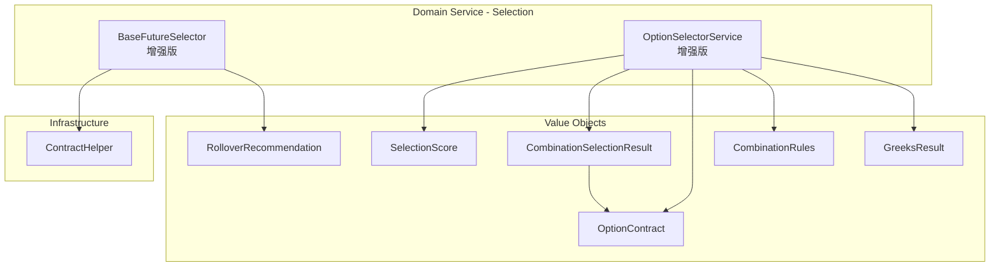

# 设计文档：选择服务增强

## 概述

本设计增强 `selection/` 下的两个核心服务：`BaseFutureSelector`（期货选择）和 `OptionSelectorService`（期权选择）。

期货选择器从简单的字母排序升级为基于成交量/持仓量的主力合约判断，集成 `ContractHelper.get_expiry_from_symbol` 实现真正的到期日解析，并新增移仓换月建议功能。

期权选择器扩展为支持组合策略联合选择（Straddle/Strangle/Vertical Spread）、Greeks 感知选择（按目标 Delta 选择最优合约）、以及多维度评分排名机制。

所有增强均遵循现有 DDD 分层架构，新增值对象放在 `value_object/` 下，选择逻辑保持在 `domain_service/selection/` 中。

## 架构



### 设计决策

1. **不新建类，扩展现有类**：`BaseFutureSelector` 和 `OptionSelectorService` 已有清晰职责边界，新增方法即可满足需求，无需引入新的服务类。
2. **新增值对象承载结果**：移仓建议（`RolloverRecommendation`）、组合选择结果（`CombinationSelectionResult`）、评分（`SelectionScore`）作为不可变值对象，保持领域模型纯净。
3. **行情数据通过字典传入**：期货选择器需要成交量/持仓量数据，通过 `Dict[str, MarketData]` 参数传入（key 为 vt_symbol），避免选择器直接依赖行情基础设施。
4. **Greeks 数据通过字典传入**：期权 Greeks 感知选择通过 `Dict[str, GreeksResult]` 参数传入，保持选择器与定价引擎的松耦合。

## 组件与接口

### BaseFutureSelector 增强接口

```python
class BaseFutureSelector:
    """期货合约选择器 - 增强版"""

    def select_dominant_contract(
        self,
        contracts: List[ContractData],
        current_date: date,
        market_data: Optional[Dict[str, MarketData]] = None,
        volume_weight: float = 0.6,
        oi_weight: float = 0.4,
        log_func: Optional[Callable[[str], None]] = None
    ) -> Optional[ContractData]:
        """
        基于成交量/持仓量加权得分选择主力合约。
        若无行情数据则回退到按到期日排序。
        """

    def filter_by_maturity(
        self,
        contracts: List[ContractData],
        current_date: date,
        mode: str = "current_month",
        date_range: Optional[Tuple[date, date]] = None,
        log_func: Optional[Callable[[str], None]] = None
    ) -> List[ContractData]:
        """
        基于真实到期日解析过滤合约。
        mode: "current_month" | "next_month" | "custom"
        date_range: 仅 mode="custom" 时使用
        """

    def check_rollover(
        self,
        current_contract: ContractData,
        all_contracts: List[ContractData],
        current_date: date,
        rollover_days: int = 5,
        market_data: Optional[Dict[str, MarketData]] = None,
        log_func: Optional[Callable[[str], None]] = None
    ) -> Optional[RolloverRecommendation]:
        """
        检查是否需要移仓换月，返回移仓建议或 None。
        """
```

### OptionSelectorService 增强接口

```python
class OptionSelectorService:
    """期权选择服务 - 增强版"""

    # --- 现有方法保持不变 ---

    def select_combination(
        self,
        contracts: pd.DataFrame,
        combination_type: CombinationType,
        underlying_price: float,
        strike_level: Optional[int] = None,
        spread_width: Optional[int] = None,
        option_type_for_spread: Optional[str] = None,
        log_func: Optional[Callable] = None
    ) -> Optional[CombinationSelectionResult]:
        """
        根据组合类型联合选择多个期权腿。
        """

    def select_by_delta(
        self,
        contracts: pd.DataFrame,
        option_type: str,
        underlying_price: float,
        target_delta: float,
        greeks_data: Dict[str, GreeksResult],
        delta_tolerance: float = 0.05,
        log_func: Optional[Callable] = None
    ) -> Optional[OptionContract]:
        """
        基于目标 Delta 选择最优期权。
        若无 Greeks 数据则回退到虚值档位选择。
        """

    def score_candidates(
        self,
        contracts: pd.DataFrame,
        option_type: str,
        underlying_price: float,
        liquidity_weight: float = 0.4,
        otm_weight: float = 0.3,
        expiry_weight: float = 0.3,
        log_func: Optional[Callable] = None
    ) -> List[SelectionScore]:
        """
        对候选合约进行多维度评分排名。
        """
```

### MarketData 协议

```python
@dataclass(frozen=True)
class MarketData:
    """行情数据（用于期货主力合约选择）"""
    vt_symbol: str
    volume: int          # 成交量
    open_interest: float # 持仓量
```

## 数据模型

### 新增值对象

```python
@dataclass(frozen=True)
class RolloverRecommendation:
    """移仓换月建议"""
    current_contract_symbol: str   # 当前合约代码
    target_contract_symbol: str    # 建议目标合约代码（可为空）
    remaining_days: int            # 当前合约剩余交易日
    reason: str                    # 移仓原因描述
    has_target: bool               # 是否找到合适目标合约


@dataclass(frozen=True)
class CombinationSelectionResult:
    """组合策略选择结果"""
    combination_type: CombinationType
    legs: List[OptionContract]     # 选中的各腿
    success: bool                  # 是否选择成功
    failure_reason: str = ""       # 失败原因


@dataclass(frozen=True)
class SelectionScore:
    """合约选择评分"""
    option_contract: OptionContract
    liquidity_score: float         # 流动性得分 [0, 1]
    otm_score: float               # 虚值程度得分 [0, 1]
    expiry_score: float            # 到期日得分 [0, 1]
    total_score: float             # 加权总分 [0, 1]
```

### 现有值对象复用

- `OptionContract`：期权合约信息，已有所有必要字段
- `CombinationType`：组合类型枚举，直接用于 `select_combination` 参数
- `GreeksResult`：Greeks 计算结果，用于 Delta 感知选择
- `combination_rules.VALIDATION_RULES`：组合结构验证函数，用于验证选择结果


## 正确性属性

*属性是系统在所有有效执行中都应保持为真的特征或行为——本质上是关于系统应该做什么的形式化陈述。属性是人类可读规范与机器可验证正确性保证之间的桥梁。*

### Property 1: 主力合约得分最高

*For any* 非空期货合约列表和对应的行情数据，`select_dominant_contract` 返回的合约的加权得分（volume × volume_weight + open_interest × oi_weight）应大于等于列表中所有其他合约的加权得分。当得分相同时，返回的合约到期日应最近。

**Validates: Requirements 1.1, 1.2**

### Property 2: 到期日过滤正确性

*For any* 合约列表、当前日期和过滤模式（current_month / next_month / custom），`filter_by_maturity` 返回的每个合约的解析到期日都应落在对应的目标日期范围内，且原始列表中所有到期日在目标范围内的可解析合约都应被包含在结果中。

**Validates: Requirements 2.1, 2.2, 2.3**

### Property 3: 移仓触发正确性

*For any* 合约和移仓阈值天数，`check_rollover` 返回非 None 结果当且仅当该合约的剩余交易日小于等于阈值天数。

**Validates: Requirements 3.1, 3.3**

### Property 4: 移仓目标为最大成交量合约

*For any* 需要移仓的场景，当存在下一到期月份的合约时，`check_rollover` 返回的目标合约应是下一到期月份中成交量最大的合约。

**Validates: Requirements 3.2**

### Property 5: 组合选择结构合规

*For any* 成功的组合选择结果，将其各腿转换为 `LegStructure` 后调用 `combination_rules.VALIDATION_RULES` 中对应的验证函数，验证结果应为 None（即通过验证）。

**Validates: Requirements 4.5**

### Property 6: Straddle 选择最接近 ATM

*For any* 期权链和标的价格，成功选择的 STRADDLE 组合中 Call 和 Put 的行权价应相同，且该行权价与标的价格的绝对差值应小于等于期权链中任何其他可用行权价与标的价格的绝对差值。

**Validates: Requirements 4.1**

### Property 7: Strangle 选择虚值档位正确

*For any* 期权链、标的价格和虚值档位配置，成功选择的 STRANGLE 组合中 Call 的行权价应高于标的价格，Put 的行权价应低于标的价格，且各自的虚值排序位置应等于配置的档位。

**Validates: Requirements 4.2**

### Property 8: 流动性不足拒绝整个组合

*For any* 期权链中至少有一腿不满足流动性要求的情况，`select_combination` 应返回 `success=False` 的结果。

**Validates: Requirements 4.4**

### Property 9: Delta 选择最优性

*For any* 候选合约集合、目标 Delta 值和对应的 Greeks 数据，`select_by_delta` 返回的合约的 Delta 与目标值的绝对差值应小于等于所有其他候选合约的 Delta 与目标值的绝对差值。

**Validates: Requirements 5.1**

### Property 10: Delta 范围过滤正确性

*For any* 候选合约集合和 Delta 范围约束，`select_by_delta` 返回的合约的 Delta 值应在指定范围内。

**Validates: Requirements 5.3**

### Property 11: 评分单调性

*For any* 两个候选合约，若合约 A 的买卖价差更小且买一量更大，则 A 的流动性得分应高于 B；若合约 A 的虚值档位偏差更小，则 A 的虚值程度得分应高于 B；若合约 A 的剩余交易日更接近目标范围中点，则 A 的到期日得分应高于 B。

**Validates: Requirements 6.2, 6.3, 6.4**

### Property 12: 评分完整性与排序

*For any* 候选合约列表和权重配置，`score_candidates` 返回的每个 `SelectionScore` 的 `total_score` 应等于 `liquidity_score × liquidity_weight + otm_score × otm_weight + expiry_score × expiry_weight`，且返回列表应按 `total_score` 降序排列。

**Validates: Requirements 6.1, 6.5**

## 错误处理

| 场景 | 处理方式 |
|------|---------|
| 合约列表为空 | 返回 None 或空列表，不抛异常 |
| 行情数据缺失 | 回退到按到期日排序的简单选择 |
| 合约代码无法解析到期日 | 排除该合约，通过 log_func 记录警告 |
| Greeks 数据缺失 | 回退到虚值档位选择 |
| 组合腿流动性不足 | 返回 success=False 的 CombinationSelectionResult |
| 移仓无目标合约 | 返回 has_target=False 的 RolloverRecommendation |
| 权重参数非法（负数或总和为零） | 使用默认权重并记录警告 |
| underlying_price <= 0 | 返回 None，记录错误日志 |

## 测试策略

### 属性测试

使用 **Hypothesis** 库进行属性测试，每个属性至少运行 100 次迭代。

每个正确性属性对应一个独立的属性测试函数，测试标注格式：
`# Feature: selection-service-enhancement, Property {N}: {property_text}`

属性测试重点覆盖：
- Property 1: 生成随机合约列表和行情数据，验证选择结果得分最高
- Property 2: 生成随机合约和日期，验证过滤结果的到期日范围正确
- Property 3: 生成随机合约和阈值，验证移仓触发条件
- Property 5: 生成随机期权链，验证组合选择结果通过结构验证
- Property 9: 生成随机候选集和目标 Delta，验证选择最优性
- Property 11-12: 生成随机候选集和权重，验证评分单调性和排序

### 单元测试

使用 **pytest** 进行单元测试，覆盖边界情况和具体示例：

- 空合约列表返回 None
- 所有合约成交量为零的回退行为
- 无法解析到期日的合约被排除
- 无 Greeks 数据时回退到虚值档位选择
- 组合选择中单腿流动性不足导致整体失败
- 移仓无目标合约时返回警告
- 各评分维度的边界值（0 和 1）

### 测试配置

```python
# conftest.py 或 pytest.ini
# Hypothesis 配置
from hypothesis import settings
settings.register_profile("ci", max_examples=200)
settings.register_profile("dev", max_examples=100)
```
