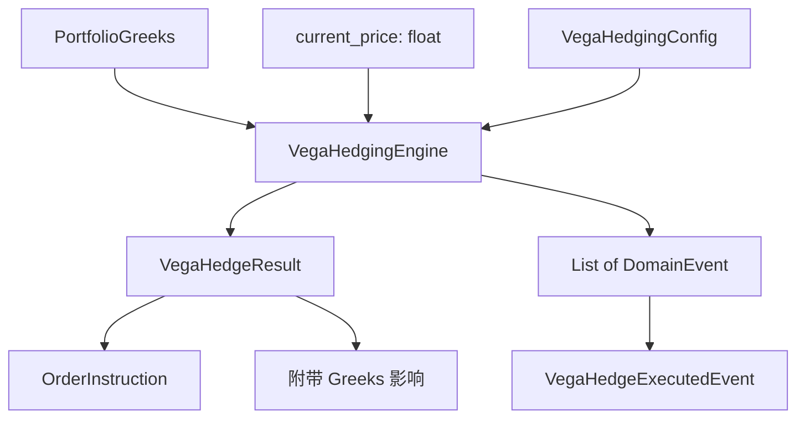

# 设计文档: Vega 对冲引擎

## 概述

Vega 对冲引擎 (`VegaHedgingEngine`) 是一个纯计算领域服务，遵循与现有 `DeltaHedgingEngine` 和 `GammaScalpingEngine` 相同的模式：输入 (PortfolioGreeks + 价格) → 输出 (Result + DomainEvents)。

核心区别在于 Vega 对冲使用期权作为对冲工具，因此对冲工具本身携带 Delta、Gamma、Theta 等 Greeks。引擎需要计算并报告这些附带影响，帮助交易员评估对冲的副作用。

## 架构



引擎位于 `src/strategy/domain/domain_service/hedging/vega_hedging_engine.py`，与现有引擎平级。

## 组件与接口

### VegaHedgingEngine

```python
class VegaHedgingEngine:
    def __init__(self, config: VegaHedgingConfig) -> None: ...

    @classmethod
    def from_yaml_config(cls, config_dict: dict) -> "VegaHedgingEngine": ...

    def check_and_hedge(
        self, portfolio_greeks: PortfolioGreeks, current_price: float
    ) -> Tuple[VegaHedgeResult, List[DomainEvent]]: ...
```

`check_and_hedge` 方法遵循与 `DeltaHedgingEngine.check_and_hedge` 相同的签名模式。

### 计算流程

1. 校验配置和输入（乘数 > 0、对冲工具 Vega ≠ 0、价格 > 0）
2. 计算 Vega 偏差: `vega_diff = portfolio_greeks.total_vega - config.target_vega`
3. 判断是否超过容忍带: `abs(vega_diff) > config.hedging_band`
4. 计算对冲手数: `raw_volume = (target_vega - total_vega) / (hedge_vega * multiplier)`
5. 四舍五入: `hedge_volume = round(raw_volume)`
6. 确定方向: 正数 → LONG，负数 → SHORT
7. 计算附带 Greeks 影响:
   - `delta_impact = hedge_volume * hedge_delta * multiplier * direction_sign`
   - `gamma_impact = hedge_volume * hedge_gamma * multiplier * direction_sign`
   - `theta_impact = hedge_volume * hedge_theta * multiplier * direction_sign`
8. 生成 OrderInstruction 和 VegaHedgeExecutedEvent

## 数据模型

### VegaHedgingConfig

```python
@dataclass(frozen=True)
class VegaHedgingConfig:
    """Vega 对冲配置"""
    target_vega: float = 0.0                    # 目标 Vega
    hedging_band: float = 50.0                  # Vega 容忍带
    hedge_instrument_vt_symbol: str = ""        # 对冲工具合约代码
    hedge_instrument_vega: float = 0.1          # 对冲工具每手 Vega
    hedge_instrument_delta: float = 0.5         # 对冲工具每手 Delta
    hedge_instrument_gamma: float = 0.01        # 对冲工具每手 Gamma
    hedge_instrument_theta: float = -0.05       # 对冲工具每手 Theta
    hedge_instrument_multiplier: float = 10.0   # 合约乘数
```

### VegaHedgeResult

```python
@dataclass(frozen=True)
class VegaHedgeResult:
    """Vega 对冲计算结果"""
    should_hedge: bool
    hedge_volume: int = 0
    hedge_direction: Optional[Direction] = None
    instruction: Optional[OrderInstruction] = None
    delta_impact: float = 0.0       # 对冲引入的 Delta 变化
    gamma_impact: float = 0.0       # 对冲引入的 Gamma 变化
    theta_impact: float = 0.0       # 对冲引入的 Theta 变化
    rejected: bool = False
    reject_reason: str = ""
    reason: str = ""
```

### VegaHedgeExecutedEvent

```python
@dataclass
class VegaHedgeExecutedEvent(DomainEvent):
    """Vega 对冲执行事件"""
    hedge_volume: int = 0
    hedge_direction: str = ""
    portfolio_vega_before: float = 0.0
    portfolio_vega_after: float = 0.0
    hedge_instrument: str = ""
    delta_impact: float = 0.0
    gamma_impact: float = 0.0
    theta_impact: float = 0.0
```


## 正确性属性

*正确性属性是一种在系统所有有效执行中都应成立的特征或行为——本质上是关于系统应该做什么的形式化陈述。属性作为人类可读规范与机器可验证正确性保证之间的桥梁。*

### Property 1: 对冲手数公式正确性

*For any* 有效的 VegaHedgingConfig（乘数 > 0、对冲工具 Vega ≠ 0）和任意 PortfolioGreeks，当 Vega 偏差超过容忍带时，返回的 hedge_volume 应等于 `round((target_vega - total_vega) / (hedge_instrument_vega * hedge_instrument_multiplier))`，且 should_hedge 为 True（除非四舍五入后为零）。

**Validates: Requirements 1.1, 1.3**

### Property 2: 容忍带内不对冲

*For any* 有效的 VegaHedgingConfig 和任意 PortfolioGreeks，当 `abs(total_vega - target_vega) <= hedging_band` 时，返回的 should_hedge 应为 False，且事件列表为空。

**Validates: Requirements 1.2**

### Property 3: 方向与指令正确性

*For any* 触发对冲的输入，当 `(target_vega - total_vega)` 与 `(hedge_instrument_vega * multiplier)` 同号时方向为 LONG，异号时方向为 SHORT；且 OrderInstruction 的 volume 为正整数、vt_symbol 与配置一致、signal 为 "vega_hedge"。

**Validates: Requirements 2.1, 2.2, 2.3**

### Property 4: 附带 Greeks 影响计算正确性

*For any* 触发对冲的输入，VegaHedgeResult 中的 delta_impact 应等于 `hedge_volume * hedge_instrument_delta * multiplier * direction_sign`，gamma_impact 和 theta_impact 同理。

**Validates: Requirements 3.1**

### Property 5: 事件数据一致性

*For any* 触发对冲的输入，VegaHedgeExecutedEvent 中的 portfolio_vega_after 应等于 `portfolio_vega_before + hedge_volume * hedge_instrument_vega * multiplier * direction_sign`，且事件中的 delta_impact、gamma_impact、theta_impact 与 VegaHedgeResult 中的值一致。

**Validates: Requirements 3.2**

### Property 6: 无效输入拒绝

*For any* 配置中 hedge_instrument_multiplier ≤ 0 或 hedge_instrument_vega = 0 的输入，或 current_price ≤ 0 的输入，返回的 rejected 应为 True、should_hedge 为 False，且事件列表为空。

**Validates: Requirements 4.1, 4.2, 4.3**

### Property 7: YAML 配置加载一致性

*For any* 配置字典（可能缺少部分字段），from_yaml_config 生成的 VegaHedgingConfig 中，已提供的字段应与字典值一致，缺失的字段应等于 VegaHedgingConfig 的默认值。

**Validates: Requirements 5.1, 5.2**

### Property 8: 事件列表与对冲结果一致性

*For any* 输入，事件列表非空当且仅当 should_hedge 为 True；事件列表为空当且仅当 should_hedge 为 False 或 rejected 为 True。

**Validates: Requirements 6.1, 6.2**

## 错误处理

| 错误场景 | 处理方式 |
|---------|---------|
| 合约乘数 ≤ 0 | 返回 rejected=True，reject_reason="无效配置: 合约乘数 <= 0" |
| 对冲工具 Vega = 0 | 返回 rejected=True，reject_reason="对冲工具 Vega 为零" |
| 当前价格 ≤ 0 | 返回 rejected=True，reject_reason="当前价格 <= 0" |
| 对冲手数四舍五入为零 | 返回 should_hedge=False，不生成事件 |

所有错误场景均不抛出异常，通过返回值传递错误信息，与现有引擎保持一致。

## 测试策略

### 属性测试

使用 `hypothesis` 库进行属性测试，每个属性至少运行 100 次迭代。

每个正确性属性对应一个独立的属性测试：

- **Feature: vega-hedging-engine, Property 1**: 对冲手数公式正确性
- **Feature: vega-hedging-engine, Property 2**: 容忍带内不对冲
- **Feature: vega-hedging-engine, Property 3**: 方向与指令正确性
- **Feature: vega-hedging-engine, Property 4**: 附带 Greeks 影响计算正确性
- **Feature: vega-hedging-engine, Property 5**: 事件数据一致性
- **Feature: vega-hedging-engine, Property 6**: 无效输入拒绝
- **Feature: vega-hedging-engine, Property 7**: YAML 配置加载一致性
- **Feature: vega-hedging-engine, Property 8**: 事件列表与对冲结果一致性

### 单元测试

单元测试聚焦于具体示例和边界条件：

- 典型对冲场景（Vega 偏高需要卖出期权、Vega 偏低需要买入期权）
- 边界条件：偏差恰好等于容忍带、四舍五入为零的临界值
- 各种无效输入组合

### 测试框架

- 属性测试: `hypothesis`（Python 属性测试库）
- 单元测试: `pytest`
- 测试文件位置: `tests/unit/strategy/domain/domain_service/hedging/test_vega_hedging_engine.py`
