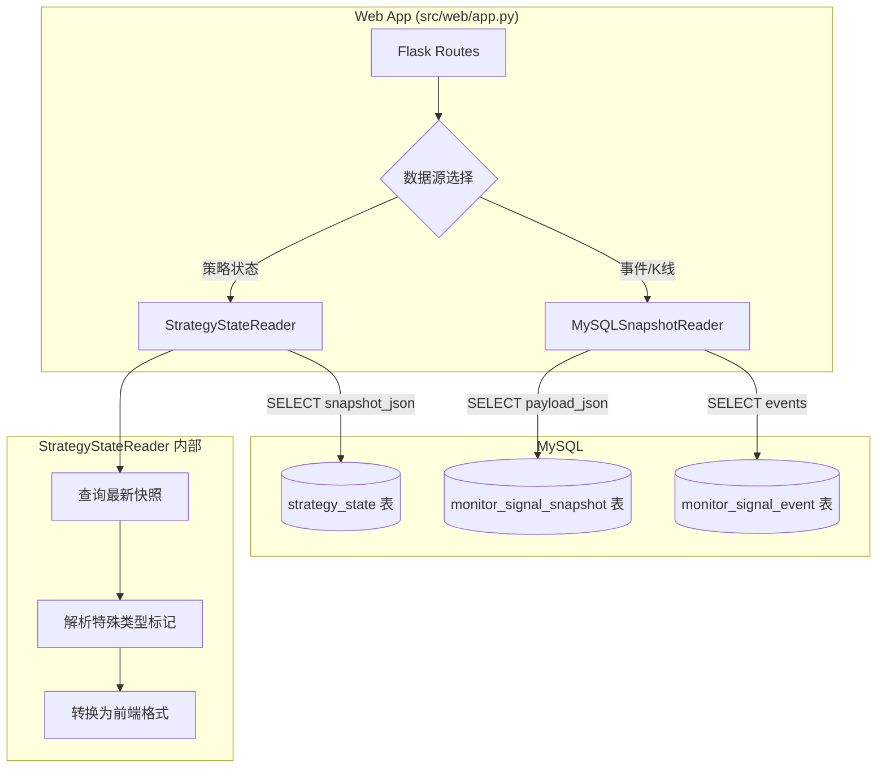

# Design Document: Web MySQL State Reader

## Overview

本设计将监控端的策略状态数据源从 pickle 文件迁移到 MySQL `strategy_state` 表。核心工作是新建一个 `StrategyStateReader` 类，负责：

1. 通过 pymysql 连接 MySQL，查询 `strategy_state` 表
2. 解析 `snapshot_json` 中的特殊类型标记（`__dataframe__`、`__datetime__`、`__enum__` 等）
3. 将 JSON 快照转换为前端期望的格式（instruments、positions、orders）
4. 替代 `SnapshotReader`（pickle）成为主数据源

设计原则：
- 监控端不依赖策略端的领域对象（不 import InstrumentManager、PositionAggregate 等）
- JSON 特殊类型标记的解析采用轻量级实现，不复用策略端的 `JsonSerializer`（避免引入策略端依赖链）
- 保留 `MySQLSnapshotReader` 的 events/bars 功能不变

## Architecture



数据源优先级变更：
- **之前**: MySQLSnapshotReader (monitor_signal_snapshot) → SnapshotReader (pickle)
- **之后**: StrategyStateReader (strategy_state) → MySQLSnapshotReader (monitor_signal_snapshot)

## Components and Interfaces

### 1. StrategyStateReader（新增）

位置：`src/web/reader.py`

```python
class StrategyStateReader:
    """从 strategy_state 表读取策略状态并转换为前端格式"""

    def __init__(self, db_config: dict):
        """
        Args:
            db_config: 数据库连接配置 {host, port, user, password, database}
        """

    def list_available_strategies(self) -> List[Dict[str, Any]]:
        """查询所有策略名称及最新更新时间
        
        Returns:
            [{"variant": "15m", "last_update": "2025-01-15 14:30:00", "file_size": None}, ...]
        """

    def get_strategy_data(self, strategy_name: str) -> Optional[Dict[str, Any]]:
        """读取指定策略的最新快照并转换为前端格式
        
        Args:
            strategy_name: 策略名称（对应前端的 variant）
        
        Returns:
            前端格式的字典，或 None（无数据/解析失败）
        """
```

### 2. SnapshotJsonTransformer（新增）

位置：`src/web/reader.py`（内部辅助类）

负责将 `strategy_state` 表中的 JSON 快照转换为前端格式。这是一个纯函数式的转换器，不涉及数据库操作。

```python
class SnapshotJsonTransformer:
    """将 strategy_state 的 snapshot_json 转换为前端格式"""

    @staticmethod
    def transform(snapshot: dict, strategy_name: str) -> dict:
        """主转换入口"""

    @staticmethod
    def resolve_special_markers(obj: Any) -> Any:
        """递归解析 JSON 中的特殊类型标记"""

    @staticmethod
    def transform_instruments(target_aggregate: dict) -> dict:
        """转换标的数据为前端格式"""

    @staticmethod
    def transform_positions(position_aggregate: dict) -> list:
        """转换持仓数据为前端格式"""

    @staticmethod
    def transform_orders(position_aggregate: dict) -> list:
        """转换挂单数据为前端格式"""

    @staticmethod
    def extract_delivery_month(vt_symbol: str) -> str:
        """从合约代码提取到期月份（复用 SnapshotReader 的逻辑）"""
```

### 3. Web App 变更

`src/web/app.py` 的变更：
- 新增 `StrategyStateReader` 实例
- 修改 `list_strategies_best_effort()`: 优先使用 `StrategyStateReader`，回退到 `MySQLSnapshotReader`
- 修改 `get_snapshot_best_effort()`: 优先使用 `StrategyStateReader`，回退到 `MySQLSnapshotReader`
- 移除 `SnapshotReader` 的 import 和实例化
- 移除 `pickle_reader` 相关代码
- WebSocket `poll_db` 改为轮询 `strategy_state` 表

## Data Models

### strategy_state 表结构（已存在）

| 字段 | 类型 | 说明 |
|------|------|------|
| id | BIGINT AUTO_INCREMENT | 主键 |
| strategy_name | VARCHAR(128) | 策略名称，有索引 |
| snapshot_json | TEXT | JSON 快照 |
| schema_version | INT | Schema 版本号 |
| saved_at | DATETIME | 保存时间，有索引 |

### snapshot_json 内部结构

```
snapshot_json
├── schema_version: int
├── target_aggregate
│   ├── instruments: {vt_symbol: InstrumentData}
│   │   └── InstrumentData
│   │       ├── vt_symbol: str
│   │       ├── bars: {"__dataframe__": true, "records": [...]}
│   │       ├── indicators: {name: value}
│   │       └── last_update_time: {"__datetime__": "..."}
│   └── active_contracts: {product: vt_symbol}
├── position_aggregate
│   ├── positions: {key: PositionData}
│   │   └── PositionData
│   │       ├── vt_symbol: str
│   │       ├── direction: {"__enum__": "Direction.LONG"} 或 str
│   │       ├── volume: int/float
│   │       ├── open_price: float
│   │       └── pnl: float
│   ├── pending_orders: {key: OrderData}
│   │   └── OrderData
│   │       ├── vt_orderid: str
│   │       ├── vt_symbol: str
│   │       ├── direction: {"__enum__": "..."} 或 str
│   │       ├── offset: {"__enum__": "..."} 或 str
│   │       ├── volume: int/float
│   │       ├── price: float
│   │       └── status: {"__enum__": "..."} 或 str
│   ├── managed_symbols: [...] 或 {"__set__": true, "values": [...]}
│   ├── daily_open_count_map: {}
│   ├── global_daily_open_count: int
│   └── last_trading_date: str 或 {"__date__": "..."}
└── current_dt: {"__datetime__": "..."} 或 str
```

### 前端格式（输出）

```json
{
  "timestamp": "2025-01-15 14:30:00",
  "variant": "15m",
  "instruments": {
    "rb2501.SHFE": {
      "dates": ["2025-01-15 14:29:00"],
      "ohlc": [[3500.0, 3505.0, 3498.0, 3510.0]],
      "volumes": [1200],
      "indicators": {"hv_20": 0.25, "signal": "sell_put"},
      "status": {},
      "last_price": 3505.0,
      "delivery_month": "2501"
    }
  },
  "positions": [
    {"vt_symbol": "rb2501.SHFE", "direction": "Direction.LONG", "volume": 1, "price": 3500.0, "pnl": 0.0}
  ],
  "orders": [
    {"vt_orderid": "xxx", "vt_symbol": "rb2501.SHFE", "direction": "Direction.LONG", "offset": "Offset.OPEN", "volume": 1, "price": 3500.0, "status": "Status.SUBMITTING"}
  ]
}
```

### 特殊类型标记解析规则

| JSON 标记 | 解析结果 |
|-----------|---------|
| `{"__dataframe__": true, "records": [...]}` | records 列表（不还原为 DataFrame） |
| `{"__datetime__": "2025-01-15T14:29:00+08:00"}` | 字符串 `"2025-01-15 14:29:00"` |
| `{"__date__": "2025-01-15"}` | 字符串 `"2025-01-15"` |
| `{"__enum__": "Direction.LONG"}` | 字符串 `"Direction.LONG"` |
| `{"__set__": true, "values": [1, 2]}` | 列表 `[1, 2]` |
| `{"__dataclass__": "mod.Cls", "a": 1}` | 字典 `{"a": 1}` |

注意：监控端不需要还原为 Python 对象（DataFrame、Enum 等），只需转换为前端可消费的 JSON 基本类型。


## Correctness Properties

*A property is a characteristic or behavior that should hold true across all valid executions of a system — essentially, a formal statement about what the system should do. Properties serve as the bridge between human-readable specifications and machine-verifiable correctness guarantees.*

### Property 1: Special marker resolution produces only JSON-primitive types

*For any* arbitrarily nested dictionary/list containing Special_Type_Marker objects (`__dataframe__`, `__datetime__`, `__date__`, `__enum__`, `__set__`, `__dataclass__`), after calling `resolve_special_markers`, the result SHALL contain only JSON-primitive types (str, int, float, bool, None, list, dict) with no marker keys remaining.

**Validates: Requirements 5.1, 5.2, 5.3, 5.4, 5.5, 5.6, 3.4, 4.5**

### Property 2: Bars extraction preserves record count and data

*For any* list of bar record dictionaries (each containing `datetime`, `open`, `close`, `low`, `high`, `volume`), extracting `dates`, `ohlc`, and `volumes` SHALL produce three lists of equal length matching the input record count, where each `ohlc[i]` equals `[record[i].open, record[i].close, record[i].low, record[i].high]` and `volumes[i]` equals `record[i].volume`.

**Validates: Requirements 3.1, 3.2**

### Property 3: Positions and orders dict-to-list transformation

*For any* positions dictionary and pending_orders dictionary, `transform_positions` and `transform_orders` SHALL produce lists whose lengths equal the number of entries in the respective input dictionaries, and each output item SHALL contain the required fields (`vt_symbol`, `direction`, `volume`, `price`, `pnl` for positions; `vt_orderid`, `vt_symbol`, `direction`, `offset`, `volume`, `price`, `status` for orders).

**Validates: Requirements 4.1, 4.2, 4.3, 4.4**

### Property 4: Full snapshot transform produces all required Frontend_Format fields

*For any* valid `snapshot_json` dictionary containing `target_aggregate`, `position_aggregate`, and `current_dt`, calling `transform` SHALL produce a dictionary containing exactly the keys `timestamp`, `variant`, `instruments`, `positions`, `orders`, where `variant` equals the input `strategy_name` and `timestamp` is a string in `YYYY-MM-DD HH:MM:SS` format.

**Validates: Requirements 2.2, 2.3, 3.1**

### Property 5: Delivery month extraction

*For any* vt_symbol string matching the pattern `<letters><digits>.<exchange>`, `extract_delivery_month` SHALL return a 4-digit string representing the delivery month, or `"Other"` if the pattern does not match.

**Validates: Requirements 3.5**

## Error Handling

| 场景 | 处理方式 | 返回值 |
|------|---------|--------|
| 数据库连接失败 | 捕获异常，记录日志 | 空列表 / None |
| SQL 查询失败 | 捕获异常，记录日志 | 空列表 / None |
| snapshot_json 为 None 或空 | 跳过，返回 None | None |
| JSON 解析失败（malformed） | 捕获 json.JSONDecodeError | None |
| snapshot_json 缺少必要字段 | 使用默认值（空 dict/list） | 部分数据 |
| 特殊类型标记格式异常 | 保留原始值不转换 | 原始 dict |
| bars records 为空 | 跳过该 instrument | 不包含在输出中 |

所有数据库操作使用 try/finally 确保连接关闭。`StrategyStateReader` 的所有公开方法不抛出异常，始终返回有效的默认值。

## Testing Strategy

### 测试框架

- 单元测试：`pytest`
- 属性测试：`hypothesis`（Python 属性测试库）
- 每个属性测试至少运行 100 次迭代

### 单元测试

重点覆盖：
- `SnapshotJsonTransformer.resolve_special_markers` 的各种标记类型
- `SnapshotJsonTransformer.transform_instruments` 的正常和边界情况
- `SnapshotJsonTransformer.transform_positions` 和 `transform_orders` 的转换
- `SnapshotJsonTransformer.transform` 的完整快照转换
- `StrategyStateReader` 的数据库连接失败处理
- `extract_delivery_month` 的各种合约代码格式

### 属性测试

每个属性测试必须引用设计文档中的属性编号：

- **Feature: web-mysql-state-reader, Property 1: Special marker resolution produces only JSON-primitive types**
  - 使用 hypothesis 生成包含随机嵌套特殊标记的 JSON 结构
  - 验证解析后不包含任何标记键

- **Feature: web-mysql-state-reader, Property 2: Bars extraction preserves record count and data**
  - 使用 hypothesis 生成随机 bar records 列表
  - 验证提取后的 dates/ohlc/volumes 长度和内容一致

- **Feature: web-mysql-state-reader, Property 3: Positions and orders dict-to-list transformation**
  - 使用 hypothesis 生成随机 positions/orders 字典
  - 验证转换后列表长度和字段完整性

- **Feature: web-mysql-state-reader, Property 4: Full snapshot transform produces all required Frontend_Format fields**
  - 使用 hypothesis 生成随机有效快照
  - 验证输出包含所有必要字段且格式正确

- **Feature: web-mysql-state-reader, Property 5: Delivery month extraction**
  - 使用 hypothesis 生成随机 vt_symbol 字符串
  - 验证提取结果为 4 位数字或 "Other"
